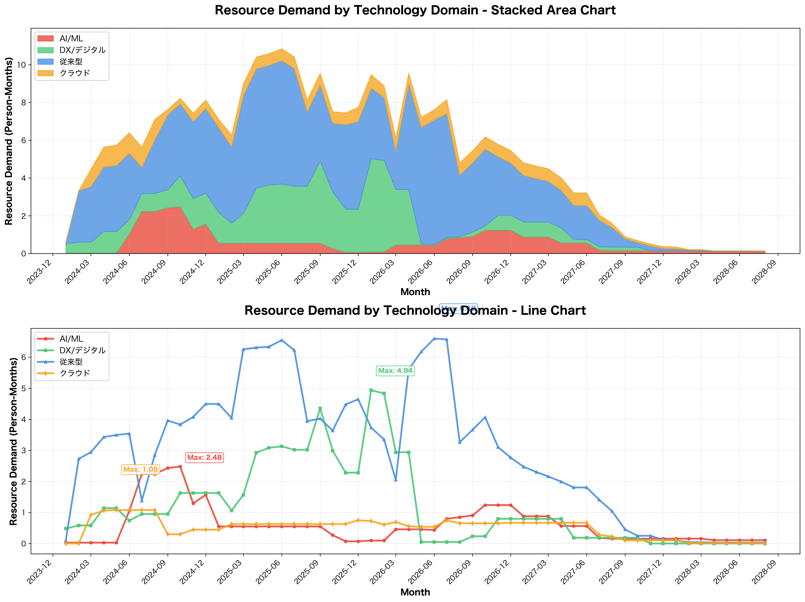
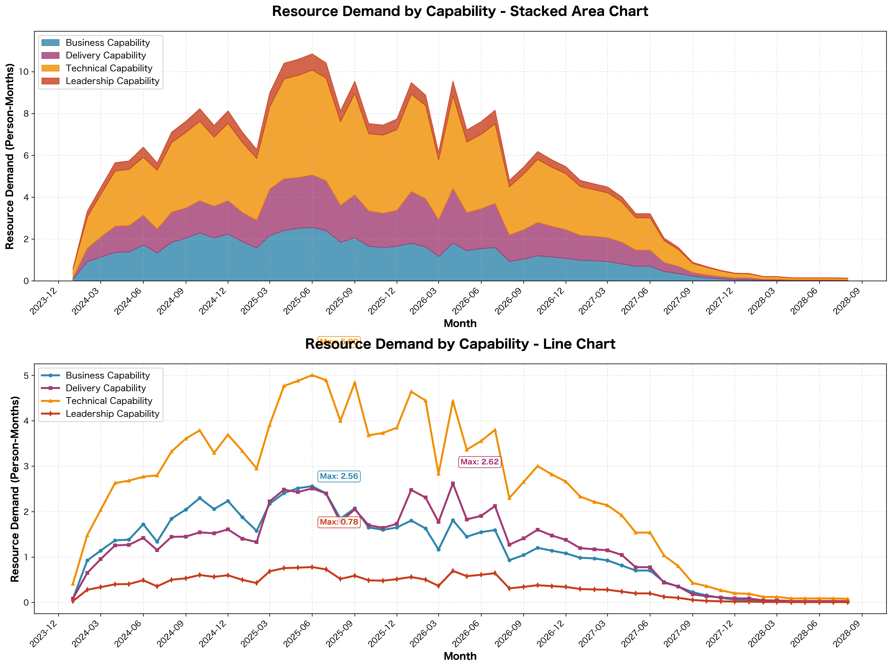
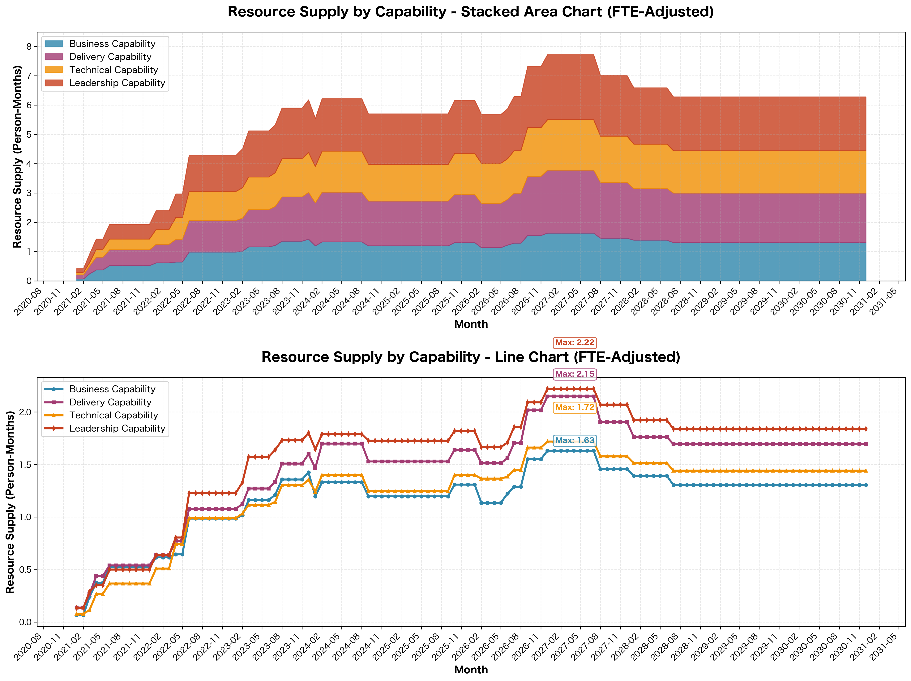
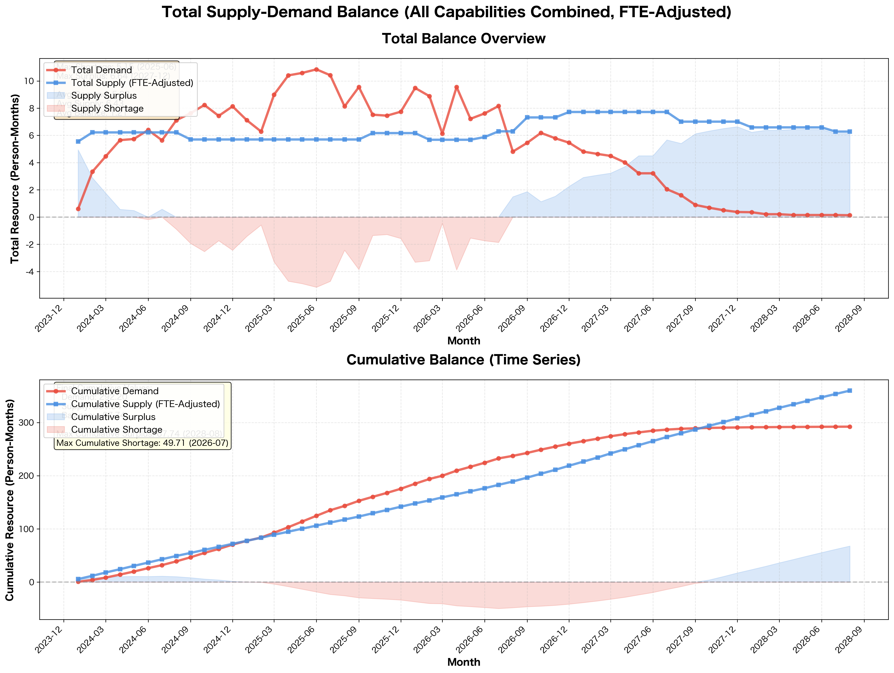
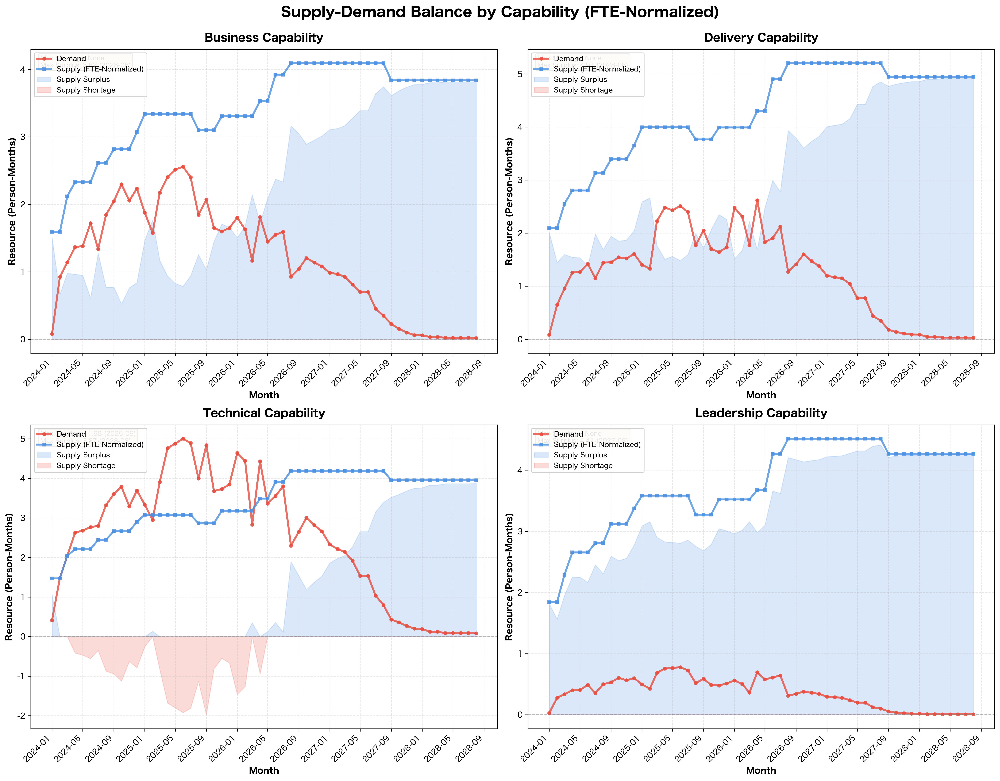

# 分析サマリー

## 1. Resource Demand by Technology Domain（技術領域別需要）

### 読み取れる情報

**Stacked Area Chart（積み上げ面グラフ）**
- 分析期間：2023年12月〜2029年9月
- 全体需要のピーク：2025年6月頃に約10.5人月
- 2026年後半以降、現時点で確定している需要がほぼゼロ（＝将来の需要がまだ見えていない状態）

**各技術領域の需要推移（Line Chart）**

| 技術領域 | ピーク時期 | ピーク需要 | 特徴 |
|---------|----------|-----------|------|
| 従来型 | 2025年6月 | 約6.7人月 | 最大の需要、2024年初〜2026年中盤まで継続 |
| DX/デジタル | 2026年3月 | 約4.9人月 | 2024年後半から立ち上がり、2025〜2026年前半がピーク |
| AI/ML | 2024年9月 | 約2.5人月 | 2024年に集中、その後急速に減少 |
| クラウド | 2024年6月 | 約1.1人月 | 最も需要が小さく、短期間 |

---

## 2. Resource Demand by Capability（ケイパビリティ別需要）

### 読み取れる情報

**Stacked Area Chart（積み上げ面グラフ）**
- 全体需要のピーク：2025年6月頃に約10.5人月
- 2026年後半以降、現時点で確定している需要がほぼゼロ（＝将来の需要がまだ見えていない状態）

**各ケイパビリティの需要推移（Line Chart）**

| ケイパビリティ | ピーク時期 | ピーク需要 | 特徴 |
|-------------|----------|-----------|------|
| Technical | 2025年6月 | 約4.9人月 | 最も需要が大きい、2024年初〜2026年中盤まで高水準 |
| Delivery | 2025年6月 | 約2.6人月 | Technical に次ぐ需要、変動が大きい |
| Business | 2024年6月 | 約2.2人月 | 2024年中盤がピーク、その後も一定需要が継続 |
| Leadership | 2025年6月 | 約0.8人月 | 最も需要が小さく、全期間で1人月以下 |

**需要の大きさの比較**
- Technical ≫ Delivery ≒ Business ≫≫ Leadership
- Technicalは他のケイパビリティの2倍以上の需要

---

## 3. Resource Supply by Capability（ケイパビリティ別供給）

### 読み取れる情報

**Stacked Area Chart（積み上げ面グラフ）**
- 供給の合計：2020年11月の約0.4人月から段階的に増加
- 2025年12月頃にピーク（約7.8人月）に到達
- その後、2026年以降も約6.3人月で高止まり

**各ケイパビリティの供給推移（Line Chart）**

| ケイパビリティ | 最大供給 | 時期 | 2029年9月時点 | 特徴 |
|-------------|---------|------|-------------|------|
| Leadership | 2.22人月 | 2025年12月 | 約1.8人月 | 最も供給が多い |
| Technical | 1.77人月 | 2026年2月 | 約1.4人月 | 段階的に増加 |
| Delivery | 2.15人月 | 2026年2月 | 約1.7人月 | 2026年にピーク |
| Business | 1.63人月 | 2025年12月 | 約1.3人月 | 比較的安定的に増加 |

**供給の特徴**
- すべてのケイパビリティで2020年から段階的に増加
- 2025〜2026年にピークに到達後、やや減少するが高水準を維持
- Leadership と Delivery の供給が特に多い

---

## 4. Total Supply-Demand Balance（総合需給バランス）

### 読み取れる情報

**Total Balance Overview（上段グラフ）**
- 青い領域（Supply Surplus）：供給過剰の期間と規模
- 赤い領域（Supply Shortage）：供給不足の期間と規模

| 期間 | 状況 | 規模 |
|------|------|------|
| 2023年12月〜2024年8月 | 供給過剰 → バランス | +4.9人月 → ±0 |
| 2024年9月〜2026年7月 | **供給不足** | 最大-4.8人月（2025年6月） |
| 2026年9月〜2029年9月 | 確定需要なし | ー（需要未確定のため評価不可） |

**Cumulative Balance（下段グラフ）**
- 累積需要と累積供給の推移を表示
- **最大累積不足：49.71人月（2026年7月）**
- 2029年9月時点：
  - 累積需要：約294人月
  - 累積供給：約373人月
  - 累積余剰：約79人月

**重要な転換点**
1. 2024年8月頃：供給過剰から不足に転換
2. 2025年6月：不足が最大に
3. 2026年7月：累積不足が最大に（49.71人月）
4. 2026年9月頃：不足から過剰に転換

---

## 5. Supply-Demand Balance by Capability（ケイパビリティ別需給バランス）

### 読み取れる情報

**Business Capability**
- 2024年初〜2025年：軽度の供給不足（-0.5〜-0.9人月）
- 2026年以降：供給過剰（+0.8〜1.5人月）
- 需要ピーク時でも供給がやや不足気味

**Delivery Capability**
- 2024〜2025年：供給不足と過剰が交互に発生（-0.4〜+0.9人月）
- 2026年以降：供給過剰（+1.2〜1.8人月）
- 比較的バランスが取れている時期が多い

**Technical Capability**
- 2024年初〜2026年中盤：**深刻な供給不足**
  - 最大不足：約-3.6人月（2025年前半）
  - 不足期間：約30ヶ月
- 2026年後半以降：供給過剰（+0.9〜1.4人月）
- **最も需給バランスが悪い**

**Leadership Capability**
- **全期間で供給過剰**
- 過剰規模：+1.2〜2.2人月（需要の3〜10倍以上）
- 需要が最も小さいのに供給が最も多い
- **最も非効率な配置**

---
 
 
 

## 📊 示唆

### 前提条件の確認
- **人材方針**：Technical Capabilityの不足は外注で補充する方針
- **コア領域**：Business（超上流工程）とDelivery（プロジェクト遂行能力）を重視
- **データの性質**：将来予測は含まないため、2026年後半以降は「需要が減少する」のではなく「まだ見えていない」ことを意味する

---

### 1. コア領域（Business & Delivery）の状況評価

#### Business Capability（超上流工程）
**評価：⚠️ コア領域でありながら供給不足が発生**

| 期間 | 需要 | 供給 | バランス | 状況 |
|------|------|------|---------|------|
| 2024年初〜2025年 | 1.5〜2.5人月 | 1.2〜1.6人月 | **-0.2〜-0.9人月** | 🔴 供給不足 |
| 2026年以降（確定需要のみ） | 0.5人月以下 | 1.3〜1.6人月 | +0.8〜1.5人月 | ー（需要未確定） |

**重要な発見**
- **コア領域で2024〜2025年に継続的な供給不足**
- ピーク需要2.5人月に対し、供給は最大1.6人月（約36%不足）
- 超上流工程の人材不足は、プロジェクト全体の方向性や品質を左右
- Technicalと異なり外注が難しい領域で内製不足が発生

**ビジネスへの影響**
- 超上流工程の品質低下リスク
- 要件定義やビジネス設計の遅延
- プロジェクト全体への連鎖的影響

#### Delivery Capability（プロジェクト遂行能力）
**評価：🟡 おおむね良好だが変動への対応に課題**

| 期間 | 需要 | 供給 | バランス | 状況 |
|------|------|------|---------|------|
| 2024年初〜2025年 | 1.3〜2.6人月 | 1.5〜2.2人月 | **-0.4〜+0.9人月** | 🟡 変動大 |
| 2026年以降（確定需要のみ） | 0.5人月以下 | 1.7〜1.9人月 | +1.2〜1.8人月 | ー（需要未確定） |

**重要な発見**
- Business と比較すると相対的にバランスが良い
- ただし、時期により不足と過剰を繰り返す（-0.4 ↔ +0.9人月）
- 需要の変動パターンに対して、供給の調整がやや遅れる傾向
- 2025年のピーク需要2.6人月に対し、供給ピーク2.2人月は2026年に到達

**ビジネスへの影響**
- 短期的な需要急増時に人材不足が発生する可能性
- プロジェクト立ち上げ期の体制構築に遅れが生じるリスク
- 柔軟な人材配置メカニズムの必要性

---

### 2. Technical Capability（外注補充対象）の評価

**評価：📊 データ上は大幅不足だが、方針上は想定内**

| 期間 | 需要 | 供給 | 不足 | 外注必要規模 |
|------|------|------|------|------------|
| 2024年初〜中盤 | 2.5〜3.8人月 | 1.2〜1.4人月 | -1.3〜-2.4人月 | 約1.5〜2.5人月 |
| 2024年後半〜2025年 | 3.6〜4.9人月 | 1.3〜1.6人月 | -2.0〜-3.6人月 | 約2.5〜3.5人月 |
| 2025年後半〜2026年 | 2.3〜4.5人月 | 1.4〜1.7人月 | -0.6〜-3.1人月 | 約1.5〜3.0人月 |

**重要な発見**
- 約30ヶ月間、**継続的に2〜3.5人月規模の外注が必要**
- 最大で3.6人月分の外注が必要（2025年前半）
- 人材方針に沿った結果であり、想定内の範囲
- 長期継続的な外注となるため、安定的なパートナー確保が重要

**ビジネスへの影響**
- **外注コストの予算化が必要**：月額2〜3.5人月分 × 30ヶ月
- 外注先の品質管理体制の構築が重要
- 長期契約可能な信頼できるパートナーの確保
- 内製メンバーと外注メンバーの協業体制の整備

---

### 3. 技術領域別の傾向とビジネス戦略

| 技術領域 | ピーク需要 | 特徴 | ビジネス上の示唆 |
|---------|----------|------|----------------|
| 従来型 | 6.7人月 | 最大需要、長期継続 | 主力事業。安定的なリソース確保が必要 |
| DX/デジタル | 4.9人月 | 2024年後半から本格化 | 成長領域。立ち上げ期のリソース確保に注意 |
| AI/ML | 2.5人月 | 2024年のみ、短期集中 | スポット案件。外注または専門家の一時確保が適切 |
| クラウド | 1.1人月 | 需要小、限定的 | 補助的技術。フルタイム人材は不要 |

**全体的な傾向**
- **従来型（レガシー）案件が事業の中心**（需要の約60%）
- DX案件が第2の柱として成長中
- AI/ML・クラウドはメイン事業ではなく、スポット対応で十分

---
