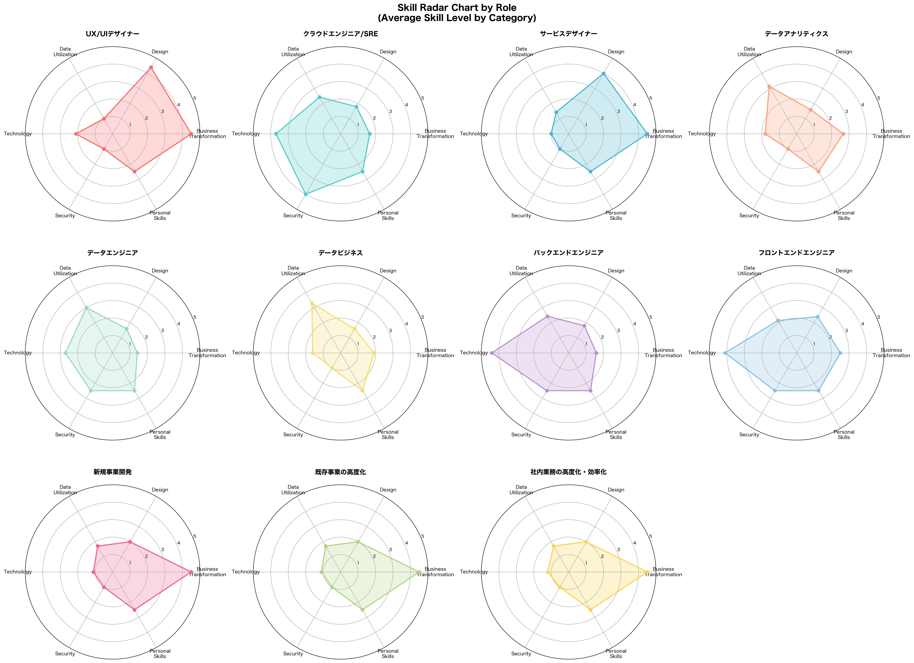
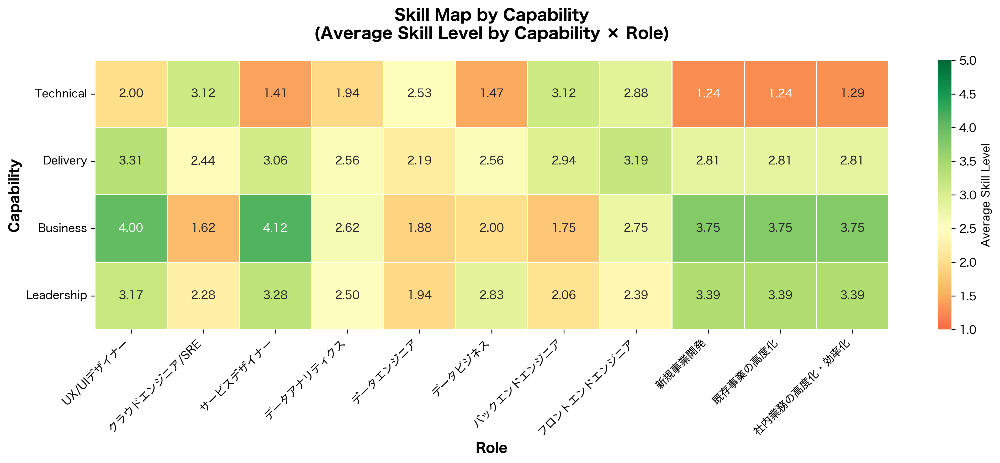
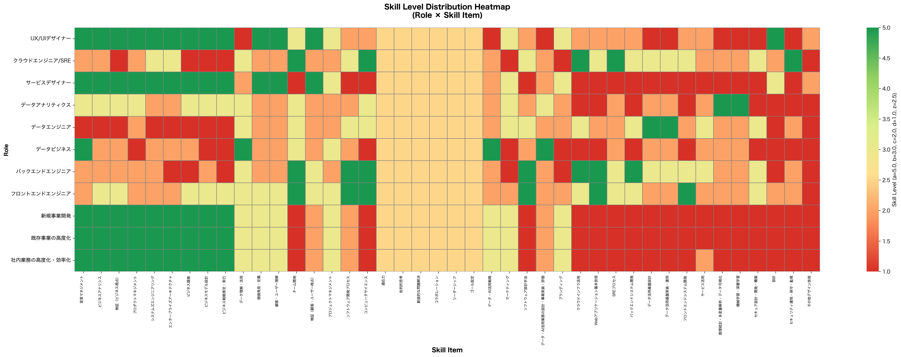
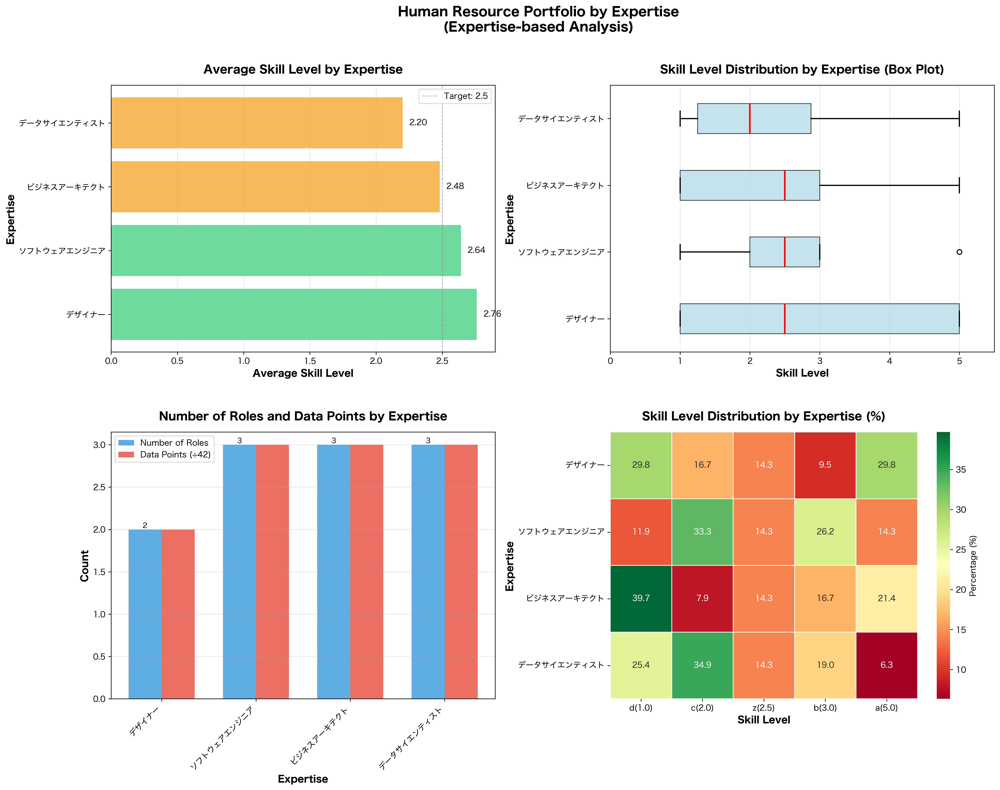
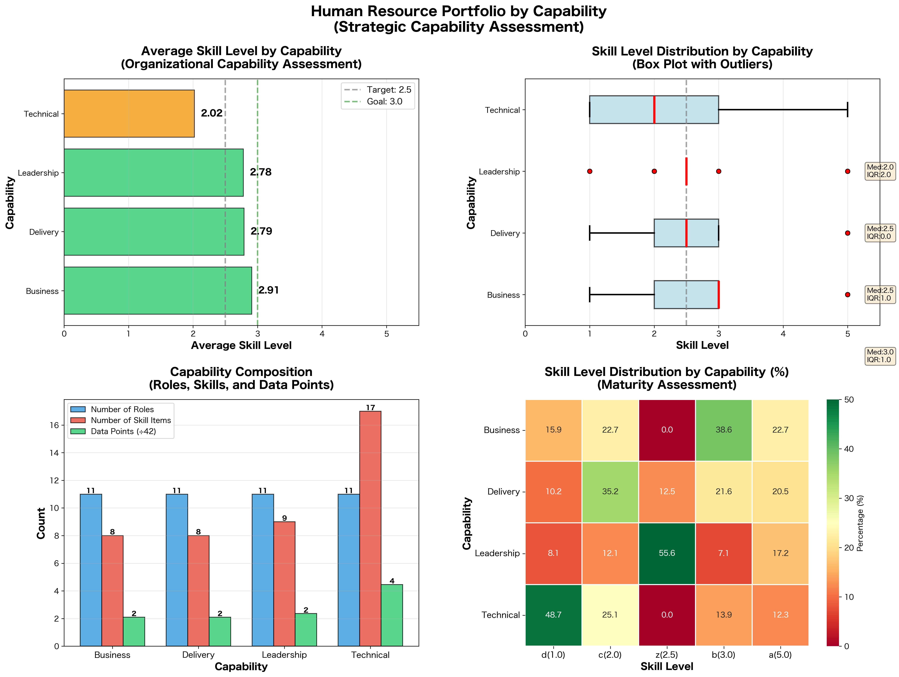
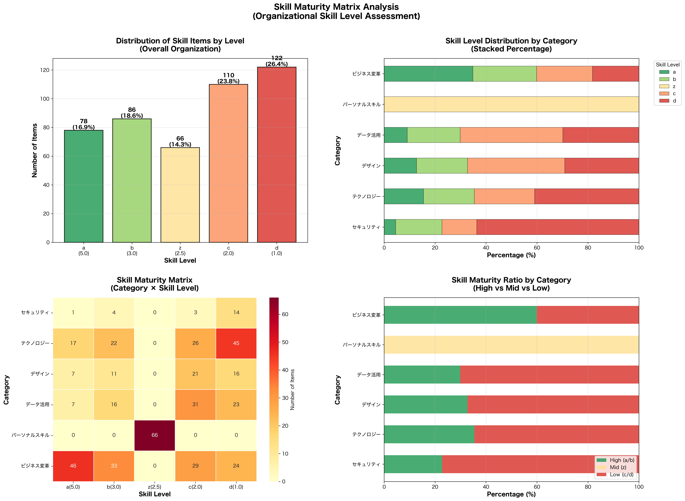

# 分析サマリー

## 分析方針：可視化の目的

### 1. ロール別スキルレーダーチャート(優先度:高)

**目的:** 各ロールの強み・弱みを把握

- ロールごとの平均スキルレベルを表示
- 組織全体のバランスと各ロールの特化領域が明確に

### 2. ケイパビリティ別スキルマップ(優先度:高)

**目的:** 組織の4つのケイパビリティ充足度を評価

- リーダーシップ、ビジネス、テクニカル、デリバリの各ケイパビリティについて
- ロール別・スキルレベル別の分布をヒートマップで表示
- どのケイパビリティが充足し、どこが弱いかを戦略的に把握

### 3. スキルレベル分布のヒートマップ(優先度:高)

**目的:** 詳細なスキルギャップ分析

- 横軸:スキル項目、縦軸:ロール
- セルの色でスキルレベル(a=5.0~d=1.0)を視覚化
- 具体的にどのスキル×ロールの組み合わせが不足しているか特定

### 4. 専門性別の人材ポートフォリオ(優先度:中)

**目的:** 人材構成の偏りを把握

- デザイナー、ソフトウェアエンジニア、ビジネスアーキテクトなどの専門性別の集計
- スキルレベルの平均値や分散を可視化
- **採用・育成計画の優先順位付けに活用**

### 5. スキルレベル×スキル項目のマトリクス分析(優先度:中)

**目的:** 組織の成熟度を測定

- 各スキルレベル(a~d)に該当する項目数を集計
- 高レベルスキル(a/b)と低レベルスキル(c/d)の比率を可視化
- 組織全体のスキル成熟度トレンドを把握

### **6. サブカテゴリー別の詳細分析(優先度:中)**

**目的:** より細かい育成計画の立案

- 「戦略・マネジメント・システム」「AI・データサイエンス」「ソフトウェア開発」など
- サブカテゴリーごとにロール別の平均スキルレベルを棒グラフで比較

---

 

## 分析結果：各可視化から得られた洞察

## 1. ロール別スキルレーダーチャート

### ✅ **組織全体の傾向**
- **ビジネス変革スキルが最強**: 組織平均3.11で6カテゴリー中トップ
- **セキュリティスキルが最弱**: 組織平均1.68で6カテゴリー中最下位（危機的状況）
- **テクノロジー・デザイン・データ活用**: いずれも2点台前半で同程度に低い

### ✅ **ロールの特化と弱点**
- **極端なスキルギャップが存在**: UX/UIデザイナー、サービスデザイナー、ビジネスアーキテクト系（新規事業開発、既存事業の高度化、社内業務の高度化・効率化）は**3.5ポイント**の差（最強4.5 vs 最弱1.0）
- **エンジニア系はセキュリティが強い**: クラウドエンジニア/SREはセキュリティ4.0、バックエンド・フロントエンドは2.5でビジネス系ロール（1.0）より大幅に高い
- **デザイナー系はビジネス変革が強い**: UX/UI、サービスデザイナーは4.5と最高レベル

### ⚠️ **示唆される課題**
- **T字型人材が少ない**: 多くのロールで得意分野と不得意分野の差が2～3.5ポイントあり、専門特化が進みすぎている
- **セキュリティは組織的弱点**: 11ロール中7ロールがセキュリティ1.0で、組織全体でセキュリティ人材・スキルが不足
- **データビジネスロールが全体的に低い**: 平均2.07で11ロール中最下位、育成が急務

---
 

## 2. ケイパビリティ別スキルマップ

### ✅ **4つのケイパビリティの充足度**
- **テクニカルケイパビリティが最弱**: 平均2.02で組織全体の最大の弱点
- **ビジネスケイパビリティが最強**: 平均2.91だが、それでも3.0未満で十分とは言えない
- **デリバリ・リーダーシップ**: 2.78～2.79で同程度、やや低い

### ✅ **ロール間の格差**
- **テクニカルケイパビリティの格差が最大**: クラウドエンジニア/SRE（3.12）と新規事業開発（1.24）で**1.88ポイント差**
- **ビジネスケイパビリティも格差大**: サービスデザイナー（4.12）とクラウドエンジニア/SRE（1.62）で**2.50ポイント差**

### ✅ **ロール別ケイパビリティバランス**
- **バランスが良いロール（標準偏差0.5未満）**: データアナリティクス、データエンジニア、フロントエンドエンジニアの3ロールのみ
- **バランスが悪いロール**: サービスデザイナー（標準偏差1.14）、新規事業開発・既存事業高度化（1.11）など8ロールが偏りすぎ

### ⚠️ **示唆される課題**
- **テクニカルケイパビリティの底上げが最優先**: 組織平均2.02は危機的水準
- **ビジネスアーキテクト系ロールの技術力不足**: 新規事業開発がテクニカル1.24と極端に低い
- **エンジニア系のビジネススキル強化が必要**: クラウドエンジニア/SREがビジネス1.62と低い

---

 

## 3. スキルレベル分布のヒートマップ

### ✅ **スキルレベルの全体分布**
- **低レベル（d=1.0）が最多**: 全体の26.4%で最も多い（122件）
- **高レベル（a=5.0）は少ない**: 全体の16.9%のみ（78件）
- **中低レベル（c=2.0）が多い**: 23.8%（110件）で2番目に多い
- **組織全体が低スキル寄り**: レベルd+cで50.2%（半数以上）

### ✅ **スキル項目別の強弱**
- **強いスキル項目（上位）**:
  - 変革マネジメント（3.64）
  - ビジネスアナリシス（3.45）
  - 検証（ビジネス視点）（3.36）
  - → **ビジネス系スキルが上位を独占**

- **弱いスキル項目（下位）**:
  - その他デザイン技術（1.18）
  - セキュリティ運用・保守・監視（1.64）
  - セキュア設計・開発・構築（1.73）
  - 設計（1.73）
  - 数理統計・多変量解析・データ可視化（1.82）
  - 機械学習・深層学習（1.82）
  - → **技術系・専門技術スキルが下位を独占**

### ✅ **ロール別の総合力**
- **トップ3**: UX/UIデザイナー（2.88）、フロントエンドエンジニア（2.81）、サービスデザイナー（2.64）
- **ボトム3**: データビジネス（2.07）、データエンジニア（2.21）、データアナリティクス（2.31）
- **データ系ロール3つが下位独占**: データ活用人材の育成が急務

### ⚠️ **示唆される課題**
- **技術的専門性の不足が深刻**: AI/ML、セキュリティ、設計などの専門技術が組織全体で1点台
- **パーソナルスキルは全ロール均一**: Level z（2.5）で横並び、差別化要因になっていない
- **データ人材の育成遅れ**: データビジネス、データエンジニア、データアナリティクスが全てボトム3
- **スキルの二極化**: ビジネス系は3点台、技術系は1～2点台と明確に分離

---
 

## 示唆

### 優先課題

1. **セキュリティスキルの組織的強化**: 組織平均1.68は致命的
2. **テクニカルケイパビリティの底上げ**: 平均2.02を最低3.0以上に
3. **データ人材の育成加速**: 3ロール全てが下位、DX推進の障壁に

### 中期的課題
4. **T字型人材の育成**: スキルギャップ3.5は専門特化しすぎ
5. **AI/ML人材の確保・育成**: 平均1.82で今後のビジネス競争力に直結
6. **クロスファンクショナルチーム編成**: ビジネス強者と技術強者を組み合わせる

---

 
 

## 4. 専門性別の人材ポートフォリオ

### ✅ **専門性別の実力差**
- **デザイナーが最強**: 平均2.76で4専門性中トップ、標準偏差1.60で幅広いスキルレンジ
- **データサイエンティストが最弱**: 平均2.20で最下位、組織の最大弱点
- **ソフトウェアエンジニアは安定**: 平均2.64、標準偏差1.14で最も安定（バラツキが小さい）
- **ビジネスアーキテクトは二極化**: 平均2.48だが標準偏差1.52で実力差が大きい

### ✅ **スキルレベル分布の特徴**
- **デザイナーの二極化**: Level a(29.8%)とLevel d(29.8%)が同率で両極端
- **ソフトウェアエンジニアの中堅層の厚さ**: Level b(26.2%)とLevel c(33.3%)で6割、実務力は高い
- **ビジネスアーキテクトの低スキル偏重**: Level d(39.7%)が最多、**4割が最低レベル**
- **データサイエンティストの底辺層**: Level a(6.3%)のみで高レベル人材が極端に少ない

### ✅ **ロール構成の内訳**
- **デザイナー**: UX/UIデザイナー(2.88) > サービスデザイナー(2.64)
- **ソフトウェアエンジニア**: フロントエンド(2.81) > バックエンド(2.60) > クラウド/SRE(2.52)
- **ビジネスアーキテクト**: 3ロール全て2.48～2.50でほぼ横並び
- **データサイエンティスト**: 3ロール全て2.07～2.31で全体的に低い

### ⚠️ **示唆される課題**
- **データ人材の育成が最優先**: 3ロール全てが低く、DX推進の最大ボトルネック
- **ビジネスアーキテクトの底上げ**: 4割がLevel dは危機的、研修・OJTの強化が必要
- **デザイナーの中堅層育成**: 両極端なので、Level b/cの中堅層を育成すべき
- **専門性間の偏在**: デザイナー(2ロール)、他(3ロール)と、人材配置のバランスを検討

---

 

## 4B. ケイパビリティ別の人材ポートフォリオ

### ✅ **主要な発見**

#### **ケイパビリティ別の実力ランキング**
1. **ビジネスケイパビリティ**: 平均2.91（成熟度:高）
2. **デリバリケイパビリティ**: 平均2.79（成熟度:中）
3. **リーダーシップケイパビリティ**: 平均2.78（成熟度:中）
4. **テクニカルケイパビリティ**: 平均2.02（成熟度:低、**最弱**）

**ギャップ**: 最強と最弱で**0.89ポイント差**

#### **成熟度の詳細分析**

**ビジネスケイパビリティ（成熟度:高）**
- 高レベル(a/b): **61.4%** ← 唯一の過半数超え
- 低レベル(c/d): 38.6%
- Level b(38.6%)が最多で中堅層が厚い

**テクニカルケイパビリティ（成熟度:低）**
- 高レベル(a/b): 26.2%のみ
- 低レベル(c/d): **73.8%** ← 危機的状況
- Level d(48.7%)が半数近くで最低レベルに集中

**リーダーシップケイパビリティ（成熟度:中）**
- Level z(55.6%)が過半数 ← パーソナルスキルが大半
- 高レベル(a/b): 24.2%
- 実質的な差別化が少ない

**デリバリケイパビリティ（成熟度:中）**
- 高レベル(a/b): 42.0%
- 低レベル(c/d): 45.5%
- ほぼ拮抗、改善の余地あり

---

### ⚠️ **示唆される課題**

1. **テクニカルケイパビリティの危機的状況**
   - 73.8%が低レベル、48.7%が最低レベル(d)
   - スキル項目数は40.5%を占めるのに最も弱い
   - ビジネスアーキテクト系3ロールが全て1.24～1.29で極端に低い

2. **ビジネス偏重のアンバランス**
   - ビジネスのみ成熟度「高」、他は全て「中」以下
   - 0.89ポイント差は組織バランスとして問題

3. **リーダーシップの形骸化**
   - 55.6%がLevel z（パーソナルスキル）で横並び
   - 実質的なリーダーシップ差別化ができていない

4. **デリバリの中途半端さ**
   - 高レベル42.0% vs 低レベル45.5%で拮抗
   - 明確な方向性がない状態

---

 

## 5. スキルレベル×スキル項目のマトリクス分析

### ✅ **組織全体の成熟度レベル**
- **低レベルスキルが半数超**: Level c/d合計で**50.2%**（232件）、組織成熟度は「低」
- **高レベルスキルは3分の1**: Level a/b合計で35.5%（164件）のみ
- **中レベルは少数**: Level z(パーソナルスキル)が14.3%（66件）
- **成熟度の結論**: 組織全体として**スキル成熟度が低く、育成途上の段階**

### ✅ **カテゴリー別の成熟度格差**
**成熟度「高」（1カテゴリーのみ）**
- **ビジネス変革**: 高レベル59.8% > 低レベル40.2% → 組織の強み

**成熟度「低」（4カテゴリー）**
- **セキュリティ**: 低レベル77.3% → **最も未成熟**（平均1.68）
- **データ活用**: 低レベル70.1% → 深刻な弱点（平均2.18）
- **デザイン**: 低レベル67.3% → 改善必要（平均2.29）
- **テクノロジー**: 低レベル64.5% → 改善必要（平均2.25）

**成熟度「中」（1カテゴリー）**
- **パーソナルスキル**: 全員Level z(2.5)で横並び、差別化要因にならず

### ✅ **スキルレベル分布の偏り**
- **Level d(26.4%)が最多**: 最低レベルが最も多い逆ピラミッド構造
- **Level a(16.9%)が最少**: トップレベルが少なく、専門家不足
- **Level b/c が比較的多い**: 合計42.4%で中堅層は一定数存在
- **健全な分布との乖離**: 理想はLevel a/bが多く、c/dが少ない正規分布

### ⚠️ **示唆される課題**
- **逆ピラミッド構造の是正**: Level dが最多は異常、Level a/bを増やす育成戦略が必須
- **セキュリティの組織的強化**: 77.3%が低レベルは致命的、外部採用も含めて対応
- **技術系カテゴリーの底上げ**: データ活用、デザイン、テクノロジー全てが成熟度「低」
- **ビジネス偏重の是正**: ビジネス変革のみ高成熟度、技術とのバランスが悪い

---

 

## 6. サブカテゴリー別の詳細分析

### ✅ **サブカテゴリー別ランキング**
**トップ5（強み）**
1. **戦略・マネジメント・システム**: 平均3.24（標準偏差1.54）
2. **ビジネスモデル・プロセス**: 平均2.98（標準偏差1.52）
3. **データ・AIの戦略的活用**: 平均2.55（標準偏差1.00）
4. **ヒューマンスキル**: 平均2.50（標準偏差0.00）
5. **コンセプチュアルスキル**: 平均2.50（標準偏差0.00）

**ボトム5（弱み）**
6. **デザイン**: 平均2.29（標準偏差1.26）
7. **ソフトウェア開発**: 平均2.25（標準偏差1.40）
8. **データエンジニアリング**: 平均2.00（標準偏差1.23）
9. **AI・データサイエンス**: 平均1.82（標準偏差1.14）
10. **セキュリティ技術**: 平均1.68（標準偏差1.09）

### ✅ **サブカテゴリー内のロール格差**
**ギャップが極端に大きい（4.0ポイント）**
- **データ・AIの戦略的活用**: データビジネス(5.00) vs UX/UIデザイナー(1.00) = **4.0差**
- **データエンジニアリング**: データエンジニア(5.00) vs 社内業務高度化(1.00) = **4.0差**
- **AI・データサイエンス**: データアナリティクス(5.00) vs 社内業務高度化(1.00) = **4.0差**

**ギャップが大きい（3.0～3.5ポイント）**
- **ソフトウェア開発**: バックエンド(4.40) vs サービスデザイナー(1.00) = **3.4差**
- **戦略・マネジメント・システム**: UX/UI(4.67) vs データエンジニア(1.33) = **3.3差**
- **ビジネスモデル・プロセス**: UX/UI(4.33) vs クラウド/SRE(1.17) = **3.2差**
- **セキュリティ技術**: クラウド/SRE(4.00) vs 社内業務高度化(1.00) = **3.0差**

**ギャップがない（0.0ポイント）**
- **ヒューマンスキル**: 全ロール2.50で完全横並び
- **コンセプチュアルスキル**: 全ロール2.50で完全横並び

### ✅ **カテゴリー内のサブカテゴリー格差**
- **ビジネス変革**: ギャップ0.26で**非常に均質**
- **データ活用**: ギャップ0.73で**やや格差あり**（戦略的活用2.55 vs AI・データサイエンス1.82）
- **パーソナルスキル**: ギャップ0.00で**完全均質**（研修で一律付与されている可能性）
- **デザイン、テクノロジー、セキュリティ**: サブカテゴリー1つのみのため格差なし

### ⚠️ **示唆される課題**
- **データ系スキルの役割別特化が極端**: データ専門ロールは5.0、非専門ロールは1.0で、相互理解不足の懸念
- **技術系とビジネス系の断絶**: ソフトウェア開発でエンジニア(4.40) vs デザイナー(1.00)など、部門間連携の障壁
- **パーソナルスキルの形骸化**: 全員2.5で横並びは、研修で一律対応しているだけで実効性に疑問
- **セキュリティの属人化**: クラウド/SRE(4.00)のみ高く、他は1.0。組織全体でのセキュリティ意識欠如
- **ビジネスアーキテクト系ロールの技術力不足**: ソフトウェア開発、データ系で1.0が多く、技術理解が不十分

---
