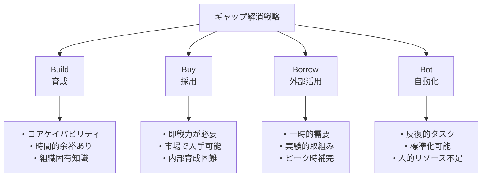
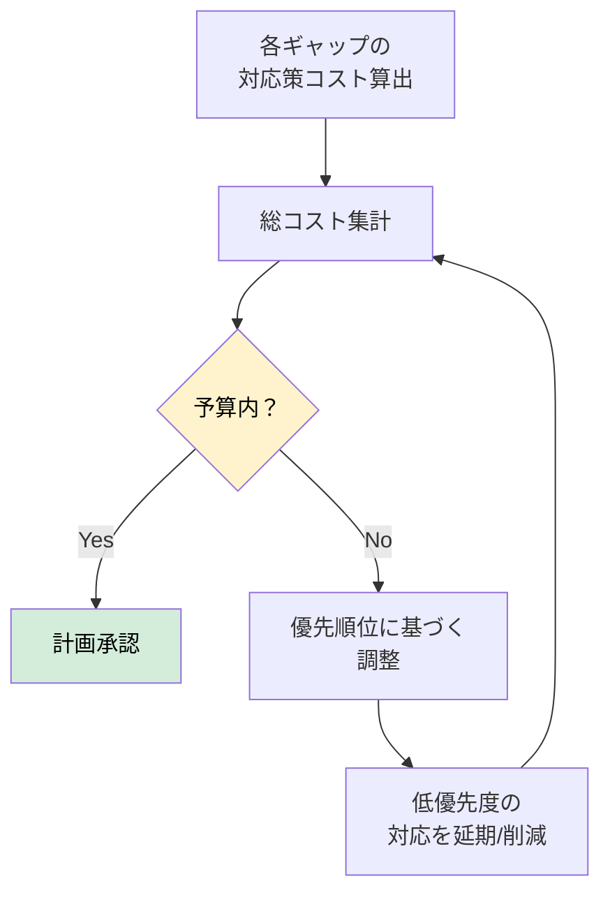
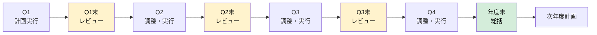
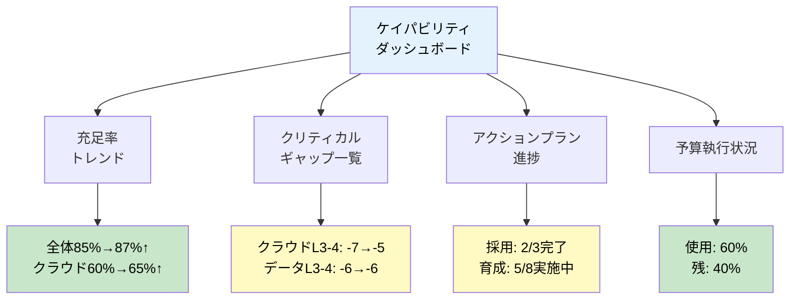

# IT組織におけるケイパビリティ管理フレームワーク
## 第3部：需給キャップへの対応策

## ギャップ対応策：4B戦略

需給ギャップを可視化した後は、そのギャップを解消するための対応策を立案・実行する。

### Build-Buy-Borrow-Bot戦略

ギャップ解消には4つの基本戦略があり、ギャップの性質に応じて使い分ける。

 

### 4B戦略の比較表

| 項目 | Build（育成） | Buy（採用） | Borrow（外部活用） | Bot（自動化） |
|------|-------------|-----------|-----------------|-------------|
| **適用場面** | ・長期的に必要なコアケイパビリティ ・組織固有の知識・経験が必要 ・時間的余裕がある | ・即座に必要なケイパビリティ ・内部育成が困難な高度専門性 ・市場で入手可能なスキル | ・一時的な需要（プロジェクトベース） ・実験的取り組み（技術検証、POC） ・ピーク時の補完 | ・反復的タスク ・標準化可能な作業 ・人的リソース不足を補完 |
| **期間** | 6ヶ月～2年 | 3-6ヶ月 | 3-24ヶ月（形態により変動） | 継続的 |
| **主な手法** | ・構造化育成プログラム ・ジョブローテーション ・社内認定制度 ・外部研修・資格取得支援 | ・戦略的採用計画 ・ダイバーシティ採用 ・テックブランディング ・リファラル制度 | ・コンサルタント（3-6ヶ月） ・フリーランス（3-12ヶ月） ・SES/派遣（6-24ヶ月） ・オフショア（継続的） | ・RPA ・AI/ML ・Low-code/No-code ・DevOps/IaC |
| **実施例** | ・開発エンジニア→クラウドエンジニア（9-12ヶ月） ・PMO→アジャイルPM（6ヶ月） | ・クラウドアーキテクト（L4）2名採用 ・データサイエンティスト（L3-4）3名採用 | ・クラウド移行コンサルタント6ヶ月活用 ・アジャイルコーチ招聘3ヶ月 | ・テスト自動化で需要30%削減 ・RPA導入で保守運用20%効率化 ・CI/CD導入でデプロイ90%削減 |
| **メリット** | ・長期的な組織能力の蓄積 ・従業員エンゲージメント向上 ・比較的低コスト | ・即戦力の確保 ・外部知見の導入 ・新しい視点・文化の取り込み | ・柔軟性が高い ・必要な時だけ活用 ・リスク分散 | ・長期的コスト削減 ・品質向上 ・人材を高付加価値業務に集中 |
| **デメリット** | ・時間がかかる ・育成後の退職リスク ・成果が不確実 | ・高コスト（採用費、給与） ・市場競争が激しい ・組織への適応に時間 | ・組織知識の蓄積なし ・継続的コスト ・セキュリティリスク | ・初期投資が必要 ・メンテナンスコスト ・全てが自動化可能ではない |
| **コスト感** | 低～中 | 高 | 中～高 | 初期高、長期的には低 |
| **効果発現** | 遅い（6ヶ月～2年） | 中（3-6ヶ月） | 早い（即時～3ヶ月） | 中～早い（3-6ヶ月） |
---

 

## アクションプラン策定

各ギャップに対して、以下の要素を含むアクションプランを策定する。

**アクションプランテンプレート:**

| 要素 | 内容 |
|------|------|
| **ギャップ** | クラウドアーキテクト（L3-4）-7名 |
| **ビジネス影響** | 基幹システムクラウド移行（P1）に必須、遅延リスク大 |
| **優先度** | 🔴 最高 |
| **目標** | 6ヶ月以内に7名相当の能力を確保 |
| **戦略** | Buy（採用）+ Borrow（外部）+ Build（育成）の組み合わせ |
| **短期（3ヶ月）** | ・外部採用開始（目標2名） ・外部コンサル契約（2名相当、3ヶ月） ・認定トレーニング実施（5名受講） |
| **中期（6-12ヶ月）** | ・採用完了（2名） ・内部育成（3名がL3達成） ・外部活用継続（1名相当） |
| **長期（1-2年）** | ・追加育成（2名がL3達成） ・外部依存度低減 |
| **予算** | 採用費：¥5,000,000、外部活用：¥12,000,000、育成費：¥3,000,000 |
| **責任者** | クラウド部門長 |
| **KPI** | ・L3以上のクラウド人材数 ・プロジェクトP1の進捗率 ・外部依存度 |
---

 
 

## 予算との整合性確保

すべての対応策は、最終的に予算制約内に収める必要がある。

**予算調整のポイント:**
1. 最優先（🔴）のギャップ対応は削減しない
2. 重要（🟡）レベルで調整（一部延期、Borrowへのシフト等）
3. 低優先度は次年度送り
4. Build（育成）とBorrow（外部活用）のバランス調整

 

## 継続的改善サイクル

計画を立てて終わりではなく、継続的にモニタリングし、改善する。

### KPIによるモニタリング

**主要KPI例:**

| KPI | 目的 | 目標値例 | 測定頻度 |
|-----|------|---------|---------|
| **充足率** | 全体的なケイパビリティの充足度 | 85%以上 | 月次 |
| **クリティカルギャップ数** | 最優先対応が必要なギャップ | 3件以下 | 月次 |
| **育成完了率** | 育成プログラムの完遂率 | 80%以上 | 四半期 |
| **採用充足率** | 計画に対する採用実績 | 80%以上 | 四半期 |
| **内部昇格率** | L2→L3等のレベルアップ率 | 年20%以上 | 半期 |
| **リテンション率** | 重要人材の定着率 | 95%以上 | 四半期 |
| **外部依存度** | 外部活用の比率 | 30%以下 | 月次 |
| **スキル充足スピード** | ギャップ解消までの期間 | 6ヶ月以内 | プロジェクト毎 |
---

 

### 四半期レビューサイクル

**四半期レビューの内容:**

1. **実績確認**
   - KPI達成状況
   - アクションプランの進捗
   - 予算執行状況

2. **ギャップ再評価**
   - 需要の変化（新規プロジェクト、戦略変更）
   - 供給の変化（採用、育成、退職）
   - 優先順位の見直し

3. **対応策の調整**
   - 遅延しているアクションの加速
   - 効果が低い施策の見直し
   - 予算の再配分

4. **次四半期計画**
   - 調整後の目標設定
   - 新規アクションの追加
   - リソース配分の最適化

 

## ダッシュボードによる可視化

継続的なモニタリングには、リアルタイムで状況を把握できるダッシュボードが有効。

**ダッシュボードの主要要素:**

 

## まとめ

この第3部では、ギャップ対応策について解説しました。

### ケイパビリティ管理成功の鍵

1. **4B戦略のバランス**: Build/Buy/Borrow/Botを最適に組み合わせる
2. **継続的改善**: 一度きりではなく、生きた仕組みとして運用
3. **データドリブン**: KPIに基づいた意思決定と進捗管理
4. **予算との整合**: 優先順位に基づいた現実的な計画

 

### 重要な洞察

> **精度30%でも意思決定の80%は可能**

完璧なデータを待つより、不完全でも行動を開始し、段階的に精度を上げることが重要です。

### 次のステップ

1. **現状のベースライン把握**: 可能な範囲でデータ収集
2. **需要予測**: プロジェクトポートフォリオからの粗算出
3. **量的ギャップ分析**: 総人月レベルでの過不足把握
4. **対応策の立案**: 優先順位に基づいたアクションプラン
5. **予算化**: 必要リソースの予算申請
6. **実行とモニタリング**: KPIに基づいた進捗管理

