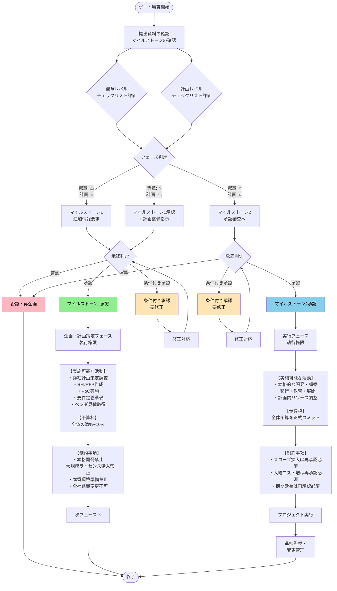

# プロジェクトチャーター概要

プロジェクト憲章（プロジェクトチャーター）は、「何を・なぜ・どこまで・誰の権限でやるプロジェクトなのか」を公式に定義し、承認するための基本文書です。

## 概要と役割

- プロジェクトの目的・目標・範囲・主要メンバー・権限などを一枚にまとめた**契約書的**な位置づけの文書です。
- 経営層やスポンサーがこれを承認することで、「このプロジェクトをやってよい」「このリソースを使ってよい」という公式なゴーサインになります。

 

## 主な記載内容

典型的には次のような項目を含みます。

- プロジェクトの目的・背景・ビジネスニーズ  
- 目標・成功基準（KGI・KPIなど測定可能な指標）  
- スコープ（範囲）とアウトオブスコープ  
- 主要ステークホルダーと組織体制  
- プロジェクトマネージャーの責任と権限  
- 予算・期間・主要マイルストーン  
- 前提条件・制約条件・主要リスク  

 

## プロジェクト計画書との違い

プロジェクト憲章とプロジェクト計画書は、プロジェクトマネジメントの初期段階で作成される重要な文書ですが、目的、タイミング、詳細度が異なります。

### 作成タイミングと責任者

- プロジェクト憲章はプロジェクト開始前にスポンサーや発起人が作成し、承認を得てプロジェクトを正式に立ち上げます。
- 一方、プロジェクト計画書は憲章承認後にプロジェクトマネージャーが作成し、実行フェーズの指針とします。
- この順序により、憲章が「やるべきか」を決め、計画書が「どうやるか」を具体化します。

### 内容の詳細度と焦点

憲章は1-2ページの簡潔な文書で変更しにくく、計画書は「生きた文書」として進行中に更新されます。

| 項目 | プロジェクト憲章  | プロジェクト計画書  |
|---------------|------------------------------------------|--------------------------------------------|
| **目的**  | プロジェクトの正当性・目標・範囲の概要  | 実行のための詳細スケジュール・タスク分解  |
| **詳細度**| 高レベル（なぜ・何を・誰が） | 詳細（いつ・どうやって・リソース配分） |
| **主な内容** | 目的、ステークホルダー、予算概要、権限  | WBS、スケジュール、リスク管理、品質基準 |

### 役割と活用の違い

- 憲章はチームの共通理解とマネージャーの権限を明確化し、計画書は日常の進行管理と変更対応に使われます。
- 両者を連動させることで、手戻りやスコープクリープを防ぎ、成功率を高めます。

   

## なぜ必要か

- 目的・期待値・成功条件を事前にそろえることで、後工程での手戻りや「言った／言わない」を減らせます。
- プロジェクトマネージャーに与えられた権限や利用可能なリソースが明文化されるため、調整や意思決定がスムーズになります。

 

## プロジェクト憲章の記載項目

プロジェクト憲章に必須の項目は、PMBOK準拠で主に10項目程度が標準的に挙げられ、これらでプロジェクトの基本枠組みを明確化します。 
さらに業界特性、社内文化や他の社内決裁フォーマットに合わせて文章量や用語の形式ばり具合を調整するとより扱いやすくなります。

### 必須項目一覧

以下の項目を簡潔に記載し、1-2ページ以内にまとめます。

- **プロジェクト名と概要**: 
    - プロジェクトの名称、背景、ビジネスニーズを1-2文で記述
    - （例: 「社内ERPシステム刷新プロジェクト：業務効率20%向上を目指す」）。

- **目的と目標**: 
    - なぜ実施するのか、SMART基準（Specific, Measurable, Achievable, Realistic, Time-bound）で目標を明記
    - （例: 「2026年3月までに全拠点で稼働、コスト10%削減」）。[8][1]

- **スコープ**: 
    - 含む範囲（In-Scope）と除外範囲（Out-of-Scope）を明確化
    - （例: In: モジュールA/B刷新、Out: ハードウェア更新）。

- **主要ステークホルダーと組織**: 
    - スポンサー、PM、キー担当者、リソース概要をリスト
    - （例: PM: 山田太郎、予算: 5000万円）。
 
- **スケジュールとマイルストーン**: 
    - 高レベル期間と主要節目
    - （例: 開始: 2026/1、完了: 2026/6、設計完了: 2026/3）。
 
### 追加推奨項目

状況に応じて以下の項目を加えます。

- **前提条件・制約・リスク**: 依存事項、予算/人員制約、トップ3リスクと対応方針。
- **成功基準と成果物**: KPI（例: 稼働率95%以上）と主要アウトプット一覧。
- **承認者と日付**: スポンサー署名欄。

 

## 期待効果

「期待効果」は、基本的には**プロジェクト憲章側**に置くべき項目で、プロジェクトの目的・ビジネス上の正当性・成功基準の一部として定義するのが標準的です。

### なぜ憲章側か

- プロジェクト憲章では「ビジネス上の正当性」「期待される成果・便益」を明確にして承認を得ることが目的であり、多くの解説で必須要素として「期待効果」や「ビジネス上の利益」が挙げられています。
- 例えば「コスト10％削減」「リードタイム20％短縮」といった期待効果は、憲章の中の「目的・正当化理由」「測定可能な目標・成功基準」として記載するのが自然です。

### 計画書との関係

- プロジェクト計画書には、憲章で定義した期待効果を前提として「どの施策（スコープ）・成果物でその効果を実現するか」「どのKPIでモニタリングするか」を詳細化して記載します。
- そのため、期待効果そのものは憲章に明記し綴じておき、計画書ではプロジェクト自体の達成手段や品質測定方法・進捗モニタリング計画に集中する、という整理が分かりやすいです。

 
 

# プロジェクトガバナンス

## フェーズ判定の基本ロジック

### マイルストーン1相当（憲章レベル）と判定する場合

**情報の特徴:**
- 目的・期待効果・概略スコープ・概算予算・概略期間・主要ステークホルダー程度まで記載
- WBS、詳細スケジュール、詳細リソース計画、リスク対応案などが粗い、または未整備

**判定:** 
- 「構想・企画フェーズ」としてマイルストーン1のゲート審査対象とする

### マイルストーン2相当（実行計画レベル）と判定する場合

**情報の特徴:**
- WBSレベルのタスク分解がされている
- フェーズ別スケジュール、体制・役割分担が明示されている
- リスク・変更・コミュニケーション計画が具体的に記載されている
- 期待効果に紐づくKPIとモニタリング方法が定義されている

**判定:** 
- 「計画フェーズ完了」としてマイルストーン2のゲート審査対象とする

### 判定ルール（中間的な状態への対応）

- **憲章レベルの内容が曖昧な場合**（目的・期待効果・スコープがブレている）
  - 「マイルストーン1の再審査が必要」とし、マイルストーン2承認には進まない

- **計画書系項目の整備率が70%未満の場合**
  - 「マイルストーン1のみ判定」とする
  
 

## マイルストーン承認後の執行権限

各マイルストーン承認により使用できる予算・リソース・裁量の範囲を段階的に設定します。

 

## マイルストーン承認後の執行権限

| 項目 | マイルストーン1承認前 （構想・提案段階） | マイルストーン1承認後 （企画・計画策定フェーズ） | マイルストーン2承認後 （実行フェーズ） |
|------|-----------------------------------|-------------------------------------------|----------------------------------|
| **認められる活動** | ・構想立案・アイデア検討 ・簡易な情報収集（公開情報調査） ・非公式な関係者ヒアリング ・概算見積もりの依頼 ・憲章ドラフト作成 ・予備的な技術調査 | ・詳細計画策定のための調査活動 ・RFI/RFP作成 ・PoC（概念実証）の実施 ・要件定義準備 ・外部ベンダとの見積り取得 ・簡易PoC ・業務ヒアリング | ・計画書に基づく本格的な実行（開発・構築・移行・教育・展開など） ・計画内でのリソース調整（人員アサイン変更、軽微なスケジュール調整など）をPM裁量で実施 |
| **制約事項** | ・予算執行は原則不可（既存業務の範囲内で実施） ・外部への発注・契約は禁止 ・組織横断的な活動は限定的 ・公式なプロジェクト体制の構築は不可 ・システムやツールの導入・変更は禁止 | ・本格的な開発・構築作業は禁止 ・大規模ライセンス購入は禁止 ・本番環境準備は禁止 ・プロジェクトブランドでの全社的な組織変更は原則不可 ・大規模研修などの実施は原則不可 | ・承認された範囲を超えるスコープ拡大は変更管理プロセス＋再承認が必須 ・大幅なコスト増は変更管理プロセス＋再承認が必須 ・期間延長は変更管理プロセス＋再承認が必須 ・一定以上の超過見込み時は、ポートフォリオの再優先順位付け・縮小・中止も選択肢とする |
| **予算の扱い** | ・予算配賦なし ・既存部門予算または個人の業務時間内で対応 ・外部コストは原則発生させない | ・「企画・調査枠」「計画立案枠」として全体予算の一部（数%〜10%程度）のみコミット | ・全体予算（またはフェーズ毎予算）を正式コミット ・ポートフォリオ上も「実行中案件」として位置づける |
| **承認者** | - | ・事業側スポンサー ・IT側/CIO等 | ・ステアリングコミッティ ・PMO/CIO |
---

 

## フェーズ不明案件を扱うための運用ルール

PMOやIT投資委員会で以下のフローを明文化し、現場の判断ブレを防止します。

### ステップ1: 提出資料の評価
- 「憲章レベルチェックリスト」で採点
- 「計画レベルチェックリスト」で採点

### ステップ2: フェーズ判定
| 憲章レベル | 計画レベル | 判定結果 |
|-----------|-----------|---------|
| △ | × | マイルストーン1（追加情報要求あり） |
| ○ | △ | マイルストーン1承認＋計画整備指示 |
| ○ | ○ | マイルストーン2承認審査へ |

### ステップ3: 承認ステータスと執行権限の紐付け

承認区分ごとに執行可能な範囲をマトリクスで定義:

- **企画のみ承認（MS1）** → 企画・調査活動のみ可
- **実行計画承認（MS2）** → 本格実行可
- **条件付き承認（要修正）** → 条件クリア後に権限付与
- **否認（再企画）** → 執行権限なし

 
 
