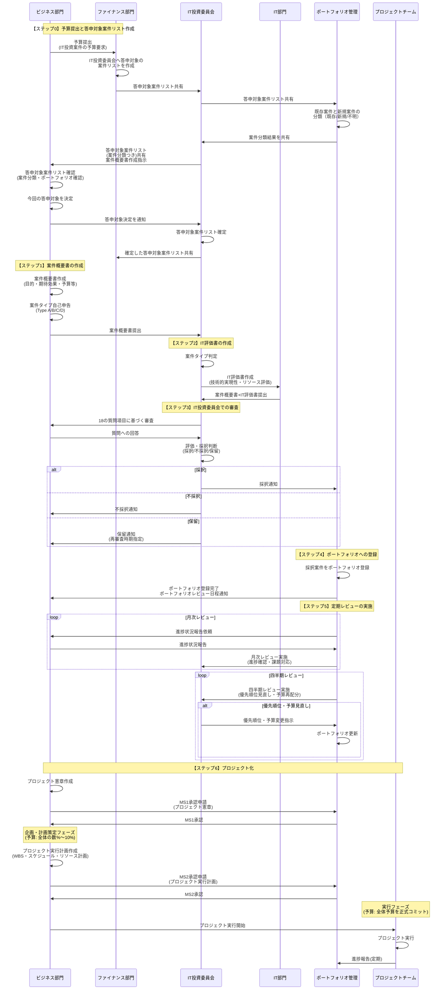

# IT投資ポートフォリオ管理 ドキュメント集

このフォルダには、IT投資ポートフォリオ管理に関する包括的なガイドラインとテンプレートが格納されています。

## 📁 フォルダ構成

```
PORTFOLIO-management/
├── README.md (本ファイル)
├── portfolio-management.md              # ポートフォリオ管理の全体フローと基本概念
├── portfolio-management-format.md        # 案件概要書・IT評価書のテンプレート
├── it-investment-committee-questions.md # IT投資委員会での質問項目と評価基準
├── portfolio-review-meeting.md          # ポートフォリオレビューの実施方法
├── portfolio-review-kpi.md              # ポートフォリオマネジメントのKPI定義
└── project-charter.md                   # プロジェクト憲章とガバナンス
```

<br>

## 📚 ドキュメント概要

### 1. portfolio-management.md
**IT投資ポートフォリオ管理の全体像**

- **目的**: IT投資ポートフォリオ管理の基本概念と全体フローを説明
- **主な内容**:
  - IT投資ポートフォリオ管理の全体フロー
  - 案件タイプ（Type A/B/C/D）の分類
  - ポートフォリオ段階での文書（案件概要書・IT評価書）
  - RACI（責任分担）の定義
  - ポートフォリオの構成要素（採択案件管理、優先順位付け、予算配賦、リソース配分、依存関係）
  - ポートフォリオの定期レビュー（月次・四半期・年次）
  - ポートフォリオからプロジェクトへの移行プロセス

### 2. portfolio-management-format.md
**案件概要書・IT評価書のテンプレート集**

- **目的**: IT投資案件の提案と評価に使用する標準フォーマットを提供
- **主な内容**:
  - **IT投資案件概要書テンプレート**: ビジネス部門が作成する案件提案書のフォーマット
    - 基本情報、目的・背景、期待効果、概算予算、スコープ、スケジュール、ステークホルダー、リスク、案件タイプ自己申告など
  - **IT評価書テンプレート**: IT部門が作成する技術評価書のフォーマット（案件タイプ別）
    - Type A: ベンダー提案型
    - Type B: 製品導入型（SaaS/新技術）
    - Type C: 既存改修型
    - Type D: 新規開発型

### 3. it-investment-committee-questions.md
**IT投資委員会での質問項目と評価基準**

- **目的**: IT投資委員会での審査を標準化し、起案者の準備度を客観的に評価
- **主な内容**:
  - **18の質問項目**: 案件タイプ別のウェイト付き質問一覧
    - 質問カテゴリ: 目的・背景、期待効果、予算、スコープ、スケジュール、リスク、実行体制、他案件との関係、戦略整合性、タイミング、段階的実施
  - **回答評価基準**: GOOD/STANDARD/BADの3段階評価
    - 評価項目: 具体性、根拠、リスク認識、準備度、責任明確化（各5段階評価）
  - **回答例**: GOOD/STANDARD/BADの具体例とスコア
  - **タイプ別評価の重点ポイント**: 各案件タイプで特に重視すべき質問項目

### 4. portfolio-review-meeting.md
**ポートフォリオレビューの実施方法**

- **目的**: ポートフォリオの定期レビューを効果的に実施するための手順とテンプレートを提供
- **主な内容**:
  - **レビューサイクル**: 日次・週次・月次・四半期・年次・臨時レビューの種類と頻度
  - **月次レビュープロセス**:
    - 事前準備（データ収集、分析・資料作成）
    - レビュー会議の実施（アジェンダ、進行方法）
    - レビュー後のアクション（議事録作成、情報更新）
  - **四半期レビュープロセス**:
    - 深堀り分析（案件別パフォーマンス、投資効果、ポートフォリオバランス）
    - 優先順位見直し、予算再配分、新規案件審査
  - **ポートフォリオダッシュボード**: リアルタイム可視化の構成と活用方法
  - **臨時レビューのトリガー**: 重大問題発生時の対応プロセス

### 5. portfolio-review-kpi.md
**ポートフォリオマネジメントのKPI定義**

- **目的**: ポートフォリオマネジメントの効果を測定するためのKPI体系を定義
- **主な内容**:
  - **4つのKPIカテゴリ**:
    1. レビューサイクルのKPI（プロセスの健全性）
       - レビュー実施の確実性、レビューの質、レビューの効果、プロセスの効率性
    2. ポートフォリオダッシュボードのKPI（可視化の有効性）
       - データの正確性・鮮度、ダッシュボードの活用度、有効性、網羅性
    3. 臨時レビューのKPI（問題対応の迅速性）
       - 臨時レビューの適時性、効果、効率性、エスカレーションの適切性
    4. ポートフォリオ全体のKPI（投資成果）
       - 案件の健全性、投資効果、リソース最適化、ポートフォリオバランス
  - **KPI定義書サンプル**: 各KPIの詳細定義（目標値、測定方法、データソース、アクション基準）
  - **KPIレポートサンプル**: 月次KPIレポートのフォーマット

### 6. project-charter.md
**プロジェクト憲章とガバナンス**

- **目的**: ポートフォリオ承認後のプロジェクト化プロセスとガバナンスを定義
- **主な内容**:
  - **プロジェクト憲章の概要**: 目的、役割、記載内容、プロジェクト計画書との違い
  - **プロジェクトガバナンス**: 
    - マイルストーン1（MS1）とマイルストーン2（MS2）の承認プロセス
    - フェーズ判定ロジック（憲章レベル vs 計画レベル）
    - 承認後の執行権限（予算・活動範囲の制約）
  - **プロジェクト憲章の項目・サンプル**: 新規投資・延命投資の記載例
  - **審査シート**: プロジェクト憲章・計画書の審査チェックリスト
  - **DX組織における役割定義**: ビジネス部門・デジタル部門・IT部門の役割とRACI

<br>

## 🔄 ドキュメント間の関係性

```
【提案フェーズ】
portfolio-management-format.md
  ├─ 案件概要書（ビジネス部門作成）
  └─ IT評価書（IT部門作成）
       ↓
it-investment-committee-questions.md
  └─ IT投資委員会での審査・評価
       ↓
【ポートフォリオ管理フェーズ】
portfolio-management.md
  └─ ポートフォリオの構成・管理
       ↓
portfolio-review-meeting.md
  └─ 定期レビューの実施
       ↓
portfolio-review-kpi.md
  └─ レビュー効果の測定
       ↓
【プロジェクト化フェーズ】
project-charter.md
  └─ プロジェクト憲章作成・承認
       ↓
プロジェクト実行
```

<br>

## 🎯 主要な概念

### 案件タイプ分類
- **Type A: ベンダー提案型**: 既存ITベンダーから具体的提案を受けている
- **Type B: 製品導入型**: SaaS/パッケージ等、製品が存在している
- **Type C: 既存改修型**: 既存システムの改修・機能追加
- **Type D: 新規開発型**: ゼロから開発が必要

### レビューサイクル
- **日次**: ダッシュボード確認（PMO事務局）
- **週次**: 課題の早期発見（PMO事務局）
- **月次**: 進捗・課題の詳細確認（PMO + IT部門長）
- **四半期**: 優先順位見直し・予算再配分（IT投資委員会）
- **年次**: 新年度ポートフォリオ策定（経営会議 + IT投資委員会）
- **臨時**: 緊急案件・重大問題対応（IT投資委員会）

### マイルストーン承認
- **MS1（マイルストーン1）**: プロジェクト憲章承認
  - 企画・計画策定フェーズへの進行を承認
  - 予算枠: 全体の数%〜10%
- **MS2（マイルストーン2）**: プロジェクト実行計画承認
  - 実行フェーズへの進行を承認
  - 予算枠: 全体予算を正式コミット

### ステータス管理
- **🟢 Green**: 計画通り、重大な課題なし
- **🟡 Amber**: 軽微な遅延・課題あり、リカバリー可能
- **🔴 Red**: 重大な遅延・課題、介入必要
- **⚪ 保留**: 一時中断中

<br>

## 📖 使用方法

### 新規案件の提案から承認まで



### KPI管理の実施

1. **KPI定義の確認** (`portfolio-review-kpi.md`参照)
   - 4つのカテゴリ、24指標の定義を確認

2. **データ収集・測定**
   - 各KPIのデータソースからデータを収集
   - 月次・四半期で測定

3. **KPIレポート作成**
   - 月次KPIレポートを作成
   - 目標未達項目の改善策を検討

<br>
<br>

**APPENDIX**

# AI自動化が可能なタスク一覧

## 1. 文書作成・支援タスク

#### 高自動化可能
- **案件概要書の自動生成支援**
  - テンプレートへの入力支援
  - 類似案件からの情報抽出・提案
  - 期待効果の計算ロジック検証
  - 必須項目の漏れチェック

- **IT評価書のドラフト生成**
  - 案件タイプ判定（Type A/B/C/D）
  - 類似案件の評価書からの情報抽出
  - 技術リスクの自動チェックリスト生成
  - ベンダー提案書の要約・分析

- **プロジェクト憲章・計画書のドラフト生成**
  - テンプレートへの自動入力
  - 案件概要書からの情報引き継ぎ
  - 必須項目の網羅性チェック

#### 中自動化可能
- **議事録の自動生成**
  - 会議音声からの文字起こし
  - アクションアイテムの自動抽出
  - 決定事項の要約

<br>

## 2. 評価・審査タスク

#### 高自動化可能
- **18の質問項目への回答評価**
  - 回答テキストの自動スコアリング（具体性・根拠・リスク認識・準備度・責任明確化）
  - GOOD/STANDARD/BADの自動判定
  - 案件タイプ別ウェイト付き総合スコア算出
  - 改善提案の自動生成

- **プロジェクト憲章・計画書の審査チェック**
  - チェックリスト項目の自動判定（Yes/No/要修正）
  - 憲章と計画書の整合性チェック
  - 必須項目の漏れ検出
  - リスク評価の自動化

#### 中自動化可能
- **優先順位付けの支援**
  - 評価軸（ビジネスインパクト、戦略適合性、緊急性等）の自動スコアリング
  - 類似案件との比較分析
  - 優先順位の提案

<br>

## 3. データ収集・分析タスク

#### 高自動化可能
- **月次レビュー資料の自動生成**
  - 各案件の進捗データ自動収集（プロジェクト管理ツール連携）
  - ポートフォリオサマリーの自動生成
  - ステータス別案件数の自動集計
  - Red/Amber案件の自動抽出と詳細分析

- **KPIの自動測定・レポート生成**
  - 24指標の自動計算（データソース連携）
  - 月次KPIレポートの自動生成
  - 目標未達項目の自動検出
  - トレンド分析と予測

- **予算執行状況の自動集計**
  - 予算消化率の自動計算
  - 超過見込み案件の自動検出
  - 予算トレンドの可視化

- **リソース状況の自動分析**
  - スキル別稼働率の自動計算
  - リソース競合の自動検出
  - リソース調整案の自動提案

#### 中自動化可能
- **四半期レビューの深堀り分析**
  - 案件別パフォーマンス分析（進捗率・予算消化率の比較）
  - 投資効果の中間評価
  - ポートフォリオバランス分析
  - 依存関係の影響分析

<br>

## 4. ダッシュボード・可視化タスク

#### 高自動化可能
- **ポートフォリオダッシュボードの自動更新**
  - リアルタイムデータ更新
  - ステータス別可視化（🟢🟡🔴）
  - 予算トレンドグラフの自動生成
  - ガントチャートの自動更新

- **アラートの自動生成**
  - Red案件の自動検出と通知
  - 予算超過リスクの早期警告
  - スケジュール遅延の自動検知
  - リソース競合の自動通知

<br>

## 5. 分類・判定タスク

#### 高自動化可能
- **案件タイプの自動判定**
  - 案件概要書の内容からType A/B/C/Dを自動分類
  - 既存案件と新規案件の自動分類
  - 類似案件の自動検索・推薦

- **ステータス判定の自動化**
  - 進捗・予算・リスクデータから🟢🟡🔴を自動判定
  - ステータス変更の履歴管理

<br>

## 6. レビュー支援タスク

#### 中自動化可能
- **臨時レビューのトリガー検知**
  - 重大遅延の自動検出（マイルストーン遅延2ヶ月以上）
  - 重大予算超過の自動検出（20%以上）
  - リスク顕在化の自動検知

- **レビューアジェンダの自動生成**
  - 前回アクションアイテムの自動抽出
  - 重点レビュー案件の自動選定
  - アジェンダの自動作成

<br>

## 7. 文書整合性管理タスク

#### 高自動化可能
- **文書間の整合性チェック**
  - 案件概要書 → プロジェクト憲章の整合性検証
  - 憲章 → 計画書の整合性検証
  - スコープ変更の自動検出
  - 予算・スケジュール変更の自動検出

<br>

## 8. レポート・通知タスク

#### 高自動化可能
- **定期レポートの自動配信**
  - 月次レビュー資料の自動配布
  - KPIレポートの自動配信
  - ステータス変更通知の自動送信

<br>

## 実装時の考慮事項

### 自動化しやすいタスクの特徴
- ルールベースの判定が可能
- 構造化データの処理
- テンプレートベースの文書生成
- 数値計算・集計

### 注意が必要なタスク
- 最終的な意思決定（人間の判断が必要）
- 戦略的な優先順位付け（経営判断が必要）
- 複雑なリスク評価（専門知識が必要）
- ステークホルダー調整（人間関係が必要）

