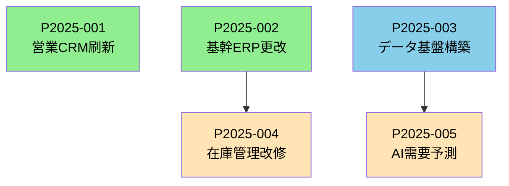

# IT投資ポートフォリオ概要

## IT投資ポートフォリオ管理の全体フロー

```
【提案フェーズ】
ビジネス部門
  ├─ 案件概要書作成（全案件共通）
  └─ IT部門へ提出
       ↓
IT部門
  ├─ 案件タイプ判定（A/B/C/D）
  ├─ 該当するIT評価書作成
  │   ├─ Type A: ベンダー提案型
  │   ├─ Type B: 製品導入型
  │   ├─ Type C: 既存改修型
  │   └─ Type D: 新規開発型
  └─ IT投資委員会へ提出
       ↓
【IT投資委員会】
  ├─ 案件概要書 + IT評価書をセットで審査
  ├─ 採択/不採択判断
  ├─ 優先順位付け
  └─ 予算配賦決定
       ↓
【IT投資ポートフォリオ】
  採択案件のリスト
  ├─ 優先順位
  ├─ 予算配賦額
  ├─ 想定スケジュール
  ├─ リソース配分計画
  └─ 依存関係マップ
       ↓
【プロジェクト化】
  各案件について
  ├─ プロジェクト憲章作成（MS1承認）
  ├─ プロジェクト実行計画作成（MS2承認）
  └─ プロジェクト実行
```

### IT評価の案件タイプ

| タイプ | 説明 | 評価対象の有無 | 評価の焦点 |
|--------|------|---------------|-----------|
| **Type A: ベンダー提案型** | 既存ITベンダーから具体的な提案を受けている | ◎ 提案書あり | 提案内容の妥当性評価 |
| **Type B: 製品導入型** | SaaS/パッケージ等、製品が存在している | ◎ 製品仕様あり | 製品適合性評価 |
| **Type C: 既存改修型** | 既存システムの改修・機能追加 | △ 既存システムあり | 改修影響範囲評価 |
| **Type D: 新規開発型** | ゼロから開発が必要 | × 評価対象なし | 技術選定・実現性評価 |

<br>

## ポートフォリオ段階での文書

### 文書作成の課題

- **ポートフォリオレベル**：案件の採択・優先順位付け・予算配賦
- **プロジェクトレベル**：プロジェクト憲章（MS1）→ 計画書（MS2）

**ギャップ**：
- ポートフォリオで「採択判断」するには、何らかの**案件情報**が必要
- しかし、プロジェクト憲章はポートフォリオ承認**後**に作成するのか？

### 案件概要書・IT評価書の作成

```
【ビジネス部門】
案件概要書（1-2ページ）
  ├─ 目的・期待効果
  ├─ 概算予算・期間
  ├─ ビジネスインパクト
  └─ 概略リスク
    ↓
【IT部門】
IT評価書
  ├─ 技術的実現性（インフラ・セキュリティ・運用負荷・技術負債・他案件との依存関係）
  └─ リソース制約（保有リソース・リソース競合）
    ↓
【IT投資委員会】
両文書をセットで審査
採択・優先順位付け
    ↓
【プロジェクト段階】
プロジェクト憲章（MS1承認用）
  └─ より詳細化した内容
```

**メリット:**
- ポートフォリオ判断に必要な情報のみに絞れる
- 不採択案件への工数を最小化

**デメリット:**
- 文書が重複する可能性
- 案件概要書→プロジェクト憲章の整合性管理が必要

### RACIの再定義

| 役割 | ビジネス部門 | IT部門 | デジタル部門 | IT投資委員会 |
|------|-------------|--------|-------------|-------------|
| **案件概要書作成** | R/A | C | C | - |
| **IT評価書作成** | I | R/A | C | - |
| **ポートフォリオ採択判断** | C | C | C | **R/A** |
| **プロジェクト憲章ドラフト作成** | R/A | C | C | I |
| **優先順位確定・予算配賦** | C | C | C | **R/A** |
| **憲章正式版承認（MS1）** | **R/A** | C | C | I |

<br>

## IT投資ポートフォリオの構成要素

### ポートフォリオリストの構成

| 案件ID | 案件名 | 提案部門 | タイプ | 優先度 | 予算配賦額 | 開始予定 | 完了予定 | ステータス | 依存案件 |
|--------|--------|---------|--------|--------|-----------|---------|---------|-----------|---------|
| P2025-001 | 営業CRM刷新 | 営業本部 | B | 高 | 5,000万 | 2025/4 | 2026/3 | 承認済 | - |
| P2025-002 | 基幹ERP更改 | 経営企画 | A | 高 | 8,000万 | 2025/6 | 2026/6 | 承認済 | - |
| P2025-003 | データ基盤構築 | IT部門 | D | 高 | 1.2億 | 2025/7 | 2026/12 | 承認済 | - |
| P2025-004 | 在庫管理改修 | 製造本部 | C | 中 | 1,500万 | 2025/10 | 2026/3 | 承認済 | P2025-002 |
| P2025-005 | AI需要予測 | 製造本部 | B | 中 | 3,000万 | 2026/1 | 2026/9 | 承認済 | P2025-003 |
---

<br>

## IT投資ポートフォリオの管理項目

### 1. 採択案件の管理

**記録事項:**
- 採択日時・採択理由
- 不採択案件の記録（理由・再提案条件）
- 保留案件の記録（保留理由・再審査時期）

### 2. 優先順位付けの基準

**評価軸（例）:**
| 評価軸 | 配点 | 判断基準 |
|--------|------|---------|
| ビジネスインパクト | 30点 | 売上・コスト削減効果 |
| 戦略適合性 | 25点 | 経営戦略・DX戦略との整合性 |
| 緊急性 | 20点 | 法対応、システム老朽化等 |
| 実現可能性 | 15点 | IT評価書での判定 |
| リソース制約 | 10点 | 人材・インフラの確保可能性 |

### 3. 予算配賦の管理

**予算枠の分類:**
```
全社IT投資予算: 10億円/年
  ├─ 戦略的投資枠: 6億円
  │   ├─ DX推進案件: 3.5億円
  │   ├─ 業務効率化案件: 2.0億円
  │   └─ 新規事業案件: 0.5億円
  │
  ├─ 維持・延命投資枠: 3億円
  │   ├─ システム更改: 2.0億円
  │   └─ 保守・改修: 1.0億円
  │
  └─ 予備枠: 1億円
      └─ 緊急対応・機会対応
```

### 4. リソース配分計画

**IT人材のアサイン計画:**
```
2025年度 IT人材配分（延べ人月）
  ├─ SAP専門家: 36人月 → 3案件に配分
  ├─ クラウドエンジニア: 48人月 → 4案件に配分
  ├─ データサイエンティスト: 24人月 → 2案件に配分
  └─ PMO: 60人月 → 全案件支援
```

### 5. 依存関係の可視化



<br>

## IT投資ポートフォリオの定期レビュー

### レビューサイクル

| レビュー種別 | 頻度 | 目的 | 参加者 |
|-------------|------|------|--------|
| **月次レビュー** | 毎月 | 進捗確認、課題対応 | IT投資委員会事務局 |
| **四半期レビュー** | 3ヶ月毎 | 優先順位見直し、予算再配分 | IT投資委員会 |
| **年次レビュー** | 年1回 | 新年度ポートフォリオ策定 | 経営会議・IT投資委員会 |

### レビューで確認する事項

1. **進捗状況**
   - 予定通り進行中の案件
   - 遅延している案件とその影響
   - 完了した案件の成果

2. **リソース状況**
   - IT人材の稼働状況
   - リソース競合の発生
   - 外部リソースの活用状況

3. **予算執行状況**
   - 予算消化率
   - 超過見込み案件
   - 未消化予算の再配分

4. **新規案件の追加**
   - 緊急性の高い案件の割り込み
   - 予備枠からの予算配賦

5. **案件の中止・延期判断**
   - 期待効果が見込めなくなった案件
   - リソース制約により継続困難な案件

<br>

## ポートフォリオからプロジェクトへの移行

### 移行タイミング

```
IT投資ポートフォリオ承認
    ↓
【準備期間】
  ├─ プロジェクト憲章ドラフト作成
  ├─ PMアサイン
  └─ 初期体制構築
    ↓
【MS1承認】
  プロジェクト憲章正式承認
    ↓
【企画・計画策定フェーズ】
  ├─ 詳細要件定義
  ├─ ベンダー選定
  └─ プロジェクト実行計画作成
    ↓
【MS2承認】
  プロジェクト実行計画承認
    ↓
【実行フェーズ】
  プロジェクト実行
```

<br>

## 小括：IT投資ポートフォリオの位置づけ

```
ビジネス戦略
    ↓
ビジネス投資ポートフォリオ
    ↓（IT投資枠の配賦）
IT投資ポートフォリオ ←【ここが今回整理した内容】
  ├─ 案件概要書（ビジネス部門）
  ├─ IT評価書（IT部門）Type A/B/C/D
  ├─ IT投資委員会での審査
  └─ 採択・優先順位・予算配賦の決定
    ↓
個別プロジェクト
  ├─ プロジェクト憲章（MS1）
  ├─ プロジェクト実行計画（MS2）
  └─ プロジェクト実行
```

<br>
<br>
