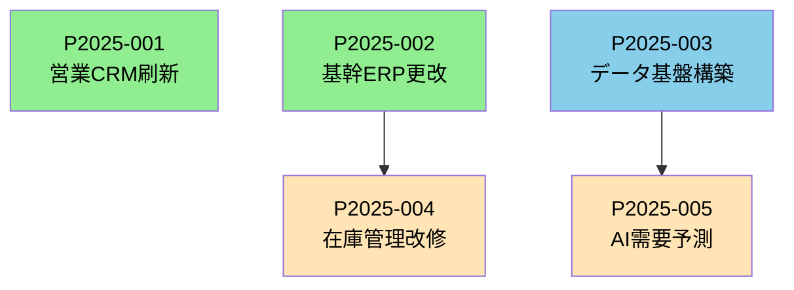

# IT投資ポートフォリオ概要

## IT投資ポートフォリオ管理の全体フロー

```
【提案フェーズ】
ビジネス部門
  ├─ 案件概要書作成（全案件共通）
  └─ IT部門へ提出
       ↓
IT部門
  ├─ 案件タイプ判定（A/B/C/D）
  ├─ 該当するIT評価書作成
  │   ├─ Type A: ベンダー提案型IT評価書
  │   ├─ Type B: 製品導入型IT評価書
  │   ├─ Type C: 既存改修型IT評価書
  │   └─ Type D: 新規開発型IT評価書
  └─ IT投資委員会へ提出
       ↓
【IT投資委員会】
  ├─ 案件概要書 + IT評価書をセットで審査
  ├─ 採択/不採択判断
  ├─ 優先順位付け
  └─ 予算配賦決定
       ↓
【IT投資ポートフォリオ】
  採択案件のリスト
  ├─ 優先順位
  ├─ 予算配賦額
  ├─ 想定スケジュール
  ├─ リソース配分計画
  └─ 依存関係マップ
       ↓
【プロジェクト化】
  各案件について
  ├─ プロジェクト憲章作成（MS1承認）
  ├─ プロジェクト実行計画作成（MS2承認）
  └─ プロジェクト実行
```

### IT評価の案件タイプ

| タイプ | 説明 | 評価対象の有無 | 評価の焦点 |
|--------|------|---------------|-----------|
| **Type A: ベンダー提案型** | 既存ITベンダーから具体的な提案を受けている | ◎ 提案書あり | 提案内容の妥当性評価 |
| **Type B: 製品導入型** | SaaS/パッケージ等、製品が存在している | ◎ 製品仕様あり | 製品適合性評価 |
| **Type C: 既存改修型** | 既存システムの改修・機能追加 | △ 既存システムあり | 改修影響範囲評価 |
| **Type D: 新規開発型** | ゼロから開発が必要 | × 評価対象なし | 技術選定・実現性評価 |

<br>

## ポートフォリオ段階での文書

### 文書作成の課題

- **ポートフォリオレベル**：案件の採択・優先順位付け・予算配賦
- **プロジェクトレベル**：プロジェクト憲章（MS1）→ 計画書（MS2）

**ギャップ**：
- ポートフォリオで「採択判断」するには、何らかの**案件情報**が必要
- しかし、プロジェクト憲章はポートフォリオ承認**後**に作成するのか？

### 案件概要書・IT評価書の作成

```
【ビジネス部門】
案件概要書（1-2ページ）
  ├─ 目的・期待効果
  ├─ 概算予算・期間
  ├─ ビジネスインパクト
  └─ 概略リスク
    ↓
【IT部門】
IT評価書
  ├─ 技術的実現性（インフラ・セキュリティ・運用負荷・技術負債・他案件との依存関係）
  └─ リソース制約（保有リソース・リソース競合）
    ↓
【IT投資委員会】
両文書をセットで審査
採択・優先順位付け
    ↓
【プロジェクト段階】
プロジェクト憲章（MS1承認用）
  └─ より詳細化した内容
```

**メリット:**
- ポートフォリオ判断に必要な情報のみに絞れる
- 不採択案件への工数を最小化

**デメリット:**
- 文書が重複する可能性
- 案件概要書→プロジェクト憲章の整合性管理が必要

### RACIの再定義

| 役割 | ビジネス部門 | IT部門 | デジタル部門 | IT投資委員会 |
|------|-------------|--------|-------------|-------------|
| **案件概要書作成** | R/A | C | C | - |
| **IT評価書作成** | I | R/A | C | - |
| **ポートフォリオ採択判断** | C | C | C | **R/A** |
| **プロジェクト憲章ドラフト作成** | R/A | C | C | I |
| **優先順位確定・予算配賦** | C | C | C | **R/A** |
| **憲章正式版承認（MS1）** | **R/A** | C | C | I |

<br>

## IT投資ポートフォリオの構成要素

### ポートフォリオリストの構成

| 案件ID | 案件名 | 提案部門 | タイプ | 優先度 | 予算配賦額 | 開始予定 | 完了予定 | ステータス | 依存案件 |
|--------|--------|---------|--------|--------|-----------|---------|---------|-----------|---------|
| P2025-001 | 営業CRM刷新 | 営業本部 | B | 高 | 5,000万 | 2025/4 | 2026/3 | 承認済 | - |
| P2025-002 | 基幹ERP更改 | 経営企画 | A | 高 | 8,000万 | 2025/6 | 2026/6 | 承認済 | - |
| P2025-003 | データ基盤構築 | IT部門 | D | 高 | 1.2億 | 2025/7 | 2026/12 | 承認済 | - |
| P2025-004 | 在庫管理改修 | 製造本部 | C | 中 | 1,500万 | 2025/10 | 2026/3 | 承認済 | P2025-002 |
| P2025-005 | AI需要予測 | 製造本部 | B | 中 | 3,000万 | 2026/1 | 2026/9 | 承認済 | P2025-003 |
---

<br>

## IT投資ポートフォリオの管理項目

### 1. 採択案件の管理

**記録事項:**
- 採択日時・採択理由
- 不採択案件の記録（理由・再提案条件）
- 保留案件の記録（保留理由・再審査時期）

### 2. 優先順位付けの基準

**評価軸（例）:**
| 評価軸 | 配点 | 判断基準 |
|--------|------|---------|
| ビジネスインパクト | 30点 | 売上・コスト削減効果 |
| 戦略適合性 | 25点 | 経営戦略・DX戦略との整合性 |
| 緊急性 | 20点 | 法対応、システム老朽化等 |
| 実現可能性 | 15点 | IT評価書での判定 |
| リソース制約 | 10点 | 人材・インフラの確保可能性 |

### 3. 予算配賦の管理

**予算枠の分類:**
```
全社IT投資予算: 10億円/年
  ├─ 戦略的投資枠: 6億円
  │   ├─ DX推進案件: 3.5億円
  │   ├─ 業務効率化案件: 2.0億円
  │   └─ 新規事業案件: 0.5億円
  │
  ├─ 維持・延命投資枠: 3億円
  │   ├─ システム更改: 2.0億円
  │   └─ 保守・改修: 1.0億円
  │
  └─ 予備枠: 1億円
      └─ 緊急対応・機会対応
```

### 4. リソース配分計画

**IT人材のアサイン計画:**
```
2025年度 IT人材配分（延べ人月）
  ├─ SAP専門家: 36人月 → 3案件に配分
  ├─ クラウドエンジニア: 48人月 → 4案件に配分
  ├─ データサイエンティスト: 24人月 → 2案件に配分
  └─ PMO: 60人月 → 全案件支援
```

### 5. 依存関係の可視化



<br>

## IT投資ポートフォリオの定期レビュー

### レビューサイクル

| レビュー種別 | 頻度 | 目的 | 参加者 |
|-------------|------|------|--------|
| **月次レビュー** | 毎月 | 進捗確認、課題対応 | IT投資委員会事務局 |
| **四半期レビュー** | 3ヶ月毎 | 優先順位見直し、予算再配分 | IT投資委員会 |
| **年次レビュー** | 年1回 | 新年度ポートフォリオ策定 | 経営会議・IT投資委員会 |

### レビューで確認する事項

1. **進捗状況**
   - 予定通り進行中の案件
   - 遅延している案件とその影響
   - 完了した案件の成果

2. **リソース状況**
   - IT人材の稼働状況
   - リソース競合の発生
   - 外部リソースの活用状況

3. **予算執行状況**
   - 予算消化率
   - 超過見込み案件
   - 未消化予算の再配分

4. **新規案件の追加**
   - 緊急性の高い案件の割り込み
   - 予備枠からの予算配賦

5. **案件の中止・延期判断**
   - 期待効果が見込めなくなった案件
   - リソース制約により継続困難な案件

<br>

## ポートフォリオからプロジェクトへの移行

### 移行タイミング

```
IT投資ポートフォリオ承認
    ↓
【準備期間】
  ├─ プロジェクト憲章ドラフト作成
  ├─ PMアサイン
  └─ 初期体制構築
    ↓
【MS1承認】
  プロジェクト憲章正式承認
    ↓
【企画・計画策定フェーズ】
  ├─ 詳細要件定義
  ├─ ベンダー選定
  └─ プロジェクト実行計画作成
    ↓
【MS2承認】
  プロジェクト実行計画承認
    ↓
【実行フェーズ】
  プロジェクト実行
```

<br>

## 小括：IT投資ポートフォリオの位置づけ

```
ビジネス戦略
    ↓
ビジネス投資ポートフォリオ
    ↓（IT投資枠の配賦）
IT投資ポートフォリオ ←【ここが今回整理した内容】
  ├─ 案件概要書（ビジネス部門）
  ├─ IT評価書（IT部門）Type A/B/C/D
  ├─ IT投資委員会での審査
  └─ 採択・優先順位・予算配賦の決定
    ↓
個別プロジェクト
  ├─ プロジェクト憲章（MS1）
  ├─ プロジェクト実行計画（MS2）
  └─ プロジェクト実行
```

<br>
<br>

# サンプル集

## IT投資案件概要書テンプレート

### 基本情報

| 項目 | 内容 |
|------|------|
| 案件ID | （事務局記入欄） |
| 案件名 | |
| 提案部門 | |
| 提案責任者 | 氏名・役職 |
| 提案日 | YYYY/MM/DD |
| 想定開始時期 | YYYY/MM |
| 想定完了時期 | YYYY/MM |
| 想定プロジェクト期間 | XX ヶ月 |

---

### 1. 案件の目的・背景

**記入ガイド:** なぜこの案件が必要なのか、ビジネス上の背景を簡潔に記載（150-300字程度）
```markdown
**【現状の課題】**


**【案件の必要性】**


**【ビジネス上の背景】**

```

### 2. 期待効果（KGI/KPI）

**記入ガイド:** 測定可能な目標を記載（SMART原則）。金額換算できる効果は必ず金額を記載
```markdown
#### 定量的効果（KGI/KPI）

| 指標 | 現状 | 目標 | 測定方法 | 効果発現時期 |
|------|------|------|---------|-------------|
| | | | | |
| | | | | |
| | | | | |

#### 金額換算効果

| 効果項目 | 年間効果額 | 算出根拠 |
|---------|-----------|---------|
| コスト削減 | 円/年 | |
| 売上増加 | 円/年 | |
| **合計** | **円/年** | |

#### 定性的効果

- 
- 
- 
```

### 3. 概算予算

**記入ガイド:** 初期投資と運用コストを分けて記載。3-5年間のTCOを意識
```markdown
#### 初期投資（イニシャルコスト）

| 費目 | 金額（概算） | 備考 |
|------|-------------|------|
| ライセンス費用 | 万円 | |
| 導入・設定費用 | 万円 | |
| カスタマイズ費用 | 万円 | |
| データ移行費用 | 万円 | |
| 教育・研修費用 | 万円 | |
| ハードウェア・インフラ | 万円 | |
| その他 | 万円 | |
| **小計** | **万円** | |
| 予備費（10-20%） | 万円 | |
| **初期投資合計** | **万円** | |

#### 運用コスト（ランニングコスト）

| 費目 | 年間金額（概算） | 備考 |
|------|----------------|------|
| ライセンス・保守費用 | 万円/年 | |
| 運用要員費用 | 万円/年 | |
| インフラ利用料 | 万円/年 | |
| その他 | 万円/年 | |
| **運用コスト合計** | **万円/年** | |

#### TCO（3年間）

| 項目 | 金額 |
|------|------|
| 初期投資 | 万円 |
| 運用コスト（3年分） | 万円 |
| **TCO合計** | **万円** |

#### ROI・投資回収期間

| 項目 | 値 |
|------|-----|
| 年間効果額 | 万円/年 |
| 初期投資額 | 万円 |
| 投資回収期間 | 年 ヶ月 |
| 3年間ROI | % |
```

### 4. スコープ（範囲）

**記入ガイド:** 何を実施し、何を実施しないかを明確に。Out of Scopeを明記することで将来の追加要求を防止

```markdown
#### In Scope（実施範囲）

**対象組織・ユーザー:**
- 

**対象業務プロセス:**
- 
- 

**対象システム・機能:**
- 
- 

**成果物:**
- 
- 

#### Out of Scope（対象外）
**明確に除外する範囲:**
- 
- 

**将来的な検討事項（本案件では対応しない）:**
- 
- 
```

### 5. 想定スケジュール（マイルストーン）

**記入ガイド:** 主要なフェーズと完了時期を記載。詳細なタスク分解は不要（MS1承認後に実施）
```markdown
| フェーズ | 主な活動 | 開始予定 | 完了予定 | 備考 |
|---------|---------|---------|---------|------|
| | | YYYY/MM | YYYY/MM | |
| | | YYYY/MM | YYYY/MM | |
| | | YYYY/MM | YYYY/MM | |
| | | YYYY/MM | YYYY/MM | |

**重要マイルストーン:**
- 
- 
- 

**制約条件・前提条件:**
- 
- 
```

### 6. 主要ステークホルダー

**記入ガイド:** プロジェクト成功に影響を与える関係者を列挙
```markdown
| 役割 | 部門・氏名 | 期待される関与 |
|------|-----------|---------------|
| ビジネススポンサー | | 意思決定、予算承認 |
| 想定PM | | プロジェクト全体管理 |
| 業務オーナー | | 業務要件定義、受入 |
| IT部門担当 | | 技術支援、インフラ連携 |
| 主要ユーザー代表 | | 要件定義、UAT |
| その他関係部門 | | |
```

### 7. 主要リスク

**記入ガイド:** この段階で想定される主要なリスクを3-5個程度列挙
```markdown
| リスク内容 | 影響度 | 発生確率 | 初期対応方針 |
|-----------|--------|---------|-------------|
| | 高/中/低 | 高/中/低 | |
| | 高/中/低 | 高/中/低 | |
| | 高/中/低 | 高/中/低 | |
```

### 8. 案件タイプの自己申告

**記入ガイド:** IT部門の評価を円滑にするため、提案者が想定する案件タイプを選択
```markdown
- [ ] Type A: ベンダー提案型（既存ITベンダーから具体的提案を受けている）
- [ ] Type B: 製品導入型（SaaS/パッケージ等、導入したい製品が決まっている）
- [ ] Type C: 既存改修型（既存システムの改修・機能追加）
- [ ] Type D: 新規開発型（ゼロから開発が必要）
- [ ] 不明（IT部門の判定に委ねる）

**タイプ選択の理由・補足:**

```

### 9. 添付資料
```markdown
- [ ] ベンダー提案書
- [ ] 製品カタログ・仕様書
- [ ] 概算見積書
- [ ] 現状業務フロー図
- [ ] その他（　　　　　　　）

**添付ファイル一覧:**
1. 
2. 
```

### 10. 承認欄
```markdown
| 役割 | 氏名・役職 | 承認日 | 署名 |
|------|-----------|--------|------|
| 提案責任者 | | | |
| 提案部門長 | | | |
```
<br>
<br>

## 評価書のテンプレート

### Type A: ベンダー提案型 - IT評価書

```markdown
## 1. 提案概要
- 提案ベンダー: [ベンダー名]
- 提案製品/サービス: [名称]
- 提案受領日: [日付]

## 2. 提案内容の技術的妥当性評価
| 評価項目 | 評価 | コメント |
|---------|------|---------|
| 提案技術の成熟度 | A/B/C/D | 実績多数 / 新技術でリスクあり 等 |
| 提案アーキテクチャの妥当性 | ○/△/× | 全社標準との整合性 |
| 提案規模・工数の妥当性 | ○/△/× | 類似案件と比較して過大/適正/過小 |
| 提案価格の妥当性 | ○/△/× | 市場相場との比較 |

## 3. ベンダー評価
- 実績評価: [当社での実績、類似案件実績]
- 技術力評価: [保有スキル、認定資格]
- 推奨度: [単独随意契約可 / 相見積推奨 / ベンダー変更推奨]

## 4. 全社標準適合性
- [クラウドファースト方針との整合性等]

## 5. 代替案の有無
- 代替ベンダー候補: [あり/なし]
- 代替技術アプローチ: [あり/なし]

## 6. リソース評価
- [必要なIT人材、確保可能性]

## 7. 総合判定
- 判定: A（提案内容で推奨）/ B（条件付き推奨）/ C（要再提案）/ D（却下推奨）
- 条件・コメント: [...]
```

### Type B: 製品導入型（SaaS/新技術）- IT評価書

```markdown
## 1. 製品概要
- 製品名: [SaaS/製品名]
- ベンダー: [ベンダー名]
- 当社実績: あり（[実績]） / なし

## 2. 製品適合性評価
| 評価項目 | 評価 | コメント |
|---------|------|---------|
| 業務要件への適合度 | ○/△/× | 標準機能でカバー可能か |
| カスタマイズ必要性 | なし/小/中/大 | カスタマイズ範囲と影響 |
| 既存システムとの連携性 | ○/△/× | API提供状況、連携実績 |

## 3. 技術リスク評価
- ベンダーの信頼性: [企業規模、財務状況、継続性]
- 製品の成熟度: [リリース時期、導入実績、アップデート頻度]
- ベンダーロックインリスク: [高/中/低]
- データポータビリティ: [移行容易性の評価]

## 4. 新技術評価（スタートアップ製品の場合）
- 技術的新規性: [どの程度革新的か]
- 市場での位置づけ: [競合製品との比較]
- スタートアップリスク: [事業継続性の懸念]
- PoC推奨度: [本格導入前の検証必要性]

## 5. セキュリティ・コンプライアンス評価
- セキュリティ基準適合: ○/△/×
- データ保管場所: [国内/海外]
- 監査対応: [SOC2、ISO27001等の取得状況]

## 6. TCO評価
- 初期費用: [ライセンス、導入費用]
- 運用費用: [月額/年額]
- 将来的なコスト変動リスク: [価格改定の可能性]

## 7. 全社標準適合性
- [SaaS利用ガイドラインとの整合性等]

## 8. 代替製品評価
| 代替製品 | メリット | デメリット | 推奨度 |
|---------|---------|-----------|--------|
| 製品X | [...] | [...] | ○/△ |

## 9. 総合判定
- 判定: A（推奨）/ B（PoC推奨）/ C（要再検討）/ D（却下推奨）
- 推奨アプローチ: [本格導入 / PoC後判断 / 代替製品検討]
```

### Type C: 既存改修型 - IT評価書

```markdown
## 1. 対象システム概要
- システム名: [...]
- 稼働時期: [...]
- 技術スタック: [言語、FW、DB等]
- 保守ベンダー: [...]

## 2. 改修影響範囲評価
| 評価項目 | 評価 | コメント |
|---------|------|---------|
| 改修規模 | 小/中/大 | [影響モジュール数、改修工数見積]
| 既存機能への影響 | なし/小/中/大 | [リグレッションリスク]
| データ移行の要否 | 要/不要 | [移行規模、リスク]

## 3. 技術的リスク評価
- システムの技術的状態: [健全 / 技術的負債あり / レガシー化]
- 保守性: [ドキュメント整備状況、属人性]
- テスト容易性: [自動テストの有無、テスト工数]

## 4. 技術的負債への影響
- 本改修による負債増加: あり/なし
- 負債解消の機会: あり/なし
- 推奨事項: [リファクタリング推奨 / 現状維持 / リプレース検討]

## 5. 代替アプローチ評価
- アプローチA（改修）: [メリット・デメリット]
- アプローチB（リプレース）: [メリット・デメリット]
- 推奨: [...]

## 6. リソース評価
- 必要スキル: [...]
- 保守ベンダー対応可否: 可/不可
- 社内対応可否: 可/不可

## 7. 総合判定
- 判定: A（改修推奨）/ B（条件付き推奨）/ C（リプレース推奨）/ D（却下推奨）
```

### Type D: 新規開発型 - IT評価書

```markdown
## 1. 要件概要
- 想定される機能規模: [...]
- 想定されるユーザー規模: [...]

## 2. 技術選定評価
| 選択肢 | メリット | デメリット | 推奨度 |
|--------|---------|-----------|--------|
| オプション1（例: フルスクラッチ） | [...] | [...] | ○/△/× |
| オプション2（例: ローコード） | [...] | [...] | ○/△/× |
| オプション3（例: パッケージカスタマイズ） | [...] | [...] | ○/△/× |

## 3. アーキテクチャ方針
- 推奨アーキテクチャ: [クラウドネイティブ / オンプレ / ハイブリッド]
- 技術スタック推奨: [言語、FW、インフラ]
- 全社標準との整合性: ○/△/×

## 4. 実現性評価
- 技術的難易度: 低/中/高
- 類似案件実績: あり/なし
- 技術的不確実性: [新技術採用の有無、リスク]

## 5. 開発方式評価
| 開発方式 | メリット | デメリット | 推奨度 |
|---------|---------|-----------|--------|
| 内製 | [...] | [...] | ○/△/× |
| 外部委託 | [...] | [...] | ○/△/× |
| 協業開発 | [...] | [...] | ○/△/× |

## 6. 段階的アプローチの推奨
- MVP（最小機能）での検証: 推奨/不要
- PoC実施: 推奨/不要
- 段階的リリース計画: [フェーズ分割案]

## 7. リソース評価
- 必要スキルセット: [...]
- 社内リソース充足度: [%]
- 外部調達必要性: あり/なし

## 8. 総合判定
- 判定: A（実現可能）/ B（PoC後判断）/ C（要再設計）/ D（実現困難）
- 推奨アプローチ: [...]
```

<br>
<br>

