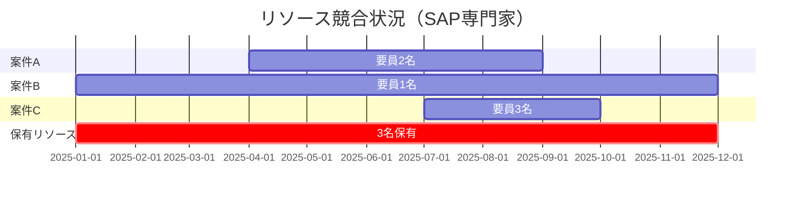
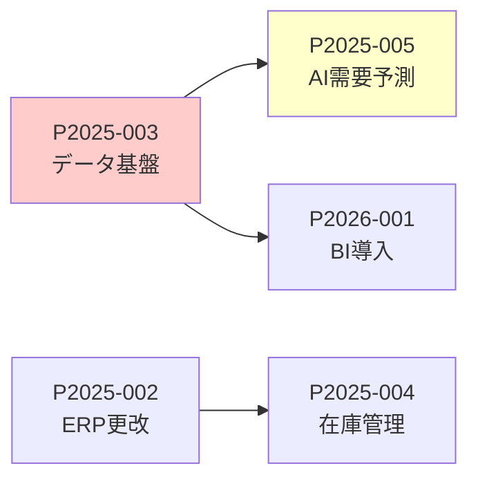
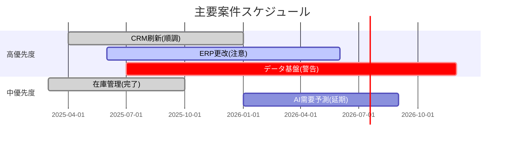

# IT投資ポートフォリオレビュー

## IT投資ポートフォリオレビューの全体像

### レビューの目的

1. **進捗の可視化**: 各案件の状況を一覧で把握
2. **リソース最適化**: 人材・予算の再配分判断
3. **優先順位の見直し**: ビジネス環境変化への対応
4. **リスクの早期発見**: 問題案件の特定と対応
5. **新規案件の評価**: 追加案件の採択判断

<br>

## レビューサイクルと役割

### レビューの種類と頻度

| レビュー種別 | 頻度 | 所要時間 | 参加者 | 主な目的 |
|-------------|------|---------|--------|---------|
| **日次モニタリング** | 毎日 | - | PMO事務局 | ダッシュボード確認 |
| **週次確認** | 毎週 | 30分 | PMO事務局 | 課題の早期発見 |
| **月次レビュー** | 毎月 | 2時間 | PMO + IT部門長 | 進捗・課題の詳細確認 |
| **四半期レビュー** | 3ヶ月毎 | 半日 | IT投資委員会 | 優先順位見直し・予算再配分 |
| **年次レビュー** | 年1回 | 1-2日 | 経営会議 + IT投資委員会 | 新年度ポートフォリオ策定 |
| **臨時レビュー** | 必要時 | 状況次第 | IT投資委員会 | 緊急案件・重大問題対応 |

<br>

## 月次レビュープロセス（詳細）

### 事前準備（レビュー1週間前）

#### Step1: PMOによるデータ収集

```markdown
【収集データ】
各案件のPMから以下を収集:
1. 進捗状況報告書
   - 進捗率（計画 vs 実績）
   - 完了マイルストーン
   - 次月の予定マイルストーン
   
2. 課題・リスク一覧
   - 課題管理表の最新版
   - 新規発生リスク
   - エスカレーション事項

3. 予算執行状況
   - 予算消化率
   - 予算超過見込み
   - 次月の支出予定

4. リソース状況
   - 人員稼働状況
   - リソース不足・余剰
   - 外部リソース活用状況

5. 変更要求
   - スコープ変更要求
   - スケジュール変更要求
   - 予算追加要求
```

#### Step2: PMOによる分析・資料作成（3-4日前）

**作成資料:**

##### 資料1: ポートフォリオサマリー

```markdown
# IT投資ポートフォリオ 月次レビュー
## 2025年XX月度

### 全体サマリー

| 指標 | 値 | 前月比 | ステータス |
|------|-----|--------|-----------|
| 総案件数 | XX件 | ±X件 | - |
| 実行中案件 | XX件 | ±X件 | - |
| 完了案件（当月） | XX件 | - | ✓ |
| 計画遅延案件 | XX件 | ±X件 | ⚠ |
| 予算超過見込案件 | XX件 | ±X件 | ⚠ |
| 全体予算消化率 | XX% | +X% | - |
| 全体進捗率（加重平均） | XX% | +X% | - |

### ステータス別案件数

| ステータス | 案件数 | 割合 |
|-----------|--------|------|
| 🟢 順調（Green） | XX件 | XX% |
| 🟡 注意（Amber） | XX件 | XX% |
| 🔴 警告（Red） | XX件 | XX% |
| ⚪ 保留・中断 | XX件 | XX% |
```

##### 資料2: 案件別詳細ステータス

```markdown
### 案件別ステータス一覧

| 案件ID | 案件名 | 優先度 | 進捗率 | 予算消化率 | ステータス | PM | 課題数 | 備考 |
|--------|--------|--------|--------|-----------|-----------|-----|--------|------|
| P2025-001 | 営業CRM刷新 | 高 | 45% | 40% | 🟢 | 佐藤 | 2 | 順調 |
| P2025-002 | ERP更改 | 高 | 30% | 35% | 🟡 | 田中 | 5 | 要件定義遅延 |
| P2025-003 | データ基盤 | 高 | 50% | 60% | 🔴 | 山田 | 8 | 予算超過見込 |
| P2025-004 | 在庫管理改修 | 中 | 80% | 75% | 🟢 | 鈴木 | 1 | 完了間近 |
```

**ステータス判定基準:**
- 🟢 Green: 計画通り、重大な課題なし
- 🟡 Amber: 軽微な遅延・課題あり、リカバリー可能
- 🔴 Red: 重大な遅延・課題、介入必要
- ⚪ 保留: 一時中断中

##### 資料3: Red/Amber案件の詳細分析

```markdown
### 🔴 Red案件: P2025-003 データ基盤構築

**現状:**
- 進捗率: 50%（計画60%、-10%遅延）
- 予算消化率: 60%（計画50%、+10%超過）
- 主要課題: クラウドインフラコストが見積の1.5倍に

**課題詳細:**
| 課題ID | 内容 | 影響 | 対応策 | 担当 | 期限 |
|--------|------|------|--------|------|------|
| R-001 | データ量が想定の2倍 | コスト増、性能懸念 | アーキテクチャ見直し | 山田 | 2025/XX/XX |
| R-002 | 既存システム連携の遅延 | スケジュール遅延 | 並行作業の見直し | 山田 | 2025/XX/XX |

**対応方針案:**
1. オプションA: 予算追加（+2,000万円）で計画通り実施
2. オプションB: スコープ縮小（Phase2に一部延期）
3. オプションC: アーキテクチャ変更によるコスト削減

**PMO推奨:** オプションB（スコープ縮小）
**理由:** 全体予算制約を考慮し、優先度の低い機能をPhase2に延期

**必要な意思決定:**
- [ ] 対応方針の承認
- [ ] 予算再配分の承認（必要な場合）
- [ ] スケジュール変更の承認
```

##### 資料4: リソース状況

```markdown
### IT人材リソース稼働状況

**スキル別稼働率:**

| スキル | 保有人数 | 稼働率 | 状況 | コメント |
|--------|---------|--------|------|---------|
| SAP専門家 | 3名 | 120% | 🔴 過負荷 | 2名が複数案件兼務 |
| クラウドエンジニア | 5名 | 85% | 🟢 適正 | - |
| データサイエンティスト | 2名 | 95% | 🟡 ほぼ満杯 | 新規案件受入困難 |
| PMO | 4名 | 75% | 🟢 余裕あり | - |
```

**リソース競合案件:**



**リソース調整提案:**
1. 案件Cの開始を2025/11に延期（2ヶ月後ろ倒し）
2. または、外部SAP専門家1名を2025/7-10に調達（追加500万円）

**意思決定事項:**
- [ ] 案件Cの開始延期を承認
- [ ] または外部リソース調達を承認

##### 資料5: 予算執行状況

```markdown
### 予算執行状況（年度累計）

**全体予算:**

| 項目 | 年度予算 | 執行済 | 執行率 | 残予算 | 見込み | 状況 |
|------|---------|--------|--------|--------|--------|------|
| 戦略的投資 | 6.0億円 | 2.5億円 | 42% | 3.5億円 | 6.2億円 | 🔴 超過見込 |
| 維持・延命投資 | 3.0億円 | 1.2億円 | 40% | 1.8億円 | 2.9億円 | 🟢 計画内 |
| 予備費 | 1.0億円 | 0.2億円 | 20% | 0.8億円 | 0.5億円 | 🟢 余裕あり |
| **合計** | **10.0億円** | **3.9億円** | **39%** | **6.1億円** | **10.6億円** | 🔴 |

**超過要因分析:**
- データ基盤構築（P2025-003）: +2,000万円見込
- 営業CRM刷新（P2025-001）: +500万円見込

**対応案:**
1. 予備費から充当: 2,500万円
2. 優先度中案件の一部を次年度に延期
3. 各案件のコスト削減努力
```

### レビュー会議の実施（月初5営業日以内）

#### アジェンダ（標準）

```markdown
# IT投資ポートフォリオ月次レビュー会議
## 日時: 2025/XX/XX 14:00-16:00
## 場所: 会議室A / オンライン併用
## 参加者: PMO、IT部門長、主要PM（必要に応じて）

### アジェンダ

1. 前回アクションアイテムの確認（10分）
2. 全体サマリーの報告（15分）
3. Red案件の詳細レビュー（各15分）
4. Amber案件の状況確認（各10分）
5. リソース調整の協議（20分）
6. 予算状況の確認（10分）
7. 新規課題・リスクの共有（15分）
8. 次月の重点管理事項の確認（10分）
9. アクションアイテムの確認（5分）

**合計: 約2時間**
```

#### 会議の進行

**1. 前回アクションアイテムの確認**
```markdown
| No | アクション | 担当 | 期限 | ステータス |
|----|-----------|------|------|-----------|
| 1 | P2025-002の要件定義完了 | 田中PM | 2025/XX/XX | ✓完了 |
| 2 | 外部ベンダーとの交渉 | 山田PM | 2025/XX/XX | 進行中 |
| 3 | リソース調整案の作成 | PMO | 2025/XX/XX | ✓完了 |
```

**2. Red案件の詳細レビュー**

各Red案件について:
- PM（または担当者）から状況説明（5分）
- 質疑応答・議論（5分）
- 対応方針の決定（5分）

**議論のポイント:**
- 問題の本質は何か
- 現在の対応策は適切か
- 追加支援が必要か
- 意思決定が必要な事項は何か

**3. リソース調整の協議**

PMOから提示されたリソース調整案について議論:
- 案件優先度の再確認
- リソース移動の実施可能性
- 外部リソース調達の是非
- スケジュール調整の影響

**意思決定事項の記録:**
```markdown
【決定事項】
1. P2025-003データ基盤構築について、スコープ縮小案を承認
   - Phase1: コア機能のみ（予算内）
   - Phase2: 拡張機能（次年度予算で対応）
   
2. SAP専門家のリソース不足について
   - 外部リソース1名を2025/7-10に調達（予算: 予備費から500万円充当）
   
3. P2025-005 AI需要予測について
   - 開始時期を2025/10に延期（当初2025/7）
   - 理由: P2025-003データ基盤の遅延
```

### レビュー後のアクション

#### Step3: 議事録の作成・配布（会議後24時間以内）

```markdown
# IT投資ポートフォリオ月次レビュー 議事録
## 日時: 2025/XX/XX 14:00-16:00

### 参加者
- PMO: ○○、××
- IT部門長: △△
- PM: 佐藤（P2025-001）、田中（P2025-002）、山田（P2025-003）

### 決定事項
1. ...
2. ...

### アクションアイテム
| No | アクション | 担当 | 期限 | 備考 |
|----|-----------|------|------|------|
| 1 | P2025-003のスコープ縮小版計画書作成 | 山田PM | 2025/XX/XX | |
| 2 | 外部SAP専門家の調達開始 | PMO | 2025/XX/XX | |
| 3 | P2025-005の延期に伴う関係者調整 | 鈴木PM | 2025/XX/XX | |

### 次回レビュー
日時: 2025/XX/XX 14:00-16:00
重点確認事項: P2025-003の進捗、外部リソースの稼働状況
```

#### Step4: ポートフォリオ情報の更新

PMOが以下を更新:
1. ポートフォリオマスタデータ
2. 案件ステータス
3. リソース配分計画
4. 予算執行計画

#### Step5: ダッシュボードの更新

リアルタイムダッシュボードに反映（後述）

## 四半期レビュープロセス（詳細）

### 四半期レビューの特徴

月次レビューとの違い:
- **戦略的な判断**: 優先順位の抜本的見直し
- **予算再配分**: 案件間の予算移動
- **新規案件の採択**: 追加案件の審査
- **ポートフォリオ最適化**: 案件の中止・延期判断

### 事前準備（2週間前から）

#### Step1: 深堀り分析の実施

**分析項目:**

1. **案件別パフォーマンス分析**
```markdown
| 案件 | 計画進捗率 | 実績進捗率 | 差異 | 計画予算消化率 | 実績予算消化率 | 差異 | 評価 |
|------|-----------|-----------|------|--------------|--------------|------|------|
| P2025-001 | 50% | 45% | -5% | 50% | 48% | -2% | 概ね順調 |
| P2025-002 | 40% | 30% | -10% | 40% | 42% | +2% | 遅延・効率悪 |
| P2025-003 | 60% | 50% | -10% | 50% | 60% | +10% | 遅延・予算超過 |
```

2. **投資効果の中間評価**（稼働済み案件）
```markdown
| 案件 | 目標効果 | 実績効果 | 達成率 | 評価 |
|------|---------|---------|--------|------|
| P2024-XXX | 年間2,000万円削減 | 年間1,500万円削減 | 75% | 一部達成 |
| P2024-YYY | 処理時間50%短縮 | 処理時間60%短縮 | 120% | 目標超過達成 |
```

3. **ポートフォリオバランス分析**
```markdown
### 投資タイプ別配分

| 投資タイプ | 予算配分 | 案件数 | 評価 |
|-----------|---------|--------|------|
| 新規事業・DX | 35% | 3件 | 戦略重視 |
| 業務効率化 | 30% | 5件 | バランス良 |
| システム更改・延命 | 30% | 4件 | 適切 |
| 緊急対応 | 5% | 1件 | 予備費活用 |
```

```markdown
### リスク分散状況

| リスクレベル | 案件数 | 予算比率 | 評価 |
|-------------|--------|---------|------|
| 高リスク（新技術・大規模） | 2件 | 25% | 適切 |
| 中リスク | 5件 | 45% | 適切 |
| 低リスク（実績技術） | 6件 | 30% | 安定重視 |
```

4. **案件間依存関係の再評価**

依存元が遅延→依存先への影響を再評価

#### Step2: 新規案件の評価

四半期レビューでは新規案件も審査:
- 前四半期に提出された案件概要書
- IT評価書の作成
- 既存案件との優先度比較

#### Step3: レビュー資料の作成

**追加資料:**

##### 資料A: 四半期サマリー

```markdown
# Q2 四半期レビュー サマリー

### ハイライト

**✓ 達成事項:**
- P2025-004 在庫管理改修が計画通り完了
- 全体で3案件が主要マイルストーン達成

**⚠ 課題:**
- P2025-003 データ基盤が2ヶ月遅延
- 予算超過見込: +6,000万円（6%）

**📊 数値サマリー:**
- 完了案件: 2件（計画3件）
- 進行中案件: 11件
- 新規開始案件: 3件
- 中止案件: 0件
- 全体進捗: 48%（計画50%）
- 予算消化: 45%（計画50%）
```

##### 資料B: 優先順位見直し提案

```markdown
### 優先順位見直し案

**見直し理由:**
1. ビジネス環境の変化（例: 新規事業の加速）
2. 技術的課題の顕在化
3. リソース制約の明確化

**提案:**

| 案件 | 現在優先度 | 提案優先度 | 変更理由 |
|------|-----------|-----------|---------|
| P2025-003 データ基盤 | 高 | 高（継続） | 遅延あるが戦略上重要 |
| P2025-007 新規提案A | - | 高（追加） | 経営方針変更により重要度上昇 |
| P2025-006 既存案件X | 中 | 低（延期） | ビジネス優先度低下 |
```

##### 資料C: 予算再配分案

```markdown
### 予算再配分提案

**現状:**
- 年度予算: 10億円
- 執行済: 4.5億円（45%）
- 残予算: 5.5億円
- 超過見込: +6,000万円

**課題:**
- P2025-003が+2,000万円超過見込
- 新規案件（P2025-007）に3,000万円必要
- 予備費残: 8,000万円 → 3,000万円に減少

**再配分案:**

| 対応 | 金額 | 対象案件 | 影響 |
|------|------|---------|------|
| 予備費から充当 | +2,000万円 | P2025-003 | 予備費減少 |
| 案件延期 | -1,500万円 | P2025-006 | 次年度に延期 |
| スコープ縮小 | -500万円 | P2025-008 | Phase2に延期 |
| 新規案件予算確保 | +3,000万円 | P2025-007 | 上記で捻出 |
| **調整後予備費** | **3,000万円** | - | 最低限確保 |
```

### 四半期レビュー会議（半日）

#### アジェンダ

```markdown
# Q2 IT投資ポートフォリオ四半期レビュー
## 日時: 2025/XX/XX 13:00-17:00
## 参加者: IT投資委員会メンバー全員

### アジェンダ

1. 前四半期の振り返り（30分）
   - 目標達成度
   - 主要成果
   - 教訓

2. 案件別パフォーマンスレビュー（60分）
   - Red案件の詳細レビュー（各15分）
   - Amber案件の確認（各5分）
   - Green案件のサマリー報告

3. ポートフォリオ全体分析（30分）
   - 投資バランス
   - リスク分散状況
   - 依存関係の影響

--- 休憩（15分） ---

4. 優先順位見直しの協議（45分）
   - 見直し提案の説明
   - 各案件の再評価
   - 優先順位の決定

5. 予算再配分の協議（30分）
   - 超過見込案件への対応
   - 新規案件への予算配賦
   - 延期・中止案件の決定

6. 新規案件の審査（30分）
   - 新規案件の説明（各10分）
   - 採択判断

7. 次四半期の重点方針（15分）
   - 重点管理案件の指定
   - リソース配分方針
   - リスク管理方針

8. まとめ・アクションアイテム確認（10分）

**合計: 4時間（休憩含む）**
```

#### 主要な意思決定事項

四半期レビューでの典型的な決定事項:

```markdown
【Q2四半期レビュー決定事項】

1. 優先順位変更
   ✓ P2025-007（新規案件）を「高」優先度で採択
   ✓ P2025-006を次年度に延期
   
2. 予算再配分
   ✓ P2025-003に予備費から2,000万円追加配賦
   ✓ P2025-007に3,000万円配賦（P2025-006延期分を充当）
   ✓ P2025-008をスコープ縮小（500万円削減）
   
3. リソース調整
   ✓ SAP専門家を外部調達（2名、6ヶ月）
   ✓ P2025-006延期により、アサイン予定だった要員をP2025-007に振替
   
4. 案件の中止・延期
   ✓ P2025-006を2026年度に延期（優先度低下のため）
   ✗ 中止案件なし
   
5. リスク管理強化
   ✓ P2025-003を重点管理案件に指定（週次報告を義務化）
   ✓ 外部専門家によるレビュー実施（コンサル活用）
   
6. 次四半期の重点方針
   ✓ データ基盤（P2025-003）のリカバリーを最優先
   ✓ 新規案件（P2025-007）の早期立ち上げ
   ✓ リソース過負荷の解消
```

<br>
<br>

## ポートフォリオダッシュボード

### リアルタイム可視化

ポートフォリオレビューを効率化するため、常時更新されるダッシュボードを整備:

#### ダッシュボード構成

**画面1: 全体サマリー**
```
┌─────────────────────────────────────┐
│ IT投資ポートフォリオ ダッシュボード     │
│ 最終更新: 2025/XX/XX 15:00          │
├─────────────────────────────────────┤
│ 【全体状況】                         │
│ 総案件数: 13件                       │
│ 🟢 Green: 8件 (62%)                │
│ 🟡 Amber: 3件 (23%)                │
│ 🔴 Red: 2件 (15%)                  │
│                                     │
│ 【予算】                            │
│ 年度予算: 10.0億円                   │
│ 執行済: 4.5億円 (45%) ████████░░   │
│ 見込: 10.6億円 (106%) ⚠ 超過       │
│                                     │
│ 【進捗】                            │
│ 計画進捗: 50%                        │
│ 実績進捗: 48% (-2%)                 │
│                                     │
│ 【リソース】                         │
│ 🔴 SAP専門家: 120% (過負荷)        │
│ 🟡 データサイエンティスト: 95%      │
│ 🟢 クラウドエンジニア: 85%          │
└─────────────────────────────────────┘
```

**画面2: 案件マトリクス**

横軸: 優先度、縦軸: ステータス

```
      │ 高優先度 │ 中優先度 │ 低優先度 │
──────┼─────────┼─────────┼─────────┤
🟢順調 │ ●●●     │ ●●      │ ●       │
🟡注意 │ ●       │ ●●      │         │
🔴警告 │ ●●      │         │         │
```

**画面3: ガントチャート（主要案件）**



**画面4: 予算トレンド**

月次の予算執行推移と見込みを可視化

```
予算執行トレンド（億円）
12 │                              ╱ 見込（10.6億）
10 │                          ╱
 8 │                      ╱
 6 │                  ╱       ← 計画線（10.0億）
 4 │              ╱
 2 │          ╱  ● 現在（4.5億）
 0 │━━━━━━━━━━━━━━━━━━━━━━━━
   4月 5月 6月 7月 8月 9月 10月...3月
```

### ダッシュボードの活用

- **日次**: PMO事務局が確認、異常値の早期発見
- **週次**: IT部門長が確認、必要に応じてPMにアラート
- **月次レビュー前**: 事前に全員が確認、論点を把握
- **四半期レビュー**: プロジェクターで投影しながら議論

<br>

## 臨時レビューのトリガー

以下の状況が発生した場合、臨時レビューを招集:

### トリガー条件

| トリガー | 具体例 | 対応 |
|---------|--------|------|
| **重大な遅延** | 主要マイルストーンが2ヶ月以上遅延 | 緊急レビュー招集 |
| **重大な予算超過** | 20%以上の予算超過見込 | 予算再配分の協議 |
| **案件の中止検討** | 技術的実現不可能が判明 | 中止判断の協議 |
| **緊急案件の発生** | 法対応・セキュリティ対応等 | 優先度変更の協議 |
| **重大なリスクの顕在化** | 情報漏洩、システム障害等 | 対応方針の決定 |

### 臨時レビューの進行

```markdown
# 臨時レビュー アジェンダ

1. 状況説明（15分）
   - 何が起きたか
   - 現在の状況
   - 影響範囲

2. 対応案の検討（30分）
   - オプションA, B, Cの提示
   - 各オプションのメリット・デメリット
   - リスク評価

3. 意思決定（15分）
   - 対応方針の決定
   - 責任者・期限の明確化
   - 次回報告タイミングの設定

**合計: 約1時間**
```

<br>
