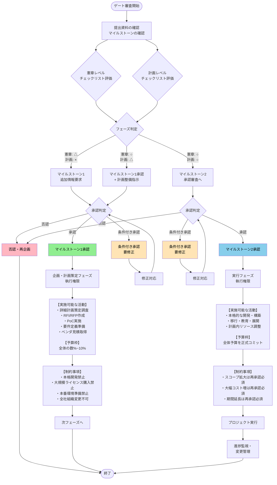

# プロジェクトチャーター概要

プロジェクト憲章（プロジェクトチャーター）は、「何を・なぜ・どこまで・誰の権限でやるプロジェクトなのか」を公式に定義し、承認するための基本文書です。

## 概要と役割

- プロジェクトの目的・目標・範囲・主要メンバー・権限などを一枚にまとめた**契約書的**な位置づけの文書です。
- 経営層やスポンサーがこれを承認することで、「このプロジェクトをやってよい」「このリソースを使ってよい」という公式なゴーサインになります。

<br>

## 主な記載内容

典型的には次のような項目を含みます。

- プロジェクトの目的・背景・ビジネスニーズ  
- 目標・成功基準（KGI・KPIなど測定可能な指標）  
- スコープ（範囲）とアウトオブスコープ  
- 主要ステークホルダーと組織体制  
- プロジェクトマネージャーの責任と権限  
- 予算・期間・主要マイルストーン  
- 前提条件・制約条件・主要リスク  

<br>

## プロジェクト計画書との違い

プロジェクト憲章とプロジェクト計画書は、プロジェクトマネジメントの初期段階で作成される重要な文書ですが、目的、タイミング、詳細度が異なります。

### 作成タイミングと責任者

- プロジェクト憲章はプロジェクト開始前にスポンサーや発起人が作成し、承認を得てプロジェクトを正式に立ち上げます。
- 一方、プロジェクト計画書は憲章承認後にプロジェクトマネージャーが作成し、実行フェーズの指針とします。
- この順序により、憲章が「やるべきか」を決め、計画書が「どうやるか」を具体化します。

### 内容の詳細度と焦点

憲章は1-2ページの簡潔な文書で変更しにくく、計画書は「生きた文書」として進行中に更新されます。

| 項目 | プロジェクト憲章  | プロジェクト計画書  |
|---------------|------------------------------------------|--------------------------------------------|
| **目的**  | プロジェクトの正当性・目標・範囲の概要  | 実行のための詳細スケジュール・タスク分解  |
| **詳細度**| 高レベル（なぜ・何を・誰が） | 詳細（いつ・どうやって・リソース配分） |
| **主な内容** | 目的、ステークホルダー、予算概要、権限  | WBS、スケジュール、リスク管理、品質基準 |


### 役割と活用の違い

- 憲章はチームの共通理解とマネージャーの権限を明確化し、計画書は日常の進行管理と変更対応に使われます。
- 両者を連動させることで、手戻りやスコープクリープを防ぎ、成功率を高めます。

<br>  

## なぜ必要か

- 目的・期待値・成功条件を事前にそろえることで、後工程での手戻りや「言った／言わない」を減らせます。
- プロジェクトマネージャーに与えられた権限や利用可能なリソースが明文化されるため、調整や意思決定がスムーズになります。

<br>

## プロジェクト憲章の記載項目

プロジェクト憲章に必須の項目は、PMBOK準拠で主に10項目程度が標準的に挙げられ、これらでプロジェクトの基本枠組みを明確化します。<br>
さらに業界特性、社内文化や他の社内決裁フォーマットに合わせて文章量や用語の形式ばり具合を調整するとより扱いやすくなります。

### 必須項目一覧

以下の項目を簡潔に記載し、1-2ページ以内にまとめます。

- **プロジェクト名と概要**: 
    - プロジェクトの名称、背景、ビジネスニーズを1-2文で記述
    - （例: 「社内ERPシステム刷新プロジェクト：業務効率20%向上を目指す」）。

- **目的と目標**: 
    - なぜ実施するのか、SMART基準（Specific, Measurable, Achievable, Realistic, Time-bound）で目標を明記
    - （例: 「2026年3月までに全拠点で稼働、コスト10%削減」）。[8][1]

- **スコープ**: 
    - 含む範囲（In-Scope）と除外範囲（Out-of-Scope）を明確化
    - （例: In: モジュールA/B刷新、Out: ハードウェア更新）。

- **主要ステークホルダーと組織**: 
    - スポンサー、PM、キー担当者、リソース概要をリスト
    - （例: PM: 山田太郎、予算: 5000万円）。
 
- **スケジュールとマイルストーン**: 
    - 高レベル期間と主要節目
    - （例: 開始: 2026/1、完了: 2026/6、設計完了: 2026/3）。
 
### 追加推奨項目

状況に応じて以下の項目を加えます。

- **前提条件・制約・リスク**: 依存事項、予算/人員制約、トップ3リスクと対応方針。
- **成功基準と成果物**: KPI（例: 稼働率95%以上）と主要アウトプット一覧。
- **承認者と日付**: スポンサー署名欄。

<br>

## 期待効果

「期待効果」は、基本的には**プロジェクト憲章側**に置くべき項目で、プロジェクトの目的・ビジネス上の正当性・成功基準の一部として定義するのが標準的です。

### なぜ憲章側か

- プロジェクト憲章では「ビジネス上の正当性」「期待される成果・便益」を明確にして承認を得ることが目的であり、多くの解説で必須要素として「期待効果」や「ビジネス上の利益」が挙げられています。
- 例えば「コスト10％削減」「リードタイム20％短縮」といった期待効果は、憲章の中の「目的・正当化理由」「測定可能な目標・成功基準」として記載するのが自然です。

### 計画書との関係

- プロジェクト計画書には、憲章で定義した期待効果を前提として「どの施策（スコープ）・成果物でその効果を実現するか」「どのKPIでモニタリングするか」を詳細化して記載します。
- そのため、期待効果そのものは憲章に明記し綴じておき、計画書ではプロジェクト自体の達成手段や品質測定方法・進捗モニタリング計画に集中する、という整理が分かりやすいです。

<br>
<br>

# プロジェクトガバナンス



## フェーズ判定の基本ロジック

### マイルストーン1相当（憲章レベル）と判定する場合

**情報の特徴:**
- 目的・期待効果・概略スコープ・概算予算・概略期間・主要ステークホルダー程度まで記載
- WBS、詳細スケジュール、詳細リソース計画、リスク対応案などが粗い、または未整備

**判定:** 
- 「構想・企画フェーズ」としてマイルストーン1のゲート審査対象とする

### マイルストーン2相当（実行計画レベル）と判定する場合

**情報の特徴:**
- WBSレベルのタスク分解がされている
- フェーズ別スケジュール、体制・役割分担が明示されている
- リスク・変更・コミュニケーション計画が具体的に記載されている
- 期待効果に紐づくKPIとモニタリング方法が定義されている

**判定:** 
- 「計画フェーズ完了」としてマイルストーン2のゲート審査対象とする

### 判定ルール（中間的な状態への対応）

- **憲章レベルの内容が曖昧な場合**（目的・期待効果・スコープがブレている）
  - 「マイルストーン1の再審査が必要」とし、マイルストーン2承認には進まない

- **計画書系項目の整備率が70%未満の場合**
  - 「マイルストーン1のみ判定」とする
  
<br>

## マイルストーン承認後の執行権限

各マイルストーン承認により使用できる予算・リソース・裁量の範囲を段階的に設定します。

<br>

## マイルストーン承認後の執行権限

| 項目 | マイルストーン1承認前<br/>（構想・提案段階） | マイルストーン1承認後<br/>（企画・計画策定フェーズ） | マイルストーン2承認後<br/>（実行フェーズ） |
|------|-----------------------------------|-------------------------------------------|----------------------------------|
| **認められる活動** | ・構想立案・アイデア検討<br/>・簡易な情報収集（公開情報調査）<br/>・非公式な関係者ヒアリング<br/>・概算見積もりの依頼<br/>・憲章ドラフト作成<br/>・予備的な技術調査 | ・詳細計画策定のための調査活動<br/>・RFI/RFP作成<br/>・PoC（概念実証）の実施<br/>・要件定義準備<br/>・外部ベンダとの見積り取得<br/>・簡易PoC<br/>・業務ヒアリング | ・計画書に基づく本格的な実行（開発・構築・移行・教育・展開など）<br/>・計画内でのリソース調整（人員アサイン変更、軽微なスケジュール調整など）をPM裁量で実施 |
| **制約事項** | ・予算執行は原則不可（既存業務の範囲内で実施）<br/>・外部への発注・契約は禁止<br/>・組織横断的な活動は限定的<br/>・公式なプロジェクト体制の構築は不可<br/>・システムやツールの導入・変更は禁止 | ・本格的な開発・構築作業は禁止<br/>・大規模ライセンス購入は禁止<br/>・本番環境準備は禁止<br/>・プロジェクトブランドでの全社的な組織変更は原則不可<br/>・大規模研修などの実施は原則不可 | ・承認された範囲を超えるスコープ拡大は変更管理プロセス＋再承認が必須<br/>・大幅なコスト増は変更管理プロセス＋再承認が必須<br/>・期間延長は変更管理プロセス＋再承認が必須<br/>・一定以上の超過見込み時は、ポートフォリオの再優先順位付け・縮小・中止も選択肢とする |
| **予算の扱い** | ・予算配賦なし<br/>・既存部門予算または個人の業務時間内で対応<br/>・外部コストは原則発生させない | ・「企画・調査枠」「計画立案枠」として全体予算の一部（数%〜10%程度）のみコミット | ・全体予算（またはフェーズ毎予算）を正式コミット<br/>・ポートフォリオ上も「実行中案件」として位置づける |
| **承認者** | - | ・事業側スポンサー<br/>・IT側/CIO等 | ・ステアリングコミッティ<br/>・PMO/CIO |
---

<br>

## フェーズ不明案件を扱うための運用ルール

PMOやIT投資委員会で以下のフローを明文化し、現場の判断ブレを防止します。

### ステップ1: 提出資料の評価
- 「憲章レベルチェックリスト」で採点
- 「計画レベルチェックリスト」で採点

### ステップ2: フェーズ判定
| 憲章レベル | 計画レベル | 判定結果 |
|-----------|-----------|---------|
| △ | × | マイルストーン1（追加情報要求あり） |
| ○ | △ | マイルストーン1承認＋計画整備指示 |
| ○ | ○ | マイルストーン2承認審査へ |

### ステップ3: 承認ステータスと執行権限の紐付け

承認区分ごとに執行可能な範囲をマトリクスで定義:

- **企画のみ承認（MS1）** → 企画・調査活動のみ可
- **実行計画承認（MS2）** → 本格実行可
- **条件付き承認（要修正）** → 条件クリア後に権限付与
- **否認（再企画）** → 執行権限なし

<br>
<br>

# サンプル集

## プロジェクト憲章の項目・概要

| 項目 | 内容概要| 記載サンプル（新規投資） | 記載サンプル（延命投資）|
| -------------------------- | ----------------------------------- | -------------------------------------------------------------------------------------- | --------------------------------------------------------------------------------------------------------------------------- |
| 1. プロジェクトの目的・正当化理由 | 背景、ビジネスニーズ、なぜ実施するのか | 「老朽化した既存ERPの保守終了が近づいており、業務標準化と生産性向上のために新ERPへ移行する。」 | 「基幹ERPのOSサポート終了とハード老朽化により、重大障害およびセキュリティインシデントのリスクが高まっているため、OS・DB・基盤の更換により今後3年間の安定稼働を確保する。」​|
| 2. 測定可能な目標・成功基準| SMARTなKGI/KPIを記載| 「2026年3月末までに全拠点で新ERP本番稼働し、受注処理リードタイムを平均20％削減する。」 | 「2027年度末まで、ERP起因の重大障害ゼロを維持し、障害対応工数を年間1,000時間から500時間に削減する。OS/DBサポート切れによるセキュリティリスクを解消する。」​|
| 3. ハイレベル要求事項・成果物 | 主要機能と成果物の一覧 | 「購買・在庫・会計モジュールを統合管理できること。成果物：要件定義書、設計書、テスト結果報告書、新業務マニュアル。」 | 「アプリケーション機能を変更せずに、現行業務を維持したままOS・DB・仮想基盤を更換できること。成果物：移行設計書、リハーサル結果報告書、本番移行手順書、バックアウト手順書。」|
| 4. スコープ（範囲）と境界 | In/Outを明確化。​| 「In：国内拠点の購買・在庫・会計業務。Out：海外拠点、給与・人事システム連携。」 | 「In：現行ERPのOS・DBバージョンアップ、ハード／仮想基盤の更新。Out：業務機能の追加・変更、周辺システムの機能改修（必要最小限のインタフェース修正のみ含む）。」 |
| 5. 主要ステークホルダー| スポンサー、PM、キー関係者 ​| 「スポンサー：経営企画本部長A氏、PM：情報システム部B氏、業務オーナー：生産本部C氏。」| 「システムオーナー：経営企画部長A氏、PM：情報システム部B氏、運用責任者：IT運用部C氏、情報セキュリティ責任者：CISO D氏。」 |
| 6. 予算・マイルストーン| 概算予算と主要節目 | 「総予算：6,000万円（ライセンス2,000万、開発3,000万、教育1,000万）。主要マイルストーン：要件定義完了＝2025/10末、本番稼働＝2026/3末。」 | 「総予算：4,000万円（基盤更新2,000万、移行作業1,500万、テスト・リハーサル500万）。主要マイルストーン：移行リハーサル＝2026/2末、本番切替＝2026/3中旬、安定稼働確認＝2026/4末。」​|
| 7. 前提条件・制約条件 | 依存事項、制限事項 | 「前提：現行マスタデータは各部門でクレンジング済みとする。制約：残業時間上限のため、平日夜間の作業は22時までとする。」 | 「前提：現行ERPのソースコードおよび設定情報一式が利用可能であること。制約：本番停止時間は最大8時間以内とし、業務機能仕様は原則変更しない（延命のための技術更換に限定）。」 |
| 8. ハイレベルリスク| 主なリスクと初期対応。​| 「主要リスク：業務要件の対立による決定遅延。対応：各部門から意思決定権限を持つ担当者を選任し、週次で課題レビュー会を実施。」 | 「主要リスク：移行時の性能劣化やデータ不整合により業務に支障が出る。対応：本番前に複数回のリハーサルと性能テストを実施し、問題発生時には即時旧環境に戻すバックアウト手順を整備する。」​|
| 9. PMの責任と権限| 責任範囲と決定権| 「PMはスケジュール・品質・コストの全体管理責任を負い、プロジェクト要員のアサインおよび優先度調整を各部門長に要請する権限を持つ。」 | 「PMは業務影響最小化と安定稼働確保を最優先とし、切替可否の判断および定義済み基準に基づくバックアウト実行の判断権限を持つ。また、必要に応じて移行手順の変更を提案する権限を持つ。」​|
| 10. 承認要件と承認者 | 成功条件と署名欄| 「上記目標達成と、主要ステークホルダー全員のUAT合格をもってプロジェクト完了とみなす。承認者：経営企画本部長／情報システム部長／生産本部長　承認日：2025年7月1日。」 | 「上記目標達成に加え、OS・DBサポート切れリスクの解消と、1か月間の安定稼働（重大障害ゼロ）が確認できた時点でプロジェクト完了とみなす。承認者：CIO／経営企画本部長／IT運用部長／情報セキュリティ責任者　承認日：20XX年X月X日。」​ |
---

<br>
<br>

## プロジェクト憲章の審査シート

**【ビジネス面】**

| 審査項目 | チェック内容 | 判定 | コメント・補足 |
|---------|-------------|------|---------------|
| 期待効果の定量性 | 期待効果(便益・KGI)が具体的な数値で示されているか(例:コスト削減○%、リードタイム短縮○日) | Yes/No/要修正 | |
| 戦略・方針整合性 | 期待効果が全社/部門の経営戦略・ITポートフォリオ方針と明示的に整合しているか | Yes/No/要修正 | |
| 重複投資の排除 | 既存プロジェクト・システムとの重複、競合がないか確認したか | Yes/No/要修正 | |

<br>

**【内容の妥当性】**

| 審査項目 | チェック内容 | 判定 | コメント・補足 |
|---------|-------------|------|---------------|
| スコープ明確性 | プロジェクトの対象範囲(In-Scope/Out-of-Scope)が高レベルで明瞭に定義されているか | Yes/No/要修正 | |
| 主要成果物定義 | プロジェクトが納めるべき主要アウトプット(成果物)が列挙されているか | Yes/No/要修正 | |
| 対象組織/システム | 対象とする組織、既存システム、外部依存関係が明記されているか | Yes/No/要修正 | |
| 概算予算の妥当性 | 概算予算が示され、見積り根拠(人員規模、期間など)が略述されているか | Yes/No/要修正 | |
| 期間・マイルストーン | プロジェクト期間と主要マイルストーン(3～5個程度の関門)が示されているか | Yes/No/要修正 | |
| 実現可能性 | リソース・技術的に実現不可能と判断される要因がないか | Yes/No/要修正 | |

<br>

**【ガバナンス・責任体制】**

| 審査項目 | チェック内容 | 判定 | コメント・補足 |
|---------|-------------|------|---------------|
| スポンサー特定 | 事業側のスポンサーが特定され、連絡先が記載されているか | Yes/No/要修正 | |
| PM特定・権限明記 | プロジェクトマネージャーが特定され、決定権限・リソース調達権限が明記されているか | Yes/No/要修正 | |
| 主要ステークホルダー | 重要な関係者(業務担当、システム担当、外部ベンダーなど)が列挙されているか | Yes/No/要修正 | |

<br>

**【リスク・制約】**

| 審査項目 | チェック内容 | 判定 | コメント・補足 |
|---------|-------------|------|---------------|
| ハイレベルリスク列挙 | 主要なリスク(技術、リソース、ビジネス等)が3個以上列挙されているか | Yes/No/要修正 | |
| 致命的リスク対応 | 致命的リスク(実現できなくなる要因)に対して初期対応方針が示されているか | Yes/No/要修正 | |
| 制約条件明記 | 予算上限、人員制限、業務継続期間など重要な制約が記載されているか | Yes/No/要修正 | |

<br>

**【ドキュメント】**

| 審査項目 | チェック内容 | 判定 | コメント・補足 |
|---------|-------------|------|---------------|
| 必須項目完備 | プロジェクト憲章の必須項目(1～10項目)がすべて埋まっているか | Yes/No/要修正 | |
| 署名欄記載 | スポンサー・PM・主要承認者の署名欄が用意されているか | Yes/No/要修正 | |

<br>

**【ゲート判定】**

| 審査項目 | チェック内容 | 判定 | コメント・補足 |
|---------|-------------|------|---------------|
| 総合判定 | 実行計画フェーズへの進行を認めるか | 承認/条件付き承認/不承認 | 条件がある場合は修正期限と内容を記載 |
| 承認者(事業側) | | | 署名:　　　　　日付: |
| 承認者(IT側/CIO等) | | | 署名:　　　　　日付: |


<br>
<br>

## プロジェクト計画書の項目・概要

| 項目| 内容概要  | 記載サンプル（粒度イメージ）  |
| ------------------- | ----------------------------------------------- | ------------------------------------------------------------------------------------ |
| 1. プロジェクト概要（目的・ゴール） | 憲章を受けて、目的・背景・ゴール（QCD）を整理して記載。  | 「老朽化した既存ERPを刷新し、受注～出荷プロセスを標準化することで、リードタイム20％短縮と入力ミス50％削減を達成する。」 |
| 2. スコープ（作業範囲・成果物）| 実施する作業範囲と成果物を、WBSの上位レベルで定義。​ | 「対象範囲：国内3拠点の販売・在庫・会計業務。成果物：要件定義書、基本設計書、結合テスト仕様書、本番移行計画書、操作マニュアル。」  |
| 3. プロジェクト体制・役割分担 | 組織図、役割と責任（RACIなど）を明示。​ | 「プロジェクトオーナー：営業本部長。PM：情報システム部A。設計担当：システム部B。業務要件担当：営業企画C。RACI表で責任区分を定義。」|
| 4. スケジュール（マスタ計画） | フェーズ構成と主要マイルストーン、クリティカルな工程を記載。​ | 「2025/10 要件定義完了、2026/01 結合テスト完了、2026/03 本番稼働。ガントチャート別紙参照。要件定義遅延は後続工程に直結するためクリティカル。」  |
| 5. 予算・コスト計画| 総予算とカテゴリ別内訳、見積り前提を記載。​ | 「総予算：6,000万円。内訳：ライセンス2,000万、SI費3,000万、教育・移行費800万、予備費200万。人件費は社内原価として別途管理。」  |
| 6. 品質計画 | 目標品質(Q)、品質指標、品質管理手順を定義。​  | 「品質目標：重大障害ゼロ、軽微な不具合は本番後1か月以内に収束。指標：本番後1か月の障害件数、UATでの欠陥検出率。コードレビューと二重テストを必須とする。」|
| 7. コミュニケーション計画| 会議体、報告頻度、報告フォーマット、利用ツールを定義。​ | 「週次進捗会議（PM・各担当リーダー）、月次ステアリングコミッティ（スポンサー報告）。主なツール：Teams、Backlog。進捗は毎週金曜17時までに更新。」  |
| 8. リスク管理計画 | リスク識別方法、評価軸、対応方針、初期リスク一覧。​| 「発生確率×影響度で評価し、重要度中以上をリスク登録。例：『キーメンバー退職』→代替要員候補の事前確保、『要件変更の多発』→変更管理プロセスの明文化。」|
| 9. 変更管理ルール | 要件・スコープ・スケジュール・コスト変更の手順を定める。​| 「変更要求はすべて変更要求票でPMへ提出し、影響分析後、変更審議会で承認を得る。影響が軽微な場合はPM裁量で承認し、週次会議で共有。」|
| 10. 受入・完了条件| 受入テストの基準と、プロジェクト完了の条件を定義。​| 「UATで重大・高レベル障害がゼロであること、運用マニュアル・教育完了報告書が承認されていることを受入条件とする。上記達成と1か月の安定稼働をもってプロジェクト完了。」 |

---

<br>
<br>

## プロジェクト計画書の審査シート

**【計画の完全性】**

| 審査項目 | チェック内容 | 判定 | コメント・補足 |
|---------|-------------|------|---------------|
| 必須項目網羅 | プロジェクト計画書の10項目(スコープ/WBS、体制、スケジュール、予算、品質、CM、リスク管理、受入条件など)が記載されているか | Yes/No/要修正 | |
| 憲章との整合性 | 計画書の目的・KGI/KPI・スコープが憲章と一致しているか(勝手な変更・追加がないか) | Yes/No/要修正 | |
| WBS詳細度 | WBSが十分な詳細度で定義されているか(最下位レベルで工数推定可能か) | Yes/No/要修正 | |

<br>

**【実現可能性 Feasibility】**

| 審査項目 | チェック内容 | 判定 | コメント・補足 |
|---------|-------------|------|---------------|
| リソース計画妥当性 | 体制表で、必要なスキル・人員数・配置タイミングが示されているか | Yes/No/要修正 | |
| スケジュール妥当性 | WBS工数とリソース計画から見て、予定期間で実施可能か(過度な残業・兼務がないか) | Yes/No/要修正 | |
| 技術的実現性 | 採用技術・ベンダー・ツール等について、技術リスクが極端に高くないか | Yes/No/要修正 | |
| スキルギャップ対応 | 必要スキルが社内にない場合、教育・外部調達の計画があるか | Yes/No/要修正 | |

<br>

**【リスク管理】**

| 審査項目 | チェック内容 | 判定 | コメント・補足 |
|---------|-------------|------|---------------|
| リスク一覧作成 | プロジェクト固有のリスク(技術、リソース、組織、外部依存など)が列挙されているか | Yes/No/要修正 | |
| リスク評価実施 | 各リスクについて、発生確率×影響度で評価し、優先度が付けられているか | Yes/No/要修正 | |
| 対応策定義 | 高リスク案件には、具体的な対応策(回避、低減、受容)が記載されているか | Yes/No/要修正 | |
| モニタリング計画 | リスク監視の頻度、トリガ、エスカレーション先が決められているか | Yes/No/要修正 | |

<br>

**【期待効果の監視】**

| 審査項目 | チェック内容 | 判定 | コメント・補足 |
|---------|-------------|------|---------------|
| KGI/KPI明示 | 憲章の期待効果(KGI)と、それを測る計画書上のKPIが明示されているか | Yes/No/要修正 | |
| 測定方法定義 | 各KPIの測定方法(データソース、計算式、単位)が定義されているか | Yes/No/要修正 | |
| 測定頻度・報告 | KPI測定の頻度(月次/四半期等)と、誰に報告するかが決まっているか | Yes/No/要修正 | |
| 閾値・是正トリガ | KPIが目標比-5%下回るなど、是正措置を講じるトリガ値が設定されているか | Yes/No/要修正 | |

<br>

**【進行中管理体制】**

| 審査項目 | チェック内容 | 判定 | コメント・補足 |
|---------|-------------|------|---------------|
| 定例会議 | 週次進捗会議、月次ステアリング等、管理会議体が定義されているか | Yes/No/要修正 | |
| 進捗レポート | 進捗報告の様式・頻度(レッドアンバーグリーン、EVM等)が決まっているか | Yes/No/要修正 | |
| 変更管理プロセス | 要件・スコープ・スケジュール・コスト変更の申請・評価・承認ルールが記載されているか | Yes/No/要修正 | |
| 課題管理 | 発生した課題(Issue)の記録、優先度付け、解決責任者が明文化されているか | Yes/No/要修正 | |

<br>

**【ポートフォリオ視点】**

| 審査項目 | チェック内容 | 判定 | コメント・補足 |
|---------|-------------|------|---------------|
| 他案件との競合分析 | 同時期に実施中の他プロジェクトとのリソース競合を整理したか | Yes/No/要修正 | |
| 依存関係整理 | 前工程として実施中の案件との依存関係が明記されているか | Yes/No/要修正 | |
| ポートフォリオ適合性 | 予算・人員アロケーションが、全体ポートフォリオ方針(優先度・リスク許容度)と矛盾していないか | Yes/No/要修正 | |

<br>

**【合意・承認】**

| 審査項目 | チェック内容 | 判定 | コメント・補足 |
|---------|-------------|------|---------------|
| ステークホルダー合意 | PM、業務オーナー、主要メンバーが計画内容をレビュー・合意したか | Yes/No/要修正 | |
| ゲート承認権者署名 | IT投資委員会やステアリングコミッティ等の定められた承認者の署名が得られたか | Yes/No/要修正 | |

<br>

**【ゲート判定】**

| 審査項目 | チェック内容 | 判定 | コメント・補足 |
|---------|-------------|------|---------------|
| 総合判定 | プロジェクト実行フェーズの開始を認めるか | 承認/条件付き承認/不承認 | 条件がある場合は修正期限と内容を記載 |
| 承認者(ステアリングコミッティ) | | | 署名:　　　　　日付: |
| 承認者(PMO/CIO) | | | 署名:　　　　　日付: |
---

<br>
<br>

**APPENDIX**

# DX組織における役割定義

## ビジネス部門（Business）

**定義:**
事業活動を主管し、業務プロセスとその成果に対して最終責任を持つ部門。DX推進においては**予算・実行体制・意思決定の主導権**を持つ。

**主な役割:**
- 事業目標・KGI/KPIの設定と達成責任
- 業務要件の定義と優先順位付け
- **投資判断（ROI評価、予算承認・執行）**
- **プロジェクトスポンサー・PMとしての意思決定と実行責任**
- エンドユーザーの代表としての受入判定
- 業務プロセス変革の推進と組織変更管理
- **プロジェクト実行体制の構築・リソース確保**

**具体例:**
営業本部（デジタル人材を含む）、製造部門DX推進チーム、経理部デジタル化担当、人事部HR-Tech推進担当など

**DX時代の特徴:**
- ビジネス部門内にデジタル人材を配置し、事業部主導でDXを推進
- 予算も人員もビジネス部門が保有・管理
- デジタル・IT部門は支援・補佐・助言役に徹する

<br>

## デジタル部門（Digital）

**定義:**
デジタル技術を活用したビジネス変革を**支援・補佐**し、ビジネス部門のイノベーション実現性を高める部門。ビジネス部門主導のプロジェクトにおいては**アドバイザー・イネーブラー**の役割。

**主な役割:**
- DX戦略フレームワークの提供とビジネス部門への助言
- デジタル技術トレンドの情報提供と適用可能性の評価
- ビジネス部門が立案した施策への技術的フィージビリティ検証
- プロジェクトマネジメント手法・ツールの提供とトレーニング
- データ活用のベストプラクティス提供
- ビジネス部門のデジタル人材育成支援
- 他部門の成功事例の横展開支援
- **ビジネス部門の要請に応じた専門知識の提供（主導ではなく補佐）**
- アジャイル開発手法の導入支援

**具体例:**
DX推進室、デジタル戦略部、CDO室、デジタルイノベーションセンターなど

**ビジネス主導型組織での位置づけ:**
- 「やる/やらない」の意思決定権はビジネス部門
- デジタル部門は選択肢の提示、リスク・機会の提示、技術的実現性の助言
- プロジェクト実行はビジネス部門が責任を持ち、デジタル部門は必要に応じて支援

<br>

## IT部門（Information Technology）

**定義:**
情報システムの企画・開発・運用・保守を担当し、**全社最適の視点からのベストプラクティス提供**と**ビジネス部門のリソース不足を補完**する役割。

**主な役割:**
- ITアーキテクチャの標準化と全社最適化の提案
- セキュリティ・ガバナンス基準の策定と遵守支援
- 既存システムとの統合・連携における技術的助言
- インフラ・基盤の提供と運用保守
- **ビジネス部門プロジェクトへのリソース補完（開発要員の提供、技術支援）**
- **全社共通領域（認証基盤、データ基盤、ネットワーク等）の提案と導入**
- 技術的実現可能性の評価とリスク指摘
- システム品質基準の提供と品質レビュー支援
- ベンダーマネジメントのベストプラクティス提供
- 技術的な問い合わせ対応とサポート

**具体例:**
情報システム部、IT推進部、システム開発部、インフラ運用部、ITアーキテクト室など

**ビジネス主導型組織での位置づけ:**
- ビジネス部門が「やりたいこと」を決定
- IT部門は「全社的に標準化すべき領域」を提案し、ビジネス部門と調整
- ビジネス部門のリソース不足時に開発・運用要員を提供
- 技術的なレビューアー・品質ゲートキーパーとしての役割

<br>

## 3部門の協業モデル（ビジネス主導型）

```
       【意思決定・実行主体】
         ビジネス部門
              ↓
    (What/Why/How/予算/実行)
              ↓
         ┌─────┴─────┐
         ↓              ↓
    デジタル部門      IT部門
   (技術助言/支援)  (標準化/補完)
```

**ポイント:**
- **ビジネス部門**が「何を実現したいか（What）」「なぜ必要か（Why）」「どう実現するか（How）」「予算執行」「実行責任」すべてを主導
- **デジタル部門**は「技術的にこういう選択肢があります」「このリスクに注意が必要です」と助言・補佐
- **IT部門**は「全社ではこの標準を使ってください」「この部分は我々が担当します」と提案・補完

<br>

## プロジェクト計画書の項目・概要（RACI補記版 - ビジネス主導型）

| 項目| 内容概要  | 記載サンプル（粒度イメージ）  | ビジネス | デジタル | IT |
| ------------------- | ----------------------------------------------- | ------------------------------------------------------------------------------------ | -------- | -------- | -- |
| 1. プロジェクト概要（目的・ゴール） | 憲章を受けて、目的・背景・ゴール（QCD）を整理して記載。  | 「老朽化した既存ERPを刷新し、受注～出荷プロセスを標準化することで、リードタイム20％短縮と入力ミス50％削減を達成する。」 | **R/A** | C | C |
| 2. スコープ（作業範囲・成果物）| 実施する作業範囲と成果物を、WBSの上位レベルで定義。 | 「対象範囲：国内3拠点の販売・在庫・会計業務。成果物：要件定義書、基本設計書、結合テスト仕様書、本番移行計画書、操作マニュアル。」  | **R/A** | C | C |
| 3. プロジェクト体制・役割分担 | 組織図、役割と責任（RACIなど）を明示。 | 「プロジェクトオーナー：営業本部長。PM：営業企画部A（ビジネス部門）。技術支援：デジタル部B、IT部C。RACI表で責任区分を定義。」| **R/A** | C | C |
| 4. スケジュール（マスタ計画） | フェーズ構成と主要マイルストーン、クリティカルな工程を記載。 | 「2025/10 要件定義完了、2026/01 結合テスト完了、2026/03 本番稼働。ガントチャート別紙参照。要件定義遅延は後続工程に直結するためクリティカル。」  | **R/A** | C | C |
| 5. 予算・コスト計画| 総予算とカテゴリ別内訳、見積り前提を記載。 | 「総予算：6,000万円。内訳：ライセンス2,000万、SI費3,000万、教育・移行費800万、予備費200万。人件費は社内原価として別途管理。」  | **R/A** | I | I |
| 6. 品質計画 | 目標品質(Q)、品質指標、品質管理手順を定義。  | 「品質目標：重大障害ゼロ、軽微な不具合は本番後1か月以内に収束。指標：本番後1か月の障害件数、UATでの欠陥検出率。コードレビューと二重テストを必須とする。」| **R/A** | C | **C** |
| 7. コミュニケーション計画| 会議体、報告頻度、報告フォーマット、利用ツールを定義。 | 「週次進捗会議（PM・各担当リーダー）、月次ステアリングコミッティ（スポンサー報告）。主なツール：Teams、Backlog。進捗は毎週金曜17時までに更新。」  | **R/A** | C | I |
| 8. リスク管理計画 | リスク識別方法、評価軸、対応方針、初期リスク一覧。| 「発生確率×影響度で評価し、重要度中以上をリスク登録。例：『キーメンバー退職』→代替要員候補の事前確保、『要件変更の多発』→変更管理プロセスの明文化。」| **R/A** | C | C |
| 9. 変更管理ルール | 要件・スコープ・スケジュール・コスト変更の手順を定める。| 「変更要求はすべて変更要求票でPMへ提出し、影響分析後、変更審議会で承認を得る。影響が軽微な場合はPM裁量で承認し、週次会議で共有。」| **R/A** | C | I |
| 10. 受入・完了条件| 受入テストの基準と、プロジェクト完了の条件を定義。| 「UATで重大・高レベル障害がゼロであること、運用マニュアル・教育完了報告書が承認されていることを受入条件とする。上記達成と1か月の安定稼働をもってプロジェクト完了。」 | **R/A** | I | C |

---

**RACI凡例:**
- **R (Responsible)**: 実行責任者
- **A (Accountable)**: 説明責任者・最終承認者
- **C (Consulted)**: 相談先・助言者
- **I (Informed)**: 報告先・情報共有先

<br>

## 補足説明: ビジネス主導型におけるRACIの考え方

### ビジネス部門が R/A を持つ項目
1. プロジェクト概要・目的・ゴール
2. スコープ定義
3. 体制・役割分担
4. スケジュール
5. 予算・コスト計画
7. コミュニケーション計画
8. リスク管理
9. 変更管理

**理由:**
- ビジネス部門が予算を持ち、実行体制を組み、PMを任命する
- デジタル・IT部門は「こういうリスクがあります」「この技術が使えます」と助言するが、最終決定はビジネス部門

### デジタル・IT部門が C（相談先）となる項目
ほぼすべての項目で C または I

**理由:**
- 技術的フィージビリティの確認
- ベストプラクティスの提案
- リスク・制約の指摘
- ただし、決定権はビジネス部門

### IT部門が特に重要な C となる項目
- 品質計画: 全社品質基準の提示、レビュー基準の助言
- 受入・完了条件: 技術的受入基準（性能、セキュリティ等）の助言

<br>

## パターン別RACI例

### パターン1: 純粋なビジネス主導プロジェクト
例: 営業部門の顧客管理プロセス改善（SaaS CRM導入）

| 項目 | ビジネス | デジタル | IT |
|------|---------|---------|-----|
| 目的・ゴール | R/A | I | I |
| スコープ | R/A | C | I |
| 予算 | R/A | I | I |
| 実行 | R/A | C | C |

### パターン2: 全社共通基盤構築プロジェクト
例: 全社認証基盤の刷新

| 項目 | ビジネス | デジタル | IT |
|------|---------|---------|-----|
| 目的・ゴール | A | C | R |
| 技術選定 | I | C | R/A |
| 予算 | A | I | C |
| 実行 | C | C | R/A |

**注:** この場合、ビジネス部門は「予算承認者」として A、IT部門が実行責任 R を持つ

### パターン3: ビジネス主導だがリソース不足で IT補完
例: 製造部門の生産管理システム刷新（ビジネス部門にエンジニアが少ない）

| 項目 | ビジネス | デジタル | IT |
|------|---------|---------|-----|
| 目的・ゴール | R/A | C | I |
| 要件定義 | R/A | C | C |
| 設計・開発 | A | C | **R** |
| テスト・受入 | R/A | I | C |

**注:** 開発実行はITがRを持つが、最終責任(A)はビジネス部門

<br>

## よくある質問

**Q1: ビジネス部門が全部 R/A を持つと、デジタル・IT部門は何もしないのか?**

A: いいえ。C（相談先）としての役割は非常に重要です。
- デジタル部門: 「この技術を使うとこういうメリットがあります」「このアプローチはリスクが高いです」
- IT部門: 「全社標準ではこの方式を推奨します」「セキュリティ基準を満たすにはこの対応が必要です」

ビジネス部門はこれらの助言を受けて最終判断しますが、専門的な助言なしには適切な判断ができません。

**Q2: IT部門がリソース補完する場合、RACIはどうなる?**

A: 作業レベルでは IT が R を持ちますが、プロジェクト全体の A はビジネス部門です。
- 例: 開発作業の実行 → IT が R、ビジネスが A
- 例: 成果物の受入 → ビジネスが R/A、ITが品質確認でC

**Q3: デジタル部門とIT部門の違いは?**

A: 
- **デジタル部門**: ビジネス変革の視点で「どう実現するか」を助言（ビジネス寄り）
- **IT部門**: 技術・全社最適の視点で「技術的にどう作るか」「全社標準は何か」を助言（技術寄り）

両者が協力してビジネス部門を支援します。

<br>

## まとめ

**ビジネス主導型DX組織の原則:**

1. **予算・人員・実行責任はビジネス部門が持つ**
2. **デジタル部門は技術的イノベーションの実現性を高める補佐役**
3. **IT部門は全社最適化とリソース補完の役割**
4. **意思決定権はビジネス部門、専門的助言はデジタル・IT部門**
5. **RACIでは、ビジネス部門が大半の項目でR/Aを持ち、他部門はC/Iが中心**

この構造により:
- ビジネス部門が主体的にDXを推進
- デジタル・IT部門の専門性を活用
- 全社最適とビジネス最適のバランスを取る