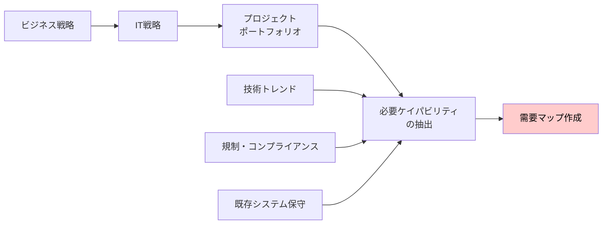
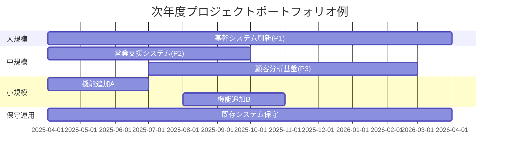
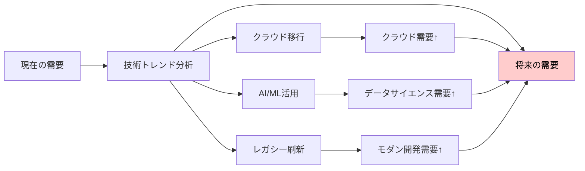
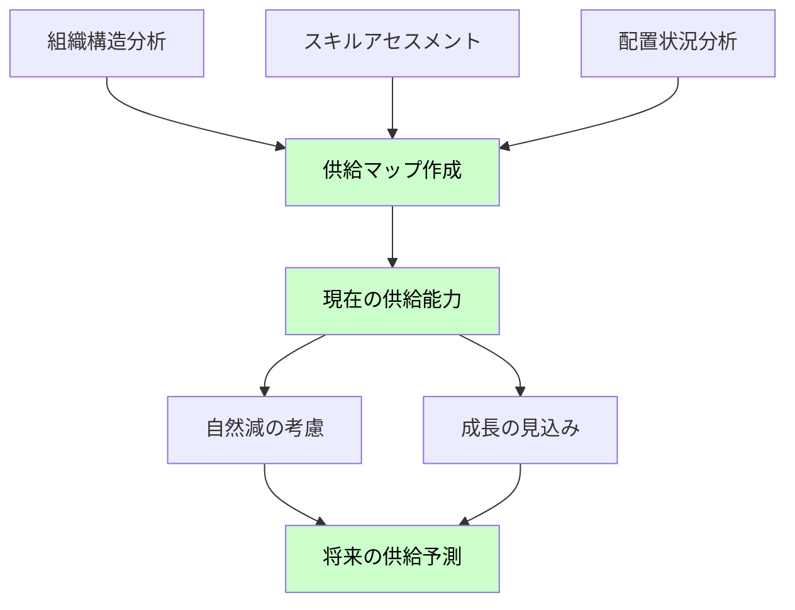
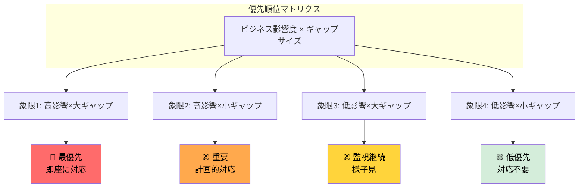

# IT組織におけるケイパビリティ管理フレームワーク

## 第2部：需給ギャップ分析

## 目次

1. [需要側の分析：必要なケイパビリティの特定](#需要側の分析必要なケイパビリティの特定)
2. [供給側の分析：現状ケイパビリティの把握](#供給側の分析現状ケイパビリティの把握)
3. [需給ギャップの可視化](#需給ギャップの可視化)

---
<br>

## 需要側の分析：必要なケイパビリティの特定

### 需要予測のアプローチ


<br>

### プロジェクトポートフォリオからの需要分析

#### ステップ1: プロジェクトの分類

プロジェクトを性質別にカテゴライズし、標準的なケイパビリティ構成を適用する。

| カテゴリ | 特徴 | 主要必要能力 | 想定人月 | 能力構成比（例） |
|---------|------|--------------|----------|------------------|
| **大規模新規開発** | 基幹システム刷新、全社プロジェクト | PM（高度）、EA、要件定義、IT専門（高） | 100-300 | PM:10%, 企画:15%, 要件:20%, 開発:40%, テスト:15% |
| **中規模新規開発** | 部門システム構築、新規サービス | PM、要件定義、開発、テスト | 30-100 | PM:10%, 要件:25%, 開発:45%, テスト:20% |
| **小規模開発** | 機能追加、改善 | 要件定義、開発 | ~30 | 要件:30%, 開発:50%, テスト:20% |
| **保守運用** | 既存システム維持、障害対応 | 保守運用、テスト、技術サポート | 継続的 | 保守:60%, 監視:20%, 改善:20% |
| **技術調査・POC** | 新技術検証、実証実験 | 技術専門性、イノベーション | ~20 | 技術調査:40%, 開発:40%, 評価:20% |
---

<br>

#### ステップ2: プロジェクト一覧からの需要算出

**例：次年度プロジェクトポートフォリオ**


<br>

**需要計算例（簡易版）:**

次年度に必要なケイパビリティを、供給側と同じカテゴリで算出します。

| スキルカテゴリ | 必要人月 | 月平均必要人数（L2相当） | 可視化（■ = 0.5名） |
|--------------|---------|----------------------|-------------------|
| ビジネス知識 | 60 | 5名 | ■■■■■■■■■■ |
| IT専門知識 | 96 | 8名 | ■■■■■■■■■■■■■■■■ |
| 要件定義 | 104 | 9名 | ■■■■■■■■■■■■■■■■■■ |
| 開発・構築 | 195 | 16名 | ■■■■■■■■■■■■■■■■■■■■■■■■■■■■■■■■ |
| PM/企画 | 41 | 3名 | ■■■■■■ |
| テスト | 79 | 7名 | ■■■■■■■■■■■■■■ |
| 保守運用 | 144 | 12名 | ■■■■■■■■■■■■■■■■■■■■■■■■ |
---

<br>

**計算ロジック:**
- 総人月 ÷ 12ヶ月 = 月平均必要人数
- 例：要件定義 104人月 ÷ 12ヶ月 ≒ 9名（L2相当）

<br>

#### ステップ3: 粗粒度から詳細へ

データの精度に応じて、段階的に詳細化する。

**レベル1: 粗粒度（最小限のデータで実施可能）**
- 役割別カテゴリ：ビジネス知識、IT専門知識、PM/企画、要件定義、開発・構築、テスト、保守運用
- 総必要人月のみ

**レベル2: 中粒度**
- 技術領域の追加：クラウド、データ、セキュリティなど
- スキルレベルの区分：初級・中級・上級

**レベル3: 詳細**
- 個別スキルの特定：AWS、Python、アジャイルPMなど
- レベル別の詳細要件：L1-L5

<br>

### 技術トレンドの反映

将来的な技術シフトも需要に影響する。


<br>

**技術トレンドによる需要変化の例（3年間の予測）**

| スキルカテゴリ | 現在の需要 | 3年後の需要 | 変化 | 現在の可視化（■ = 0.5名） | 3年後の可視化（■ = 0.5名） |
|--------------|-----------|------------|------|----------------------|------------------------|
| ビジネス知識 | 5名 | 5名 | ±0 | ■■■■■■■■■■ | ■■■■■■■■■■ |
| IT専門知識（レガシー） | 8名 | 4名 | -4名 | ■■■■■■■■■■■■■■■■ | ■■■■■■■■ |
| IT専門知識（クラウド） | 3名 | 10名 | +7名 | ■■■■■■ | ■■■■■■■■■■■■■■■■■■■■ |
| 要件定義 | 9名 | 10名 | +1名 | ■■■■■■■■■■■■■■■■■■ | ■■■■■■■■■■■■■■■■■■■■ |
| 開発・構築（従来型） | 16名 | 10名 | -6名 | ■■■■■■■■■■■■■■■■■■■■■■■■■■■■■■■■ | ■■■■■■■■■■■■■■■■■■■■ |
| 開発・構築（AI/ML） | 2名 | 8名 | +6名 | ■■■■ | ■■■■■■■■■■■■■■■■ |
| PM/企画 | 3名 | 4名 | +1名 | ■■■■■■ | ■■■■■■■■ |
| テスト（手動） | 7名 | 3名 | -4名 | ■■■■■■■■■■■■■■ | ■■■■■■ |
| テスト（自動化） | 1名 | 5名 | +4名 | ■■ | ■■■■■■■■■■ |
| 保守運用 | 12名 | 10名 | -2名 | ■■■■■■■■■■■■■■■■■■■■■■■■ | ■■■■■■■■■■■■■■■■■■■■ |

**主要トレンドの影響:**

1. **クラウド移行**: 
   - レガシーインフラ需要減少（8名 → 4名）
   - クラウド専門性需要増加（3名 → 10名）

2. **AI/ML活用**:
   - データサイエンス・機械学習需要増加（2名 → 8名）
   - 従来型開発需要は微減（16名 → 10名）

3. **自動化推進**:
   - 手動テスト需要減少（7名 → 3名）
   - テスト自動化需要増加（1名 → 5名）
   - 保守運用の効率化により需要微減（12名 → 10名）

<br>

## 供給側の分析：現状ケイパビリティの把握

### 供給分析のアプローチ



<br>

### データ収集の現実的アプローチ

#### アプローチ1: タレントマネジメントシステムがある場合

- スキルマトリクスの出力
- 認定資格データの活用
- パフォーマンスレビューデータの参照
- プロジェクト履歴の分析

<br>

#### アプローチ2: データが不十分な場合（現実的なケース）

**代理指標（プロキシ）の活用**

| 代理指標 | 取得方法 | 推定できる情報 |
|---------|---------|---------------|
| **職位・等級** | 人事システム | スキルレベルの概算 |
| **経験年数** | 人事システム | 熟達度の推定 |
| **現在の配置** | 組織図 | 専門領域の推定 |
| **過去のプロジェクト実績** | プロジェクト管理ツール | 実務経験の確認 |
| **保有資格** | 人事記録 | 技術領域の確認 |

<br>

**簡易スキルマトリクスの作成**

2段階評価から開始し、段階的に詳細化する。

**初期版（2段階）：**
- **レベル1（初級～中級）**: 支援が必要、独力では困難
- **レベル2（上級以上）**: 独力で遂行可能、他者を指導可能

<br>

**例：簡易スキルマトリクス**

**ステップ1: 個人別スキル評価**

| 氏名 | ビジネス知識 | IT専門知識 | PM/企画 | 要件定義 | 開発・構築 | テスト | 保守運用 |
|------|-------------|-----------|---------|---------|-----------|--------|---------|
| 山田太郎 | 2 | 1 | 2 | 2 | 1 | 1 | 1 |
| 鈴木花子 | 1 | 2 | 1 | 1 | 2 | 2 | 1 |
| 佐藤次郎 | 2 | 2 | 1 | 2 | 1 | 1 | 2 |
| 田中一郎 | 1 | 2 | 2 | 1 | 2 | 1 | 1 |
| 高橋美咲 | 2 | 1 | 1 | 2 | 1 | 2 | 1 |
| **集計** | **8** | **8** | **7** | **8** | **7** | **7** | **6** |
---

<br>

**ステップ2: スキル別集計結果（L2相当人数）**

| スキルカテゴリ | 現有能力（L2相当） | 可視化（■ = 0.5名） |
|--------------|------------------|-------------------|
| ビジネス知識 | 8名 | ■■■■■■■■■■■■■■■■ |
| IT専門知識 | 8名 | ■■■■■■■■■■■■■■■■ |
| 要件定義 | 8名 | ■■■■■■■■■■■■■■■■ |
| 開発・構築 | 7名 | ■■■■■■■■■■■■■■ |
| PM/企画 | 7名 | ■■■■■■■■■■■■■■ |
| テスト | 7名 | ■■■■■■■■■■■■■■ |
| 保守運用 | 6名 | ■■■■■■■■■■■■ |
---

<br>

### 自然減と成長の考慮

**自然減の要因:**
- 退職・転職（年間5-10%程度）
- 部門異動
- 休職・長期休暇
- スキルの陳腐化（技術の変化）

**成長の見込み:**
- 育成プログラムによるスキルアップ
- 実務経験によるレベルアップ（L1→L2、L2→L3等）
- 社内認定制度での昇格
- 外部資格取得

<br>

**例：3年後の供給予測**

| スキルカテゴリ | 現在 | 自然減（3年） | 成長（3年） | 3年後予測 | 変化 | 現在の可視化（■ = 0.5名） | 3年後の可視化（■ = 0.5名） |
|--------------|------|--------------|------------|-----------|------|----------------------|------------------------|
| ビジネス知識 | 8名 | -2名 | +2名 | 8名 | ±0 | ■■■■■■■■■■■■■■■■ | ■■■■■■■■■■■■■■■■ |
| IT専門知識 | 8名 | -2名 | +3名 | 9名 | +1名 | ■■■■■■■■■■■■■■■■ | ■■■■■■■■■■■■■■■■■■ |
| 要件定義 | 8名 | -2名 | +2名 | 8名 | ±0 | ■■■■■■■■■■■■■■■■ | ■■■■■■■■■■■■■■■■ |
| 開発・構築 | 7名 | -2名 | +4名 | 9名 | +2名 | ■■■■■■■■■■■■■■ | ■■■■■■■■■■■■■■■■■■ |
| PM/企画 | 7名 | -2名 | +2名 | 7名 | ±0 | ■■■■■■■■■■■■■■ | ■■■■■■■■■■■■■■ |
| テスト | 7名 | -2名 | +1名 | 6名 | -1名 | ■■■■■■■■■■■■■■ | ■■■■■■■■■■■■ |
| 保守運用 | 6名 | -2名 | +1名 | 5名 | -1名 | ■■■■■■■■■■■■ | ■■■■■■■■■■ |
---

<br>

**変動の内訳例（開発・構築）:**
- 現在: 7名 → 自然減: -2名（退職・異動） → 残: 5名 → 成長: +4名（育成完了・昇格） → **3年後: 9名**

**供給側の注意点:**
- 自然減は控えめに見積もり（年間5-10% → 3年で約15-25%）
- 成長は育成計画の実行を前提（計画未達リスクあり）
- リスキリング（スキル転換）の効果も含む

<br>
<br>

## 需給ギャップの可視化

### ギャップ計算の基本式

```
ギャップ = 需要 - 供給
```

- **ギャップ > 0**: 供給不足（採用・育成・外部活用が必要）
- **ギャップ = 0**: 需給均衡
- **ギャップ < 0**: 供給過剰（再配置・リスキリングの機会）

<br>

### 可視化の例

#### 例1: 粗粒度ギャップマップ

| 能力カテゴリ | 需要（人月） | 供給（人月） | ギャップ | 状態 |
|------------|------------|------------|---------|------|
| PM/企画 | 34 | 28 | -6 | 🔴 不足 |
| 要件定義 | 87 | 90 | +3 | 🟢 充足 |
| 開発・構築 | 163 | 140 | -23 | 🔴 不足 |
| テスト | 66 | 72 | +6 | 🟢 充足 |
| 保守運用 | 120 | 110 | -10 | 🟡 やや不足 |
| **合計** | **500** | **440** | **-60** | 🔴 **全体不足** |

<br>

#### 例2: 技術領域別×レベル別ギャップ

| 技術領域 | L1-L2（初級・中級） | L3-L4（上級・エキスパート） | 合計ギャップ |
|---------|---------------------|---------------------------|-------------|
| クラウドアーキテクチャ | +2名 | **-7名** 🔴 | -5名 |
| データサイエンス | -3名 | **-6名** 🔴 | -9名 |
| セキュリティ | 0名 | **-4名** 🔴 | -4名 |
| アジャイルPM | +5名 | **-3名** 🟡 | +2名 |
| フロントエンド開発 | -8名 | +1名 | -7名 |

**重要な洞察:**
- 上級・エキスパートレベル（L3-L4）の不足が顕著
- 初級・中級レベルは過剰または均衡状態
- **育成によるレベルアップが鍵**

<br>

### ヒートマップによる可視化

需要と供給を比較し、スキル×レベルの組み合わせでギャップを可視化します。

**スキル・レベル別ギャップマトリクス**

| スキル領域 | レベル | 需要 | 供給 | ギャップ | 状態 | 可視化（■ = 1名不足） |
|-----------|--------|------|------|---------|------|-------------------|
| クラウドアーキテクチャ | L3-L4 | 10名 | 3名 | **-7名** | 🔴 深刻 | ■■■■■■■ |
| データサイエンス | L3-L4 | 8名 | 2名 | **-6名** | 🔴 深刻 | ■■■■■■ |
| セキュリティ | L3 | 6名 | 2名 | **-4名** | 🔴 深刻 | ■■■■ |
| アジャイルPM | L3 | 5名 | 2名 | **-3名** | 🟡 要対応 | ■■■ |
| フロントエンド開発 | L1-L2 | 12名 | 4名 | **-8名** | 🟡 要対応 | ■■■■■■■■ |
| 要件定義 | L2 | 9名 | 12名 | **+3名** | 🟢 充足 | （余剰） |
---

<br>


<br>

**重要な洞察:**
- **上級レベル（L3-L4）の不足が顕著**: クラウド、データサイエンス、セキュリティ
- **初級・中級レベル（L1-L2）**: フロントエンド開発は人数的には不足だが、育成で対応可能
- **余剰スキル**: 要件定義（L2）は他領域へのリスキリング候補

<br>

### ギャップの優先順位付け

すべてのギャップを同時に解消するのは現実的ではないため、優先順位を明確にする。



<br>

**優先順位判断基準**

| 象限 | ビジネス影響 | ギャップサイズ | 対応方針 | 例 |
|------|-------------|---------------|---------|-----|
| **象限1** | 高 | 大 | 🔴 最優先：複数手段併用で即座に対応 | クラウドアーキテクト不足（基幹システム移行に必須） |
| **象限2** | 高 | 小 | 🟡 重要：計画的に対応、主に育成 | アジャイルPM不足（既存PMの再教育で対応可能） |
| **象限3** | 低 | 大 | 🟡 監視継続：様子見、長期的に検討 | レガシー技術の専門家不足（システム刷新予定） |
| **象限4** | 低 | 小 | 🟢 低優先：対応不要 | 特定の旧ツールスキル |

<br>

**具体例：優先順位付けされたギャップリスト**

| 順位 | スキル/能力 | ギャップ | ビジネス影響 | 理由 | 対応期限 |
|------|-----------|---------|-------------|------|---------|
| 1 | クラウドアーキテクト（L3-4） | -7名 | 🔴 高 | 基幹システムクラウド移行プロジェクト（P1）に必須 | 3ヶ月以内 |
| 2 | データサイエンティスト（L3-4） | -6名 | 🔴 高 | 顧客分析基盤（P3）、経営判断に影響 | 6ヶ月以内 |
| 3 | セキュリティエンジニア（L3） | -4名 | 🔴 高 | コンプライアンス、リスク管理上必須 | 6ヶ月以内 |
| 4 | アジャイルPM（L3） | -3名 | 🟡 中 | 開発速度向上、ただし既存PMの育成で対応可 | 9ヶ月以内 |
| 5 | テスト自動化エンジニア | -5名 | 🟡 中 | 品質向上、効率化に寄与 | 12ヶ月以内 |

---
<br>

## まとめ

この第2部では、需給ギャップ分析の具体的な方法について解説しました。

**重要なポイント:**
- 需要側は、プロジェクトポートフォリオから段階的に詳細化して算出する
- 供給側は、現実的な制約の中で代理指標を活用しながらデータを収集する
- ギャップは「需要 - 供給」で定量化し、ビジネス影響度とサイズで優先順位を付ける
- 上級・エキスパートレベルの不足が多くの組織で課題

**次のステップ:**
第3部では、データ制約下での実践的アプローチと、ギャップ解消の具体的な戦略について解説します。
