# IT組織におけるケイパビリティ管理フレームワーク
## 需給ギャップ可視化を中心として

---

## 目次

1. [エグゼクティブサマリー](#エグゼクティブサマリー)
2. [ケイパビリティ管理の全体像](#ケイパビリティ管理の全体像)
3. [ケイパビリティの定義と分類](#ケイパビリティの定義と分類)
4. [需要側の分析：必要なケイパビリティの特定](#需要側の分析必要なケイパビリティの特定)
5. [供給側の分析：現状ケイパビリティの把握](#供給側の分析現状ケイパビリティの把握)
6. [需給ギャップの可視化](#需給ギャップの可視化)
7. [データ制約下での実践的アプローチ](#データ制約下での実践的アプローチ)
8. [終章：ギャップ対応策の概要](#終章ギャップ対応策の概要)

---

## エグゼクティブサマリー

### 本ドキュメントの目的

IT組織における**ケイパビリティ管理**の体系的なフレームワークを提示し、特に**需給ギャップの可視化**に焦点を当てた実践的なガイドラインを提供する。

### ケイパビリティ管理とは

組織が戦略目標を達成するために必要な能力（技術、スキル、知識、経験）を：
- **定義**し
- **測定**し
- **開発**し
- **最適化**する

継続的なマネジメントプロセス。

### 需給ギャップ可視化の重要性

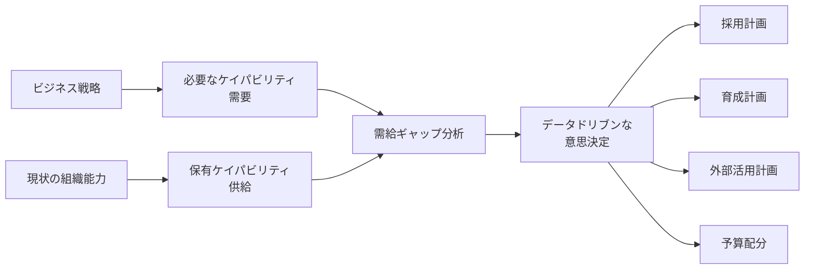

需給ギャップの可視化は、感覚的な「人が足りない」から、**具体的な「どのスキルが何名不足」** への転換を実現し、限られたリソースの最適配分を可能にする。

<br>

## ケイパビリティ管理の全体像

### ケイパビリティ管理のプロセスフロー


### 各プロセスの概要

| フェーズ | 目的 | 主な活動 | アウトプット |
|---------|------|---------|-------------|
| **1. 戦略分析** | ビジネス戦略の理解 | IT戦略の確認、事業計画の分析 | 戦略要件一覧 |
| **2. ケイパビリティ定義** | 必要な能力の体系化 | スキル分類、レベル定義 | ケイパビリティモデル |
| **3. 需要予測** | 将来必要な能力の特定 | プロジェクト分析、技術トレンド調査 | 需要マップ |
| **4. 供給分析** | 現状保有能力の把握 | スキルアセスメント、組織分析 | 供給マップ |
| **5. ギャップ分析** | 需給の差異を定量化 | 比較分析、優先順位付け | ギャップレポート |
| **6. 対応策立案** | ギャップ解消計画 | Build/Buy/Borrow戦略 | アクションプラン |
| **7. 実行** | 計画の実施 | 採用、育成、外部活用 | 実績データ |
| **8. モニタリング** | 進捗管理 | KPI追跡、効果測定 | ダッシュボード |

<br>

## ケイパビリティの定義と分類

### ケイパビリティの4つの軸

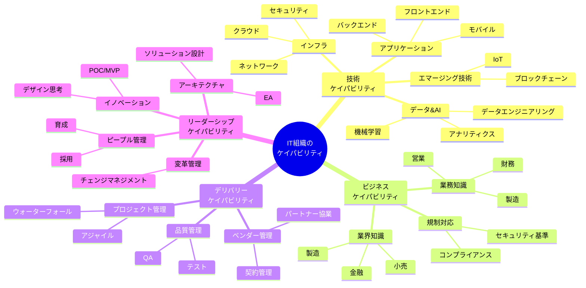

### レベル定義フレームワーク

IT組織におけるスキルレベルは、一般的に以下のように定義される：

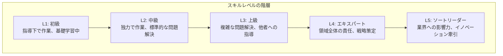

#### 各レベルの詳細定義

| レベル | 名称 | 期待される行動 | 意思決定範囲 | 影響範囲 |
|--------|------|----------------|--------------|----------|
| **L1** | 初級 | ・タスクを指示に従って実行<br/>・基礎的な知識を学習中<br/>・頻繁な支援が必要 | タスク内の選択 | 個人 |
| **L2** | 中級 | ・独力で標準的なタスクを完遂<br/>・一般的な問題を自己解決<br/>・時々の支援で対応可能 | タスクの実行方法 | 個人～小チーム |
| **L3** | 上級 | ・複雑な問題を分析・解決<br/>・他者への技術指導<br/>・設計レベルの判断 | 設計・アーキテクチャ | チーム～部門 |
| **L4** | エキスパート | ・領域全体の技術責任<br/>・標準化・ベストプラクティス推進<br/>・戦略的な技術判断 | 技術戦略 | 部門～組織全体 |
| **L5** | ソートリーダー | ・業界への発信・影響<br/>・イノベーション牽引<br/>・組織横断的な変革推進 | 組織戦略への影響 | 組織～業界 |

### T字型/π字型人材モデル

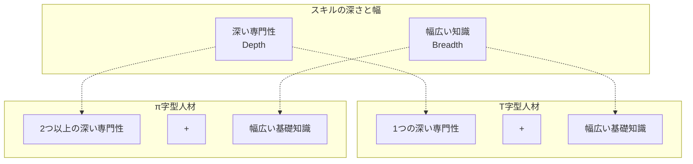

**例：T字型人材**
- 深い専門性：クラウドアーキテクチャ（L4）
- 幅広い知識：ネットワーク（L2）、セキュリティ（L2）、開発（L2）

**例：π字型人材**
- 深い専門性1：クラウドアーキテクチャ（L4）
- 深い専門性2：データエンジニアリング（L3）
- 幅広い知識：アジャイル（L2）、ビジネス知識（L2）

<br>

## 需要側の分析：必要なケイパビリティの特定

### 需要予測のアプローチ

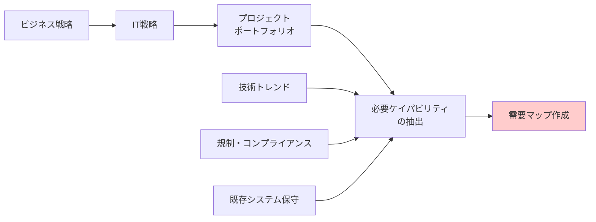

### プロジェクトポートフォリオからの需要分析

#### ステップ1: プロジェクトの分類

プロジェクトを性質別にカテゴライズし、標準的なケイパビリティ構成を適用する。

| カテゴリ | 特徴 | 主要必要能力 | 想定人月 | 能力構成比（例） |
|---------|------|--------------|----------|------------------|
| **大規模新規開発** | 基幹システム刷新、全社プロジェクト | PM（高度）、EA、要件定義、IT専門（高） | 100-300 | PM:10%, 企画:15%, 要件:20%, 開発:40%, テスト:15% |
| **中規模新規開発** | 部門システム構築、新規サービス | PM、要件定義、開発、テスト | 30-100 | PM:10%, 要件:25%, 開発:45%, テスト:20% |
| **小規模開発** | 機能追加、改善 | 要件定義、開発 | ~30 | 要件:30%, 開発:50%, テスト:20% |
| **保守運用** | 既存システム維持、障害対応 | 保守運用、テスト、技術サポート | 継続的 | 保守:60%, 監視:20%, 改善:20% |
| **技術調査・POC** | 新技術検証、実証実験 | 技術専門性、イノベーション | ~20 | 技術調査:40%, 開発:40%, 評価:20% |

#### ステップ2: プロジェクト一覧からの需要算出

**例：次年度プロジェクトポートフォリオ**

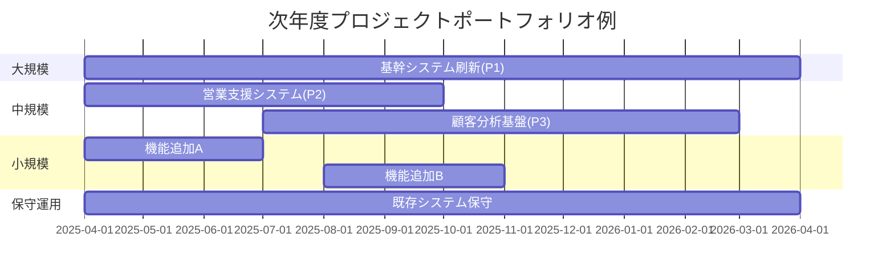

**需要計算例：**

| プロジェクト | カテゴリ | 総人月 | PM | 企画 | 要件定義 | 開発・構築 | テスト | 保守運用 |
|-------------|---------|--------|-----|------|---------|-----------|--------|---------|
| P1: 基幹システム刷新 | 大規模 | 200 | 20 | 30 | 40 | 80 | 30 | - |
| P2: 営業支援システム | 中規模 | 60 | 6 | - | 15 | 27 | 12 | - |
| P3: 顧客分析基盤 | 中規模 | 80 | 8 | - | 20 | 36 | 16 | - |
| 機能追加A/B | 小規模 | 40 | - | - | 12 | 20 | 8 | - |
| 既存システム保守 | 保守 | 120 | - | - | - | - | - | 120 |
| **合計** | - | **500** | **34** | **30** | **87** | **163** | **66** | **120** |

#### ステップ3: 粗粒度から詳細へ

データの精度に応じて、段階的に詳細化する。

**レベル1: 粗粒度（最小限のデータで実施可能）**
- 役割別カテゴリ：PM、企画、要件定義、開発・構築、テスト、保守運用
- 総必要人月のみ

**レベル2: 中粒度**
- 技術領域の追加：クラウド、データ、セキュリティなど
- スキルレベルの区分：初級・中級・上級

**レベル3: 詳細**
- 個別スキルの特定：AWS、Python、アジャイルPMなど
- レベル別の詳細要件：L1-L5

### 地域別需要の考慮

グローバル展開している組織では、地域別の需要も重要。

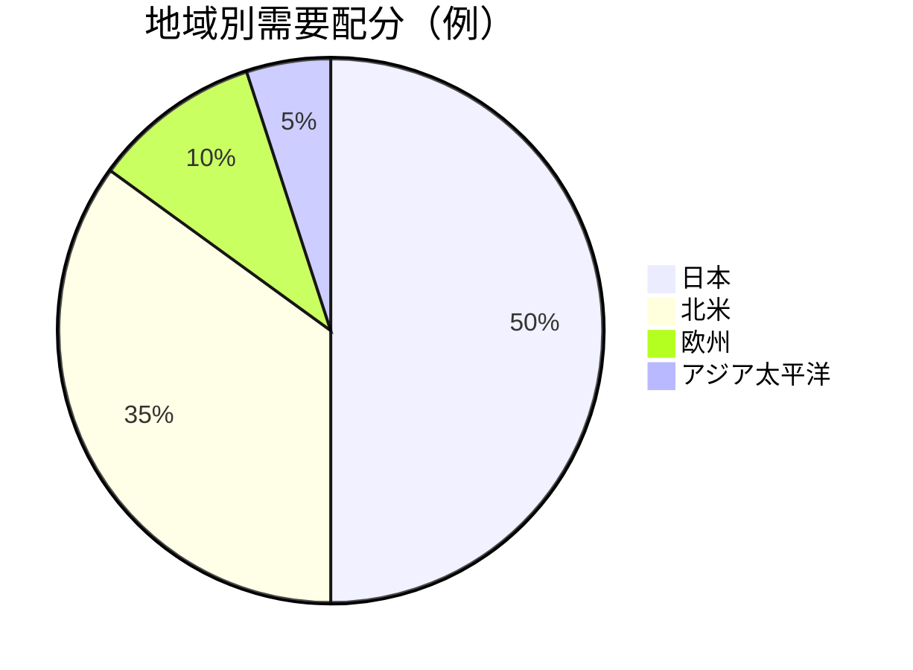

**例：海外事業拡大シナリオ**

| 年度 | 日本 | 北米 | 合計 | 北米比率 |
|------|------|------|------|---------|
| 現在 | 100名 | 100名 | 200名 | 50% |
| 1年目 | 100名 | 120名 | 220名 | 55% |
| 2年目 | 100名 | 140名 | 240名 | 58% |
| 3年目 | 100名 | 160名 | 260名 | 62% |

### 技術トレンドの反映

将来的な技術シフトも需要に影響する。

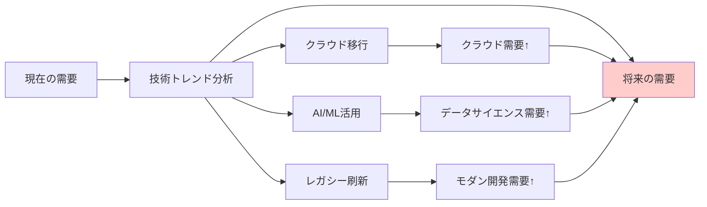

<br>

## 供給側の分析：現状ケイパビリティの把握

### 供給分析のアプローチ

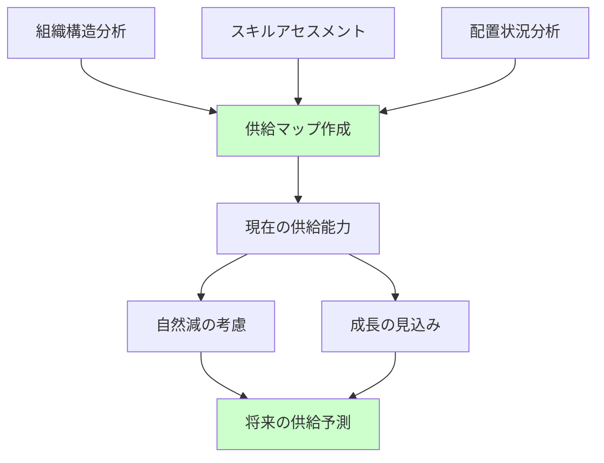

### データ収集の現実的アプローチ

#### アプローチ1: タレントマネジメントシステムがある場合

- スキルマトリクスの出力
- 認定資格データの活用
- パフォーマンスレビューデータの参照
- プロジェクト履歴の分析

#### アプローチ2: データが不十分な場合（現実的なケース）

**代理指標（プロキシ）の活用**

| 代理指標 | 取得方法 | 推定できる情報 |
|---------|---------|---------------|
| **職位・等級** | 人事システム | スキルレベルの概算 |
| **経験年数** | 人事システム | 熟達度の推定 |
| **現在の配置** | 組織図 | 専門領域の推定 |
| **過去のプロジェクト実績** | プロジェクト管理ツール | 実務経験の確認 |
| **保有資格** | 人事記録 | 技術領域の確認 |

**簡易スキルマトリクスの作成**

2段階評価から開始し、段階的に詳細化する。

**初期版（2段階）：**
- **レベル1（初級～中級）**: 支援が必要、独力では困難
- **レベル2（上級以上）**: 独力で遂行可能、他者を指導可能

**例：簡易スキルマトリクス**

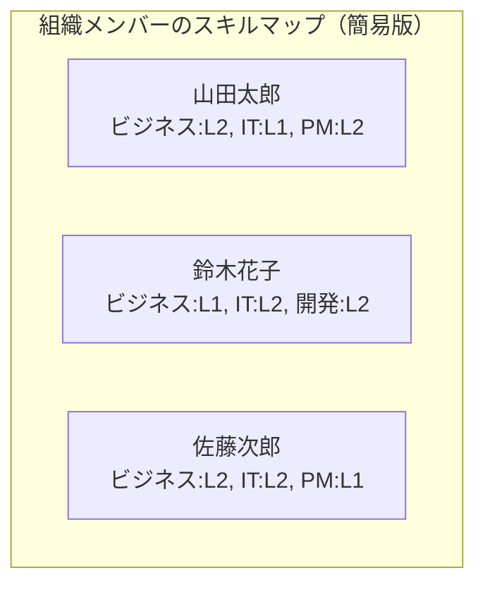

| 氏名 | ビジネス知識 | IT専門知識 | PM/企画 | 要件定義 | 開発・構築 | テスト | 保守運用 |
|------|-------------|-----------|---------|---------|-----------|--------|---------|
| 山田太郎 | 2 | 1 | 2 | 2 | 1 | 1 | 1 |
| 鈴木花子 | 1 | 2 | 1 | 1 | 2 | 2 | 1 |
| 佐藤次郎 | 2 | 2 | 1 | 2 | 2 | 1 | 1 |
| 田中一郎 | 1 | 1 | 1 | 1 | 1 | 1 | 2 |
| 伊藤美咲 | 2 | 2 | 2 | 2 | 1 | 1 | 1 |

**集計：レベル2（上級以上）の人数**

| 能力カテゴリ | L2保有者数 | 総メンバー数 | 保有率 |
|-------------|-----------|-------------|--------|
| ビジネス知識 | 3名 | 5名 | 60% |
| IT専門知識 | 3名 | 5名 | 60% |
| PM/企画 | 2名 | 5名 | 40% |
| 要件定義 | 3名 | 5名 | 60% |
| 開発・構築 | 2名 | 5名 | 40% |
| テスト | 1名 | 5名 | 20% |
| 保守運用 | 1名 | 5名 | 20% |

### 組織構造からの供給分析

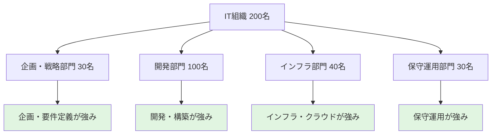

**各部門の主要ケイパビリティ推定**

| 部門 | 人数 | 主要ケイパビリティ | 供給可能人月（年間） |
|------|------|-------------------|-------------------|
| 企画・戦略 | 30名 | PM、企画、要件定義 | PM:180, 企画:180, 要件:120 |
| 開発 | 100名 | 開発・構築、テスト | 開発:800, テスト:200 |
| インフラ | 40名 | クラウド、ネットワーク、セキュリティ | インフラ全般:400 |
| 保守運用 | 30名 | 保守運用、技術サポート | 保守:300 |

### 雇用形態別の供給分析

特に日本国内では、正規社員と契約社員（フリーランス、派遣）の構成比が重要。

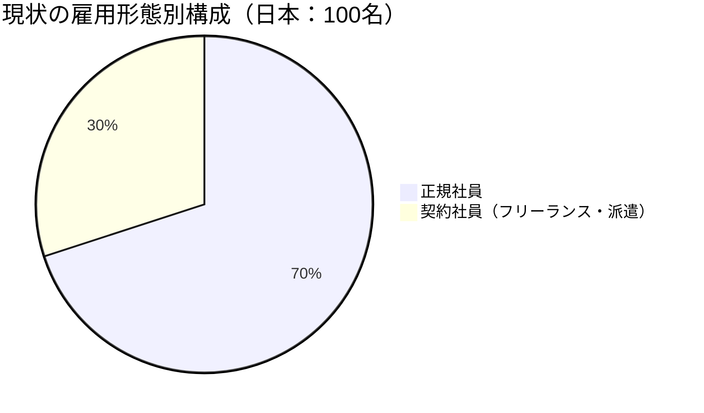

**雇用形態別の特性**

| 雇用形態 | メリット | デメリット | 適した役割 |
|---------|---------|-----------|-----------|
| **正規社員** | ・長期的育成可能<br/>・組織知識の蓄積<br/>・コミットメント高 | ・固定費<br/>・柔軟性低<br/>・採用に時間 | コア業務、マネジメント、長期プロジェクト |
| **契約社員** | ・柔軟な調整可能<br/>・専門スキル即戦力<br/>・変動費化 | ・組織への帰属意識<br/>・知識の流出リスク<br/>・契約期間制約 | 短期プロジェクト、専門技術、繁閑調整 |

### 地域別の供給分析

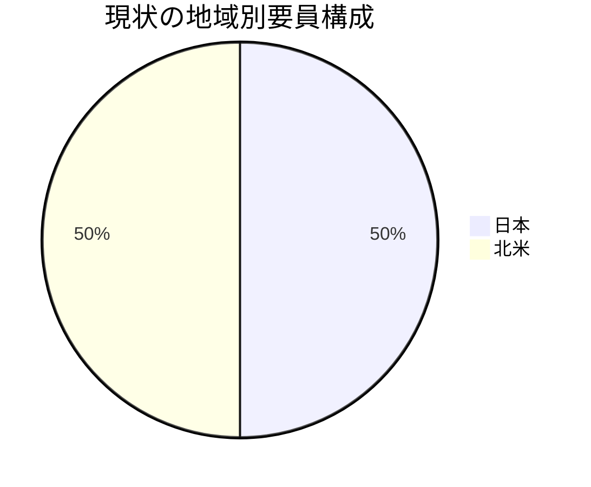

**地域別コストと特性**

| 地域 | 平均単価（年間） | 得意領域 | 課題 |
|------|----------------|---------|------|
| 日本 | ¥8,000,000 | 業務知識、要件定義 | 英語力、グローバル対応 |
| 北米 | $120,000 (¥18,000,000) | 最新技術、クラウド | コスト高、文化差異 |

<br>

## 需給ギャップの可視化

### ギャップ分析の全体フロー

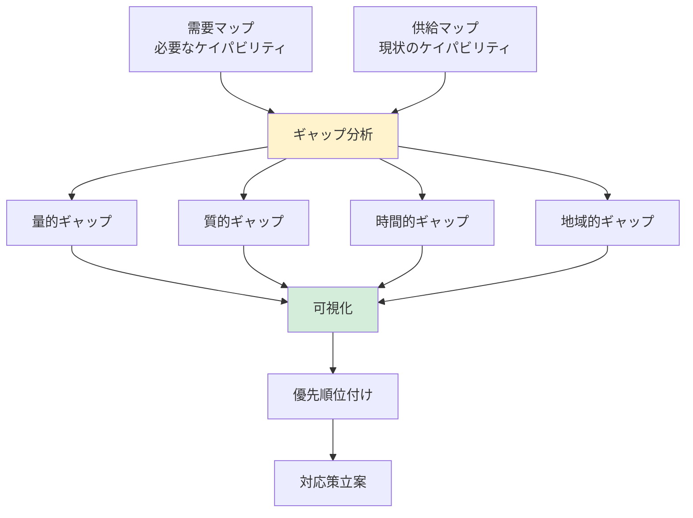

### レベル1: 量的ギャップ（最も基本的）

総量ベースでの過不足を把握。

**例：年間総人月ベース**

```
総必要人月（需要）:   500人月/年
総供給可能（供給）:   400人月/年
─────────────────────────────
ギャップ:            -100人月/年 (20%不足)
```

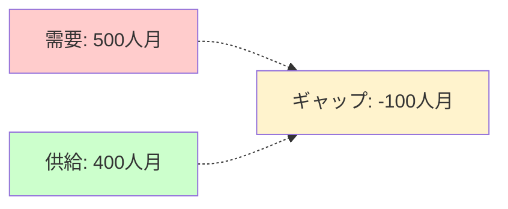

**意思決定への示唆:**
- 100人月分の外部リソース調達が必要
- または、プロジェクトの優先順位付け・延期を検討

### レベル2: 領域別ギャップ

能力カテゴリ別の過不足を可視化。

**例：能力カテゴリ別の需給比較**

| 能力カテゴリ | 需要（人月/年） | 供給（人月/年） | ギャップ | 充足率 | 状態 |
|-------------|----------------|----------------|---------|--------|------|
| PM/企画 | 64 | 60 | -4 | 94% | 🟡 |
| 要件定義 | 87 | 70 | -17 | 80% | 🔴 |
| 開発・構築 | 163 | 150 | -13 | 92% | 🟡 |
| テスト | 66 | 50 | -16 | 76% | 🔴 |
| 保守運用 | 120 | 120 | 0 | 100% | 🟢 |
| **合計** | **500** | **450** | **-50** | **90%** | - |

**ヒートマップ形式の可視化**

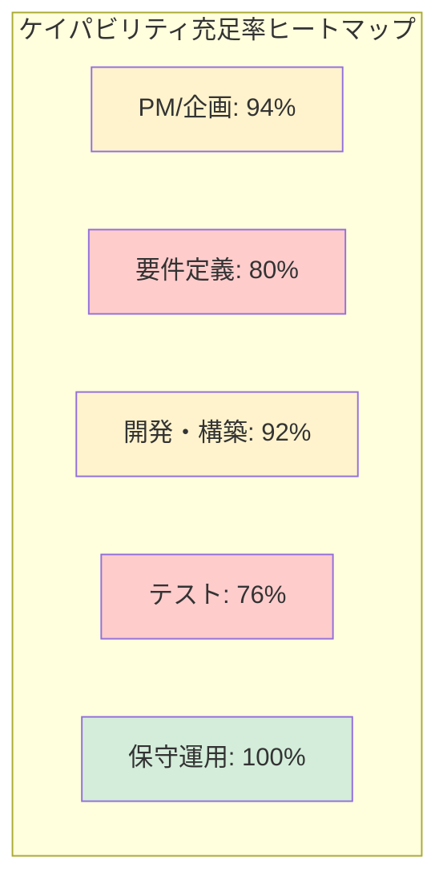

**凡例:**
- 🟢 緑（充足率95%以上）：良好
- 🟡 黄（充足率80-95%）：要注意
- 🔴 赤（充足率80%未満）：クリティカル

**意思決定への示唆:**
- 要件定義とテストの人材を優先的に確保
- PM/企画と開発は比較的充足しているが監視継続
- 保守運用は適切に配置されている

### レベル3: スキル×レベル別ギャップ

より詳細な質的ギャップを分析。

**例：クラウドスキルの需給分析**

| スキル | レベル | 需要（名） | 供給（名） | ギャップ | 充足率 | 対応策の方向性 |
|--------|--------|-----------|-----------|---------|--------|---------------|
| クラウドアーキテクチャ | L4-5 | 5 | 1 | -4 | 20% | 🔴 採用優先 |
| クラウドアーキテクチャ | L3 | 10 | 3 | -7 | 30% | 🔴 採用+育成 |
| クラウドエンジニアリング | L2-3 | 20 | 12 | -8 | 60% | 🟡 育成中心 |
| クラウドエンジニアリング | L1 | 15 | 10 | -5 | 67% | 🟡 育成 |

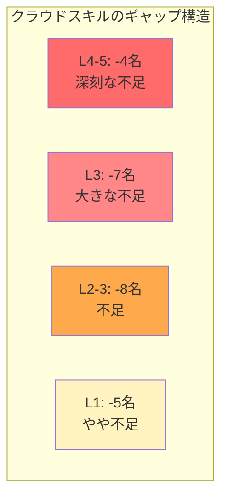

**意思決定への示唆:**
- L4-5のエキスパートは市場から即採用が必須
- L3は採用と内部育成の並行実施
- L2以下は内部育成プログラムで対応可能

### レベル4: 時系列ギャップ（動的分析）

時間軸を加えた分析により、いつギャップが発生するかを可視化。

**例：四半期別のギャップ推移**

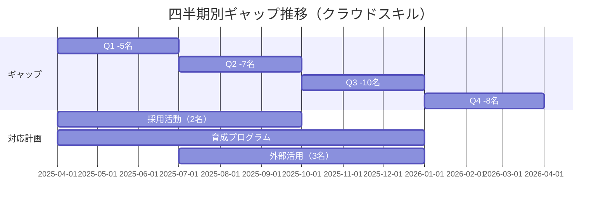

**年次推移の可視化**

| スキル | 2025 Q1 | 2025 Q2 | 2025 Q3 | 2025 Q4 | 2026年 | 2027年 |
|--------|---------|---------|---------|---------|--------|--------|
| クラウド | -5 | -7 | -10 | -8 | -12 | -15 |
| データ分析 | -3 | -4 | -6 | -8 | -10 | -12 |
| セキュリティ | -2 | -3 | -3 | -4 | -5 | -6 |
| アジャイルPM | -2 | -3 | -2 | -4 | -5 | -6 |

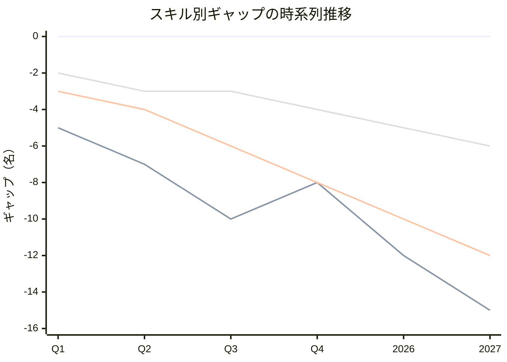

**意思決定への示唆:**
- クラウドスキルは今年度中に採用開始が必須（Q3がピーク）
- データ分析は段階的に悪化、中長期の育成計画が必要
- セキュリティは緊急性は低いが継続的な補強が必要

### レベル5: 多次元ギャップ（最も高度）

複数の軸を組み合わせた総合的な分析。

**軸の組み合わせ例:**
- スキル × レベル × 地域 × 時期
- スキル × プロジェクト × 優先度

**例：地域×スキル×時期のギャップマトリクス**

| スキル | レベル | 日本 Q1 | 日本 Q2 | 北米 Q1 | 北米 Q2 | 対応優先度 |
|--------|--------|---------|---------|---------|---------|-----------|
| クラウド | L3-4 | -2 | -3 | -5 | -7 | 🔴 最高 |
| データ分析 | L3-4 | -3 | -4 | -2 | -3 | 🔴 高 |
| アジャイルPM | L3 | -1 | -2 | -2 | -3 | 🟡 中 |

```mermaid
graph TD
    subgraph "多次元ギャップ分析"
    A[クラウドL3-4] --> A1[日本: Q1 -2, Q2 -3]
    A --> A2[北米: Q1 -5, Q2 -7]
    A2 --> A3[最優先対応<br/>北米での採用活動]
    
    B[データ分析L3-4] --> B1[日本: Q1 -3, Q2 -4]
    B --> B2[北米: Q1 -2, Q2 -3]
    B1 --> B3[高優先<br/>日本で育成+採用]
    end
    
    style A3 fill:#ff6b6b
    style B3 fill:#ffa94d
```

### 総合可視化ダッシュボード（概念図）

実際の運用では、以下のような要素を含むダッシュボードを構築する。

```mermaid
graph TD
    subgraph "ケイパビリティギャップダッシュボード"
    A[全体サマリー]
    B[領域別ヒートマップ]
    C[時系列トレンド]
    D[地域別比較]
    E[クリティカルギャップアラート]
    end
    
    A --> A1[総充足率: 78%<br/>目標: 85%<br/>改善: +5% 前期比]
    B --> B1[要件定義: 🔴<br/>テスト: 🔴<br/>開発: 🟡]
    C --> C1[ギャップ拡大傾向<br/>クラウド, データ分析]
    D --> D1[北米: 充足率65%<br/>日本: 充足率85%]
    E --> E1[最優先対応: 3件<br/>1. クラウドL3-4 北米<br/>2. データ分析L3-4<br/>3. アジャイルPM]
```

### ギャップの優先順位付け

すべてのギャップを同時に解消するのは現実的ではないため、優先順位を明確にする。

```mermaid
graph TD
    subgraph "優先順位マトリクス"
    A[ビジネス影響度 × ギャップサイズ]
    end
    
    A --> B[象限1: 高影響×大ギャップ]
    A --> C[象限2: 高影響×小ギャップ]
    A --> D[象限3: 低影響×大ギャップ]
    A --> E[象限4: 低影響×小ギャップ]
    
    B --> B1[🔴 最優先<br/>即座に対応]
    C --> C1[🟡 重要<br/>計画的対応]
    D --> D1[🟡 監視継続<br/>様子見]
    E --> E1[🟢 低優先<br/>対応不要]
    
    style B1 fill:#ff6b6b
    style C1 fill:#ffa94d
    style D1 fill:#ffd43b
    style E1 fill:#d4edda
```

**優先順位判断基準**

| 象限 | ビジネス影響 | ギャップサイズ | 対応方針 | 例 |
|------|-------------|---------------|---------|-----|
| **象限1** | 高 | 大 | 🔴 最優先：複数手段併用で即座に対応 | クラウドアーキテクト不足（基幹システム移行に必須） |
| **象限2** | 高 | 小 | 🟡 重要：計画的に対応、主に育成 | アジャイルPM不足（既存PMの再教育で対応可能） |
| **象限3** | 低 | 大 | 🟡 監視継続：様子見、長期的に検討 | レガシー技術の専門家不足（システム刷新予定） |
| **象限4** | 低 | 小 | 🟢 低優先：対応不要 | 特定の旧ツールスキル |

**具体例：優先順位付けされたギャップリスト**

| 順位 | スキル/能力 | ギャップ | ビジネス影響 | 理由 | 対応期限 |
|------|-----------|---------|-------------|------|---------|
| 1 | クラウドアーキテクト（L3-4） | -7名 | 🔴 高 | 基幹システムクラウド移行プロジェクト（P1）に必須 | 3ヶ月以内 |
| 2 | データサイエンティスト（L3-4） | -6名 | 🔴 高 | 顧客分析基盤（P3）、経営判断に影響 | 6ヶ月以内 |
| 3 | セキュリティエンジニア（L3） | -4名 | 🔴 高 | コンプライアンス、リスク管理上必須 | 6ヶ月以内 |
| 4 | アジャイルPM（L3） | -3名 | 🟡 中 | 開発速度向上、ただし既存PMの育成で対応可 | 9ヶ月以内 |
| 5 | テスト自動化エンジニア | -5名 | 🟡 中 | 品質向上、効率化に寄与 | 12ヶ月以内 |

<br>
<br>

## データ制約下での実践的アプローチ

### 現実的な課題

多くの組織では、理想的なデータが揃っていない。

**典型的なデータ制約:**
- スキルマトリクスが未整備
- タレントマネジメントシステムが未導入
- プロジェクトで必要な能力の定義が粗い
- 個人のスキルレベルが不明確

### 段階的詳細化アプローチ

```mermaid
flowchart LR
    A[フェーズ1<br/>即時実施<br/>量的ギャップ] --> B[フェーズ2<br/>1-3ヶ月<br/>粗粒度の<br/>質的ギャップ]
    B --> C[フェーズ3<br/>3-6ヶ月<br/>中粒度<br/>スキル×レベル]
    C --> D[フェーズ4<br/>6-12ヶ月<br/>詳細<br/>多次元分析]
    
    A --> A1[総人月<br/>総員数<br/>予算規模]
    B --> B1[5-10カテゴリ<br/>採用・育成<br/>重点領域]
    C --> C1[個別スキル<br/>レベル別<br/>育成計画]
    D --> D1[最適化<br/>継続改善<br/>予測管理]
    
    style A fill:#d4edda
    style B fill:#d4edda
    style C fill:#fff3cd
    style D fill:#fff3cd
```

### フェーズ1: 量的ギャップ分析（即時実施可能）

**必要データ（最小限）:**
- 現在の総要員数（内部/外部別）
- プロジェクトポートフォリオ（プロジェクト数、規模感）
- 平均単価（内部、外部）

**実施内容:**
1. プロジェクトを大分類し、標準的な人月を適用
2. 総必要人月を算出
3. 現在の供給可能人月と比較
4. 総量ギャップを把握

**意思決定できること:**
- 総要員数の増減方針
- 予算の大枠
- 外部活用の規模感

### フェーズ2: 粗粒度の質的ギャップ（1-3ヶ月）

**追加で必要なデータ:**
- マネジャーへの簡易ヒアリング（1-2時間×5-10名）
- 組織別の主要役割
- 過去のプロジェクトでの困りごと

**実施内容:**
1. 能力を5-10カテゴリに粗分類（例：PM、企画、要件定義、開発、テスト、保守）
2. 各カテゴリの需給を概算
3. マネジャーからの定性情報を収集
   - 「現状困っているスキル不足は？」
   - 「来期のプロジェクトで不安な領域は？」

**意思決定できること:**
- 採用すべきスキル領域
- 育成プログラムの重点
- 外部活用すべき領域

### フェーズ3: 中粒度のギャップ（3-6ヶ月）

**追加で必要なデータ:**
- 簡易スキルマトリクス（2-3段階評価）
- プロジェクト別の詳細要求

**実施内容:**
1. 全メンバーの簡易スキル評価（マネジャー評価または自己申告）
2. スキル×レベルでのギャップ分析
3. クリティカルなギャップの特定

**意思決定できること:**
- 個別の採用ターゲット（スキル×レベル）
- 個人別育成計画の方向性
- リスキリング対象者の選定

### フェーズ4: 詳細ギャップ分析（6-12ヶ月、タレントマネジメント導入後）

**追加で必要なデータ:**
- タレントマネジメントシステムのデータ
- 詳細なスキル評価（5段階以上）
- プロジェクト実績の定量データ

**実施内容:**
- 多次元でのギャップ分析
- 予測モデルの構築
- リアルタイムダッシュボードの運用

**意思決定できること:**
- 最適化された配置
- 予測的な人材計画
- データドリブンな継続改善

### データ精度と意思決定の関係

```mermaid
graph LR
    A[データ精度 ±30%] --> A1[総人員規模<br/>予算オーダー]
    B[データ精度 ±20%] --> B1[領域別配分<br/>採用計画]
    C[データ精度 ±10%] --> C1[詳細育成計画<br/>個別配置]
    D[データ精度 ±5%] --> D1[最適化<br/>ファインチューニング]
    
    A1 --> E[意思決定の80%は<br/>精度30%でも可能]
    
    style E fill:#d4edda
```

**重要な洞察:**
- 精度30%でも「やるべきこと」の80%は決められる
- 完璧なデータを待つより、不完全でも行動開始する方が重要
- 段階的に精度を上げながら、意思決定の質を向上させる

### データ不足時の代替手法

#### 手法1: ベンチマーキング

他社や業界標準のデータを参考にする。

**例：業界標準のスキル構成比**
- PM/企画：全体の10-15%
- 要件定義：15-20%
- 開発：40-50%
- テスト：10-15%
- 保守運用：15-20%

#### 手法2: エキスパートジャッジメント

経験豊富なマネジャーやアーキテクトの知見を活用。

**実施方法:**
1. 3-5名のシニアマネジャー/アーキテクトを招集
2. デルファイ法（複数回の匿名投票と議論）でコンセンサス形成
3. 粗いギャップ推定を実施

#### 手法3: パイロット分析

小規模な部門や特定プロジェクトで詳細分析を試行。

**実施方法:**
1. 1つの部門（30-50名規模）で詳細なスキル評価
2. 1つの大型プロジェクトで必要能力を詳細に洗い出し
3. 結果を全体に外挿

### リスクベースのアプローチ

完全なデータがなくても、リスクの高い領域を特定して対応。

```mermaid
graph TD
    A[リスク領域の特定] --> B[代替不可能な能力]
    A --> C[明らかな数的不足]
    A --> D[過去のトラブル実績]
    
    B --> B1[特定システムに<br/>精通した人材が1名のみ]
    C --> C1[北米プロジェクト3件<br/>vs 北米要員5名]
    D --> D1[過去に要員不足で<br/>遅延したプロジェクト種別]
    
    B1 --> E[優先対応]
    C1 --> E
    D1 --> E
    
    style E fill:#ff6b6b
```

**リスク領域の例:**
1. **SPOF（単一障害点）**: ある人にしかできない業務
2. **クリティカルパス**: 遅延が全体に影響する領域
3. **コンプライアンス**: 規制対応で必須の能力

<br>

## 終章：ギャップ対応策の概要

需給ギャップを可視化した後は、そのギャップを解消するための対応策を立案・実行する。

### Build-Buy-Borrow-Bot戦略

ギャップ解消には4つの基本戦略があり、ギャップの性質に応じて使い分ける。

```mermaid
graph TD
    A[ギャップ解消戦略] --> B[Build<br/>育成]
    A --> C[Buy<br/>採用]
    A --> D[Borrow<br/>外部活用]
    A --> E[Bot<br/>自動化]
    
    B --> B1[・長期的コアケイパビリティ<br/>・時間的余裕あり<br/>・組織固有知識]
    C --> C1[・即戦力が必要<br/>・市場で入手可能<br/>・内部育成困難]
    D --> D1[・一時的需要<br/>・実験的取組み<br/>・ピーク時補完]
    E --> E1[・反復的タスク<br/>・標準化可能<br/>・人的リソース不足]
```

#### 1. Build（育成）

**適用場面:**
- 長期的に必要なコアケイパビリティ
- 組織固有の知識・経験が必要
- 時間的余裕がある（6ヶ月～2年）

**主な手法:**
- 構造化された育成プログラム（トレーニングパス、メンタリング）
- ジョブローテーション（複数プロジェクト/領域での経験蓄積）
- 社内認定制度、技術コミュニティ活動
- 外部研修・資格取得支援

**例:**
- 既存の開発エンジニアをクラウドエンジニアに育成（9-12ヶ月）
- PMOメンバーをアジャイルPMに転換（6ヶ月のトレーニング+実践）

#### 2. Buy（採用）

**適用場面:**
- 即座に必要なケイパビリティ
- 内部育成が困難な高度専門性
- 市場で入手可能なスキル

**主な手法:**
- 戦略的採用計画（スキルギャップに基づいた計画的採用）
- ダイバーシティ採用（異業種、異文化からの採用）
- テックブランディング（技術ブログ、カンファレンス登壇）
- リファラル制度（社員紹介）

**例:**
- クラウドアーキテクト（L4）を市場から2名採用（3-6ヶ月）
- データサイエンティスト（L3-4）を3名採用（6ヶ月）

#### 3. Borrow（外部活用）

**適用場面:**
- 一時的な需要（プロジェクトベース）
- 実験的取り組み（技術検証、POC）
- ピーク時の補完

**形態別の活用:**
- **コンサルタント**: 戦略立案、専門知識の注入（3-6ヶ月）
- **フリーランス**: 短期プロジェクト、専門技術（3-12ヶ月）
- **SES/派遣**: 定常的な開発リソース（6-24ヶ月）
- **オフショア**: コスト効率的な開発（継続的）

**例:**
- クラウド移行コンサルタント（外部）を6ヶ月活用
- アジャイルコーチを招聘し、内部PMを育成（3ヶ月）

#### 4. Bot（自動化）

**適用場面:**
- 反復的タスク
- 標準化可能な作業
- 人的リソース不足を補完

**主な手法:**
- RPA（定型業務の自動化）
- AI/ML（意思決定支援、異常検知）
- Low-code/No-code（開発の民主化）
- DevOps/IaC（インフラ管理の自動化）

**例:**
- テスト工程の自動化により、テスター需要を30%削減
- RPA導入で保守運用作業を20%効率化

### アクションプラン策定の基本構造

各ギャップに対して、以下の要素を含むアクションプランを策定する。

**アクションプランテンプレート:**

| 要素 | 内容 |
|------|------|
| **ギャップ** | クラウドアーキテクト（L3-4）-7名 |
| **ビジネス影響** | 基幹システムクラウド移行（P1）に必須、遅延リスク大 |
| **優先度** | 🔴 最高 |
| **目標** | 6ヶ月以内に7名相当の能力を確保 |
| **戦略** | Buy（採用）+ Borrow（外部）+ Build（育成）の組み合わせ |
| **短期（3ヶ月）** | ・外部採用開始（目標2名）<br/>・外部コンサル契約（2名相当、3ヶ月）<br/>・認定トレーニング実施（5名受講） |
| **中期（6-12ヶ月）** | ・採用完了（2名）<br/>・内部育成（3名がL3達成）<br/>・外部活用継続（1名相当） |
| **長期（1-2年）** | ・追加育成（2名がL3達成）<br/>・外部依存度低減 |
| **予算** | 採用費：¥5,000,000、外部活用：¥12,000,000、育成費：¥3,000,000 |
| **責任者** | クラウド部門長 |
| **KPI** | ・L3以上のクラウド人材数<br/>・プロジェクトP1の進捗率<br/>・外部依存度 |

### 予算との整合性確保

すべての対応策は、最終的に予算制約内に収める必要がある。

```mermaid
flowchart TD
    A[各ギャップの<br/>対応策コスト算出] --> B[総コスト集計]
    B --> C{予算内？}
    C -->|Yes| D[計画承認]
    C -->|No| E[優先順位に基づく<br/>調整]
    E --> F[低優先度の<br/>対応を延期/削減]
    F --> B
    
    style C fill:#fff3cd
    style D fill:#d4edda
```

**予算調整のポイント:**
1. 最優先（🔴）のギャップ対応は削減しない
2. 重要（🟡）レベルで調整（一部延期、Borrowへのシフト等）
3. 低優先度は次年度送り
4. Build（育成）とBorrow（外部活用）のバランス調整

### モニタリングと継続改善

計画を立てて終わりではなく、継続的にモニタリングし、改善する。

**主要KPI例:**

| KPI | 目的 | 目標値例 |
|-----|------|---------|
| **充足率** | 全体的なケイパビリティの充足度 | 85%以上 |
| **クリティカルギャップ数** | 最優先対応が必要なギャップ | 3件以下 |
| **育成完了率** | 育成プログラムの完遂率 | 80%以上 |
| **採用充足率** | 計画に対する採用実績 | 80%以上 |
| **内部昇格率** | L2→L3等のレベルアップ率 | 年20%以上 |
| **リテンション率** | 重要人材の定着率 | 95%以上 |

**四半期レビューサイクル:**

```mermaid
graph LR
    A[Q1<br/>計画実行] --> B[Q1末<br/>レビュー]
    B --> C[Q2<br/>調整・実行]
    C --> D[Q2末<br/>レビュー]
    D --> E[Q3<br/>調整・実行]
    E --> F[Q3末<br/>レビュー]
    F --> G[Q4<br/>調整・実行]
    G --> H[年度末<br/>総括]
    H --> I[次年度計画]
    
    style B fill:#fff3cd
    style D fill:#fff3cd
    style F fill:#fff3cd
    style H fill:#d4edda
```

<br>

## まとめ

### ケイパビリティ管理成功の鍵

1. **戦略連動**: ビジネス戦略とケイパビリティ戦略を整合させる
2. **需給ギャップの可視化**: データドリブンな意思決定の基盤
3. **段階的アプローチ**: 完璧を求めず、実行可能なレベルから開始
4. **バランスの取れた対応**: Build/Buy/Borrow/Botを最適に組み合わせる
5. **継続的改善**: 一度きりではなく、生きた仕組みとして運用

### 次のステップ

1. **現状のベースライン把握**: 可能な範囲でデータ収集
2. **需要予測**: プロジェクトポートフォリオからの粗算出
3. **量的ギャップ分析**: 総人月レベルでの過不足把握
4. **対応策の立案**: 優先順位に基づいたアクションプラン
5. **予算化**: 必要リソースの予算申請
6. **実行とモニタリング**: KPIに基づいた進捗管理

