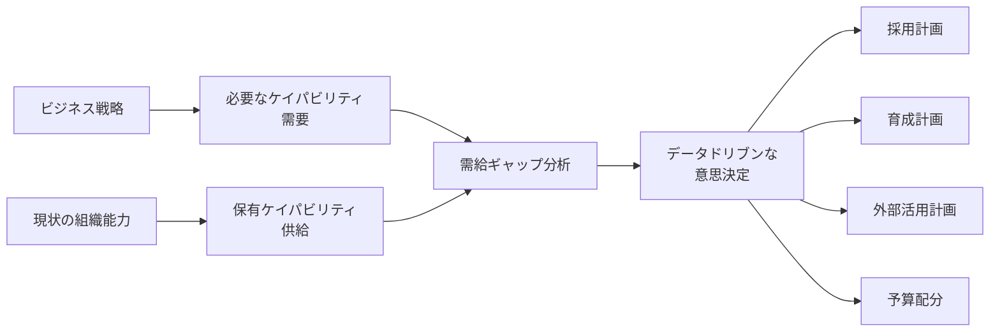
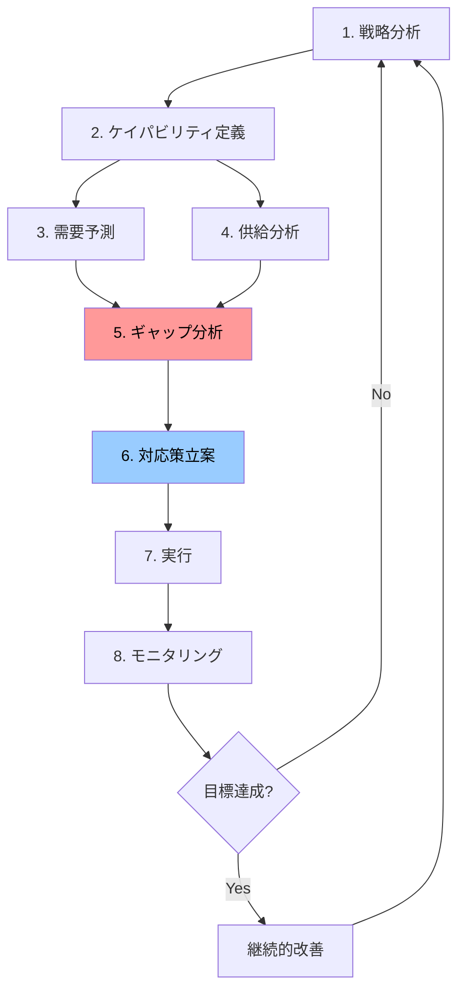
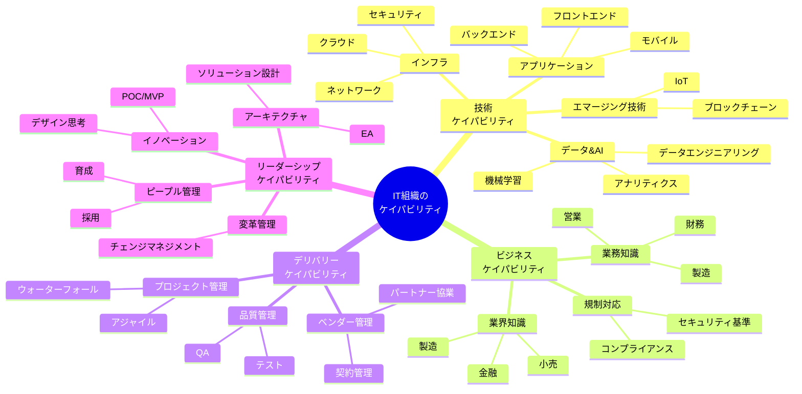
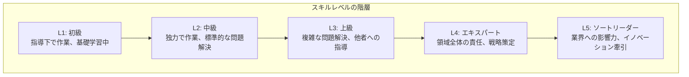
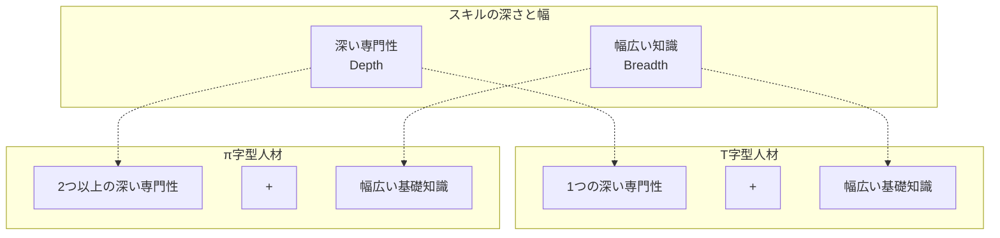

# IT組織におけるケイパビリティ管理フレームワーク

## 第1部：ケイパビリティの概要と定義

IT組織における**ケイパビリティ管理**の体系的なフレームワークを提示し、特に**需給ギャップの可視化**に焦点を当てた実践的なガイドラインを提供する。

### ケイパビリティ管理とは

組織が戦略目標を達成するために必要な能力（技術、スキル、知識、経験）を：
- **定義**し
- **測定**し
- **開発**し
- **最適化**する

継続的なマネジメントプロセス。

### 需給ギャップ可視化の重要性

需給ギャップの可視化は、感覚的な「人が足りない」から、**具体的な「どのスキルが何名不足」** への転換を実現し、限られたリソースの最適配分を可能にする。

 

## ケイパビリティ管理の全体像

### ケイパビリティ管理のプロセスフロー

### 各プロセスの概要

| フェーズ | 目的 | 主な活動 | アウトプット |
|---------|------|---------|-------------|
| **1. 戦略分析** | ビジネス戦略の理解 | IT戦略の確認、事業計画の分析 | 戦略要件一覧 |
| **2. ケイパビリティ定義** | 必要な能力の体系化 | スキル分類、レベル定義 | ケイパビリティモデル |
| **3. 需要予測** | 将来必要な能力の特定 | プロジェクト分析、技術トレンド調査 | 需要マップ |
| **4. 供給分析** | 現状保有能力の把握 | スキルアセスメント、組織分析 | 供給マップ |
| **5. ギャップ分析** | 需給の差異を定量化 | 比較分析、優先順位付け | ギャップレポート |
| **6. 対応策立案** | ギャップ解消計画 | Build/Buy/Borrow戦略 | アクションプラン |
| **7. 実行** | 計画の実施 | 採用、育成、外部活用 | 実績データ |
| **8. モニタリング** | 進捗管理 | KPI追跡、効果測定 | ダッシュボード |

 

## ケイパビリティの定義と分類

### ケイパビリティの4つの軸

 

### 4つのケイパビリティの定義

#### 1. **技術ケイパビリティ** は、ITシステムの設計・構築・運用に必要な技術的な専門知識とスキル
- **インフラ**: クラウド、ネットワーク、セキュリティ
- **アプリケーション**: フロントエンド、バックエンド、モバイル開発
- **データ&AI**: データエンジニアリング、機械学習、アナリティクス
- **エマージング技術**: IoT、ブロックチェーン

#### 2. **ビジネスケイパビリティ** は、業務や業界の特性を理解し、ITと事業を結びつけるための知識とスキル
- **業務知識**: 財務、営業、製造等
- **業界知識**: 金融、製造、小売等
- **規制対応**: コンプライアンス、セキュリティ基準

#### 3. **デリバリーケイパビリティ** は、ITプロジェクトやサービスを計画通りに遂行し、品質を確保して成果を届けるためのマネジメントスキル
- **プロジェクト管理**: アジャイル、ウォーターフォール
- **品質管理**: テスト、QA
- **ベンダー管理**: 契約管理、パートナー協業

#### 4. **リーダーシップケイパビリティ** は、組織や技術の方向性を定め、変革を推進し、人材を育成するための戦略的・組織的スキル
- **アーキテクチャ**: EA、ソリューション設計
- **イノベーション**: デザイン思考、POC/MVP
- **変革管理**: チェンジマネジメント
- **ピープルマネジメント**: 採用、育成

 

## レベル定義フレームワーク

IT組織におけるスキルレベルは、一般的に以下のように定義される：

### 各レベルの詳細定義

| レベル | 名称 | 期待される行動 | 意思決定範囲 | 影響範囲 |
|--------|------|----------------|--------------|----------|
| **L1** | 初級 | ・タスクを指示に従って実行 ・基礎的な知識を学習中 ・頻繁な支援が必要 | タスク内の選択 | 個人 |
| **L2** | 中級 | ・独力で標準的なタスクを完遂 ・一般的な問題を自己解決 ・時々の支援で対応可能 | タスクの実行方法 | 個人～小チーム |
| **L3** | 上級 | ・複雑な問題を分析・解決 ・他者への技術指導 ・設計レベルの判断 | 設計・アーキテクチャ | チーム～部門 |
| **L4** | エキスパート | ・領域全体の技術責任 ・標準化・ベストプラクティス推進 ・戦略的な技術判断 | 技術戦略 | 部門～組織全体 |
| **L5** | ソートリーダー | ・業界への発信・影響 ・イノベーション牽引 ・組織横断的な変革推進 | 組織戦略への影響 | 組織～業界 |

 

## T字型/π字型人材モデル

**T字型/π字型人材モデル** とは、1つ（T字型）または2つ以上（π字型）の深い専門性と、幅広い基礎知識を併せ持つ人材の理想的なスキル構成を示すモデル

**例：T字型人材**
- 深い専門性：クラウドアーキテクチャ（L4）
- 幅広い知識：ネットワーク（L2）、セキュリティ（L2）、開発（L2）

**例：π字型人材**
- 深い専門性1：クラウドアーキテクチャ（L4）
- 深い専門性2：データエンジニアリング（L3）
- 幅広い知識：アジャイル（L2）、ビジネス知識（L2）

---
 

## まとめ

この第1部では、ケイパビリティ管理の全体像と、ケイパビリティの体系的な分類・レベル定義を解説しました。

**重要なポイント:**
- ケイパビリティは技術・ビジネス・デリバリー・リーダーシップの4つの軸で捉える
- スキルレベルはL1（初級）からL5（ソートリーダー）まで明確に定義する
- T字型・π字型人材モデルで、専門性と幅広さのバランスを考慮する

**次のステップ:**
第2部では、需給ギャップ分析の具体的な方法について解説します。
