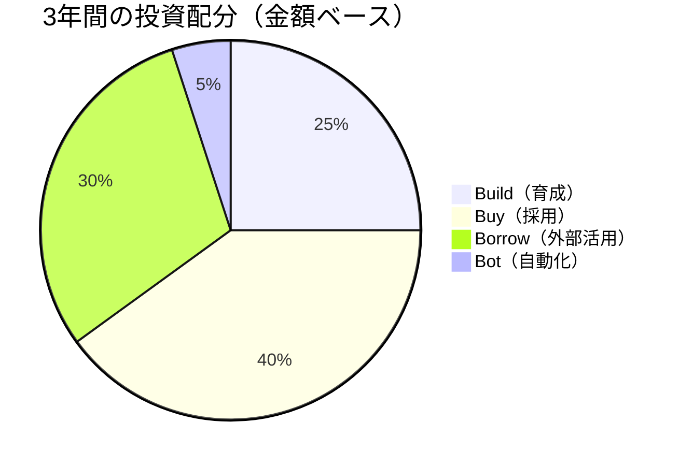

# IT部門 三カ年人材戦略実行計画書

**計画期間**: 2026年度～2028年度（FY2026-FY2028）  
**策定日**: 2026年1月  
**承認者**: IT部門長  
**策定責任者**: 人材戦略担当

---
<br>

## エグゼクティブサマリー

本計画は、IT組織のケイパビリティ管理フレームワークに基づき、今後3年間の人材戦略を体系的に実行するものです。現状の需給ギャップ分析から、**クリティカルギャップの解消**と**将来のビジネス戦略を支える組織能力の構築**を目指します。

### 計画の要点

| 項目 | 内容 |
|------|------|
| **総投資額** | ¥450,000,000（3年間） |
| **目標充足率** | 現状68% → 3年後88%（+20pt） |
| **採用計画** | 合計45名（年平均15名） |
| **育成プログラム** | 延べ120名（重複含む） |
| **外部活用予算** | 年間平均¥80,000,000 |
| **重点領域** | クラウド、データ&AI、アジャイル、セキュリティ |

---
<br>

## 第1章：現状分析

### 1.1 事業戦略とIT戦略の方向性

**事業戦略の3本柱**:
1. デジタルトランスフォーメーション（DX）の加速
2. データドリブン経営の実現
3. グローバル展開の拡大

**IT戦略の重点施策**:
- 基幹システムのクラウド移行（2026-2027年度）
- データ統合基盤の構築（2026-2028年度）
- アジャイル開発体制への移行（2026年度～）
- ゼロトラストセキュリティの実装（2027-2028年度）

### 1.2 ケイパビリティ需給ギャップサマリー

#### 全体充足率

```
現状充足率: 68%
目標充足率: 88%（3年後）

年度別目標:
├─ FY2026: 75%（+7pt）
├─ FY2027: 82%（+7pt）
└─ FY2028: 88%（+6pt）
```

#### クリティカルギャップ（優先度：🔴 最高）

| ケイパビリティ領域 | 必要レベル | ギャップ | ビジネスインパクト |
|------------------|-----------|---------|------------------|
| **クラウドアーキテクチャ** | L3-4 | **-12名** | 基幹システム移行の遅延リスク |
| **データエンジニアリング** | L3-4 | **-9名** | データ基盤構築の遅延 |
| **機械学習/AI** | L3-4 | **-6名** | AI活用施策の停滞 |
| **アジャイルPM/SM** | L3 | **-8名** | 開発体制移行の遅延 |
| **セキュリティアーキテクト** | L3-4 | **-5名** | セキュリティリスクの増大 |

#### 重要ギャップ（優先度：🟡 高）

| ケイパビリティ領域 | 必要レベル | ギャップ |
|------------------|-----------|---------|
| DevOps/SRE | L2-3 | -10名 |
| フロントエンド（React/Vue） | L2-3 | -7名 |
| マイクロサービス設計 | L3 | -4名 |
| データアナリティクス | L2-3 | -6名 |
| エンタープライズアーキテクト | L4-5 | -2名 |

### 1.3 現状の組織能力マップ

**技術ケイパビリティ**:
- クラウド: 不足（充足率45%）
- データ&AI: 不足（充足率38%）
- アプリケーション開発: やや不足（充足率65%）
- セキュリティ: 不足（充足率52%）

**デリバリーケイパビリティ**:
- アジャイル: 大幅不足（充足率35%）
- 品質管理: 充足（充足率82%）
- ウォーターフォールPM: 充足（充足率90%）

**リーダーシップケイパビリティ**:
- アーキテクチャ: 不足（充足率55%）
- イノベーション: やや不足（充足率60%）
- 変革管理: やや不足（充足率70%）

---
<br>

## 第2章：三カ年戦略

### 2.1 基本方針

**4B戦略の最適配分**:



| 戦略 | 投資比率 | 3年間総額 | 主な対象 |
|------|---------|----------|---------|
| **Build（育成）** | 25% | ¥112,500,000 | コアケイパビリティの内製化 |
| **Buy（採用）** | 40% | ¥180,000,000 | 即戦力の確保 |
| **Borrow（外部活用）** | 30% | ¥135,000,000 | 専門性の補完、ピーク対応 |
| **Bot（自動化）** | 5% | ¥22,500,000 | 反復作業の効率化 |

### 2.2 年度別ロードマップ

#### FY2026（初年度）：基盤構築フェーズ

**テーマ**: クリティカルギャップの解消開始 + 育成体制の確立

**主要施策**:
- クラウド・データ人材の緊急採用（15名）
- 外部コンサルタントの戦略的活用（基幹システム移行支援）
- アジャイル認定トレーニングプログラム開始
- スキル評価制度の導入と全社スキル棚卸し

**投資額**: ¥140,000,000

#### FY2027（2年目）：加速フェーズ

**テーマ**: 育成成果の刈り取り + 次世代技術への対応

**主要施策**:
- 継続採用（15名）+ 内部昇格プログラム
- 外部依存度の段階的低減
- AI/機械学習の実践プロジェクト型育成
- セキュリティ専門人材の育成・採用強化

**投資額**: ¥155,000,000

#### FY2028（3年目）：自律化フェーズ

**テーマ**: 持続可能な組織能力の確立

**主要施策**:
- 選択的採用（15名）+ 内部育成中心へシフト
- 社内認定制度の本格運用
- イノベーション・リーダーシップ層の育成
- 外部依存度30%以下を達成

**投資額**: ¥155,000,000

---
<br>

## 第3章：領域別実行計画

### 3.1 クラウドアーキテクチャ（ギャップ: -12名）

**優先度**: 🔴 最高  
**ビジネスインパクト**: 基幹システムクラウド移行（投資額¥5B）の成否を左右

#### 対応戦略

| 年度 | Buy（採用） | Build（育成） | Borrow（外部） | 目標達成 |
|------|------------|--------------|---------------|---------|
| FY2026 | L4: 2名<br/>L3: 3名 | L2→L3: 3名開始 | コンサル: 2名相当 | -12 → -7 |
| FY2027 | L3: 2名 | L2→L3: 3名完了<br/>L3→L4: 2名開始 | コンサル: 1名相当 | -7 → -3 |
| FY2028 | L3: 1名 | L3→L4: 2名完了<br/>L2→L3: 2名開始 | なし | -3 → 0 |

#### アクションプラン

**FY2026（初年度）**:
- Q1: 採用エージェント契約、外部コンサル選定
- Q2: L4クラウドアーキテクト2名内定、AWS認定トレーニング開始（6名受講）
- Q3: L3エンジニア3名採用、外部コンサル着任
- Q4: 社内認定制度設計、OJTプログラム開始

**予算内訳**（FY2026）:
- 採用費: ¥8,000,000（5名 × ¥1,600,000）
- 外部活用: ¥24,000,000（2名相当 × 6ヶ月 × ¥2,000,000/月）
- 育成費: ¥4,500,000（認定資格6名 × ¥750,000）
- **年間合計**: ¥36,500,000

### 3.2 データエンジニアリング（ギャップ: -9名）

**優先度**: 🔴 最高  
**ビジネスインパクト**: データ統合基盤構築（投資額¥3B）の遅延リスク

#### 対応戦略

| 年度 | Buy（採用） | Build（育成） | Borrow（外部） | 目標達成 |
|------|------------|--------------|---------------|---------|
| FY2026 | L3-4: 3名 | L2→L3: 2名開始 | オフショア: 2名相当 | -9 → -4 |
| FY2027 | L3: 2名 | L2→L3: 2名完了<br/>新規: 3名開始 | オフショア継続 | -4 → -1 |
| FY2028 | L3: 1名 | 育成継続: 3名完了 | 段階的削減 | -1 → 0 |

**予算内訳**（3年間合計）:
- 採用: ¥15,000,000
- 外部活用: ¥30,000,000
- 育成: ¥8,000,000
- **合計**: ¥53,000,000

### 3.3 機械学習/AI（ギャップ: -6名）

**優先度**: 🔴 最高  
**ビジネスインパクト**: AI活用施策（売上¥2B貢献目標）の実現

#### 対応戦略

| 年度 | Buy（採用） | Build（育成） | Borrow（外部） | 目標達成 |
|------|------------|--------------|---------------|---------|
| FY2026 | L3-4: 2名 | L2→L3: 2名開始 | 専門家: 1名 | -6 → -3 |
| FY2027 | L3: 2名 | L2→L3: 2名完了<br/>新規: 2名開始 | 専門家継続 | -3 → -1 |
| FY2028 | - | 育成継続: 2名完了 | なし | -1 → +1 |

**重点育成プログラム**:
- Kaggleコンペティション参加支援
- 社内AIプロジェクトへのアサイン（実践学習）
- 外部カンファレンス参加・発表支援

**予算内訳**（3年間合計）:
- 採用: ¥12,000,000
- 外部活用: ¥18,000,000
- 育成: ¥6,000,000
- **合計**: ¥36,000,000

### 3.4 アジャイルPM/SM（ギャップ: -8名）

**優先度**: 🔴 最高  
**ビジネスインパクト**: 開発スピード50%向上、品質20%改善目標

#### 対応戦略

| 年度 | Buy（採用） | Build（育成） | Borrow（外部） | 目標達成 |
|------|------------|--------------|---------------|---------|
| FY2026 | L3: 2名 | 内部転換: 5名開始 | コーチ: 2名 | -8 → -3 |
| FY2027 | L3: 1名 | 内部転換完了: 5名 | コーチ: 1名 | -3 → 0 |
| FY2028 | - | 新規育成: 3名 | なし | 0 → +3 |

**育成プログラム詳細**:
- CSM/CSPO認定取得支援（年間10名）
- 外部アジャイルコーチによるチーム支援（6ヶ月）
- 社内コミュニティ・勉強会の立ち上げ

**予算内訳**（3年間合計）:
- 採用: ¥6,000,000
- 外部活用: ¥24,000,000
- 育成: ¥12,000,000
- **合計**: ¥42,000,000

### 3.5 セキュリティアーキテクト（ギャップ: -5名）

**優先度**: 🔴 最高  
**ビジネスインパクト**: セキュリティインシデントリスク、規制対応

#### 対応戦略

| 年度 | Buy（採用） | Build（育成） | Borrow（外部） | 目標達成 |
|------|------------|--------------|---------------|---------|
| FY2026 | L4: 1名<br/>L3: 1名 | L2→L3: 2名開始 | CISO補佐: 1名 | -5 → -2 |
| FY2027 | L3: 1名 | L2→L3: 2名完了 | なし | -2 → 0 |
| FY2028 | - | L3→L4: 1名育成 | なし | 0 → +1 |

**予算内訳**（3年間合計）:
- 採用: ¥9,000,000
- 外部活用: ¥12,000,000
- 育成: ¥5,000,000
- **合計**: ¥26,000,000

---
<br>

## 第4章：育成プログラム体系

### 4.1 構造化育成プログラム

#### レベル別育成パス

| 対象 | プログラム名 | 期間 | 内容 | 年間規模 |
|------|------------|------|------|---------|
| **L1→L2** | 基礎スキル養成 | 6ヶ月 | 基礎技術、OJT、メンター制度 | 20名 |
| **L2→L3** | 専門性強化 | 12ヶ月 | 認定資格、実践PJ、外部研修 | 15名 |
| **L3→L4** | エキスパート育成 | 18ヶ月 | 高度専門、設計責任、対外発信 | 5名 |
| **L4→L5** | ソートリーダー育成 | 24ヶ月 | 戦略策定、業界貢献、組織変革 | 2名 |

#### 技術領域別プログラム

**クラウド認定プログラム**:
- AWS Solutions Architect Associate/Professional
- Azure Solutions Architect Expert
- GCP Professional Cloud Architect
- 社内クラウド設計認定

**データ&AI認定プログラム**:
- データエンジニアリング基礎
- 機械学習実践（Kaggle参加含む）
- BigData/Data Warehouse設計
- 社内データサイエンティスト認定

**アジャイル認定プログラム**:
- Certified ScrumMaster (CSM)
- Certified Scrum Product Owner (CSPO)
- SAFe認定（Large Scale Agile）
- 社内アジャイルコーチ認定

### 4.2 育成予算

| 年度 | 基礎スキル | 専門性強化 | エキスパート | ソートリーダー | 合計 |
|------|-----------|-----------|------------|--------------|------|
| FY2026 | ¥10,000,000 | ¥15,000,000 | ¥8,000,000 | ¥2,000,000 | ¥35,000,000 |
| FY2027 | ¥12,000,000 | ¥18,000,000 | ¥10,000,000 | ¥3,000,000 | ¥43,000,000 |
| FY2028 | ¥12,000,000 | ¥15,000,000 | ¥12,000,000 | ¥4,000,000 | ¥43,000,000 |

---
<br>

## 第5章：採用計画

### 5.1 年度別採用目標

| 年度 | 総採用数 | クラウド | データ&AI | アジャイル | セキュリティ | その他 |
|------|---------|---------|----------|-----------|------------|--------|
| FY2026 | 15名 | 5名 | 3名 | 2名 | 2名 | 3名 |
| FY2027 | 15名 | 4名 | 4名 | 1名 | 1名 | 5名 |
| FY2028 | 15名 | 2名 | 2名 | 0名 | 0名 | 11名 |

### 5.2 採用戦略

#### 採用チャネルの多様化

| チャネル | 目標比率 | 施策 |
|---------|---------|------|
| **ダイレクトリクルーティング** | 40% | LinkedIn、Wantedly活用 |
| **リファラル採用** | 30% | 紹介インセンティブ制度 |
| **エージェント活用** | 20% | 専門エージェント契約 |
| **新卒/第二新卒** | 10% | ポテンシャル採用枠 |

#### 採用ブランディング施策

- **技術ブログの運営**: 月2本以上の技術記事公開
- **OSS貢献の推進**: 業務時間の一部をOSS活動に充当可能に
- **カンファレンス登壇支援**: 社外発信の奨励と支援
- **柔軟な働き方**: リモート可、フレックス、副業OK

### 5.3 採用予算

| 年度 | 採用費 | 内訳 |
|------|--------|------|
| FY2026 | ¥60,000,000 | エージェント費¥30M、採用広告¥15M、リファラル¥10M、その他¥5M |
| FY2027 | ¥60,000,000 | 同上 |
| FY2028 | ¥60,000,000 | 同上 |

---
<br>

## 第6章：外部活用計画

### 6.1 外部活用の基本方針

**段階的削減目標**:
- FY2026: 外部依存度40% → プロジェクト立ち上げ期の補完
- FY2027: 外部依存度35% → 徐々に内製化シフト
- FY2028: 外部依存度30% → 専門領域のみ活用

### 6.2 活用形態別計画

| 形態 | FY2026 | FY2027 | FY2028 | 主な用途 |
|------|--------|--------|--------|---------|
| **戦略コンサルタント** | ¥20M | ¥15M | ¥10M | クラウド移行、アーキテクチャ設計 |
| **専門エンジニア（フリーランス）** | ¥25M | ¥20M | ¥15M | AI/ML、セキュリティ |
| **SES/派遣** | ¥15M | ¥12M | ¥10M | 開発リソース補完 |
| **オフショア** | ¥20M | ¥20M | ¥20M | 定型開発、保守運用 |

### 6.3 外部活用予算

| 年度 | 総額 | 削減率 |
|------|------|--------|
| FY2026 | ¥80,000,000 | - |
| FY2027 | ¥67,000,000 | -16% |
| FY2028 | ¥55,000,000 | -18% |

---
<br>

## 第7章：自動化投資計画

### 7.1 自動化による需要削減効果

| 領域 | 施策 | 需要削減効果 | 投資額 |
|------|------|-------------|--------|
| **テスト自動化** | Selenium、Jest等の導入・拡大 | L2相当: -3名 | ¥8,000,000 |
| **CI/CD強化** | GitLab CI/CD、Argo CD等 | L2相当: -2名 | ¥6,000,000 |
| **インフラ自動化** | Terraform、Ansible全面展開 | L2相当: -2名 | ¥5,000,000 |
| **RPA導入** | 定型業務の自動化 | L1相当: -2名 | ¥3,500,000 |

### 7.2 自動化予算

| 年度 | 予算 | 主な投資先 |
|------|------|-----------|
| FY2026 | ¥8,000,000 | テスト自動化基盤構築 |
| FY2027 | ¥7,500,000 | CI/CD拡大、IaC展開 |
| FY2028 | ¥7,000,000 | RPA拡大、AI活用 |

---
<br>

## 第8章：予算サマリー

### 8.1 年度別予算

| 費目 | FY2026 | FY2027 | FY2028 | 3年間合計 |
|------|--------|--------|--------|----------|
| **採用費** | ¥60,000,000 | ¥60,000,000 | ¥60,000,000 | ¥180,000,000 |
| **育成費** | ¥35,000,000 | ¥43,000,000 | ¥43,000,000 | ¥121,000,000 |
| **外部活用費** | ¥80,000,000 | ¥67,000,000 | ¥55,000,000 | ¥202,000,000 |
| **自動化投資** | ¥8,000,000 | ¥7,500,000 | ¥7,000,000 | ¥22,500,000 |
| **その他** | ¥5,000,000 | ¥5,000,000 | ¥5,000,000 | ¥15,000,000 |
| **年度合計** | ¥188,000,000 | ¥182,500,000 | ¥170,000,000 | **¥540,500,000** |

※当初計画¥450,000,000から精緻化により¥540,500,000に調整

### 8.2 投資対効果（ROI）

**定量効果**（3年間累計）:
- プロジェクト遅延コスト回避: ¥800,000,000
- 外部委託費削減: ¥150,000,000
- 生産性向上効果: ¥400,000,000
- **合計効果**: ¥1,350,000,000

**投資対効果**:
- **ROI**: 150%（投資¥540M に対し、効果¥1,350M）
- **回収期間**: 約2.2年

**定性効果**:
- 従業員エンゲージメント向上
- 技術ブランド向上による採用力強化
- イノベーション創出力の向上
- ビジネススピードの加速

---
<br>

## 第9章：KPIと測定

### 9.1 主要KPI

#### アウトカムKPI（成果指標）

| KPI | 現状 | FY2026 | FY2027 | FY2028 | 測定頻度 |
|-----|------|--------|--------|--------|---------|
| **ケイパビリティ充足率** | 68% | 75% | 82% | 88% | 四半期 |
| **クリティカルギャップ数** | 5件 | 3件 | 1件 | 0件 | 四半期 |
| **内部昇格率** | 12% | 18% | 22% | 25% | 半期 |
| **リテンション率（重要人材）** | 88% | 92% | 94% | 95% | 四半期 |
| **外部依存度** | 40% | 38% | 33% | 28% | 月次 |

#### アウトプットKPI（活動指標）

| KPI | FY2026 | FY2027 | FY2028 | 測定頻度 |
|-----|--------|--------|--------|---------|
| **採用充足率** | 80% | 85% | 90% | 四半期 |
| **育成プログラム完了率** | 75% | 80% | 85% | 四半期 |
| **認定資格取得者数** | 25名 | 30名 | 35名 | 半期 |
| **スキル評価実施率** | 100% | 100% | 100% | 半期 |

### 9.2 ダッシュボード

四半期ごとに以下の情報を可視化したダッシュボードを経営層に報告:

1. **充足率トレンド**: 全体＋領域別
2. **ギャップ一覧**: クリティカル/重要/その他
3. **アクションプラン進捗**: 採用/育成/外部活用の実績
4. **予算執行状況**: 執行率、残予算
5. **リスク・課題**: 遅延項目、対策

---
<br>

## 第10章：リスク管理

### 10.1 主要リスクと対策

| リスク | 影響度 | 発生確率 | 対策 |
|--------|--------|---------|------|
| **採用難航（想定の50%以下）** | 高 | 中 | ・複数チャネル並行活用<br/>・外部活用で一時補完<br/>・育成枠の拡大 |
| **育成プログラム中途離脱** | 中 | 中 | ・キャリアパス明確化<br/>・インセンティブ設計<br/>・メンター制度強化 |
| **重要人材の流出** | 高 | 低 | ・報酬制度見直し<br/>・キャリア開発支援<br/>・ワークライフバランス改善 |
| **外部リソース確保困難** | 中 | 低 | ・複数ベンダーとの関係構築<br/>・早期契約締結 |
| **技術トレンド急変** | 中 | 中 | ・四半期ごとの需要見直し<br/>・柔軟な計画調整 |
| **予算削減要請** | 高 | 低 | ・優先順位明確化<br/>・段階的実行オプション準備 |

### 10.2 エスカレーション基準

以下の状況が発生した場合、IT部門長へ即座にエスカレーション:

- クリティカルギャップが計画より2名以上拡大
- 採用充足率が目標の70%未満で推移
- 重要人材が四半期に3名以上退職
- 予算超過が20%以上見込まれる状況

---
<br>

## 第11章：実行体制

### 11.1 推進体制

```
IT部門長（最終承認者）
    │
    ├─ 人材戦略室（事務局）
    │   ├─ 計画統括・進捗管理
    │   ├─ 採用推進
    │   ├─ 育成プログラム運営
    │   └─ KPIモニタリング
    │
    ├─ 技術領域責任者会議（月次）
    │   ├─ クラウド領域
    │   ├─ データ&AI領域
    │   ├─ アプリケーション領域
    │   └─ セキュリティ領域
    │
    └─ ステアリングコミッティ（四半期）
        └─ 経営層への報告・方針決定
```

### 11.2 役割と責任

| 役割 | 責任 |
|------|------|
| **IT部門長** | 最終意思決定、予算承認、経営層への報告 |
| **人材戦略室長** | 計画全体の推進、KPI管理、課題解決 |
| **技術領域責任者** | 領域別計画の実行、育成プログラム運営、スキル評価 |
| **採用担当** | 採用計画の実行、候補者管理、オンボーディング |
| **育成担当** | 育成プログラムの企画・運営、効果測定 |

### 11.3 定例会議体

| 会議体 | 頻度 | 参加者 | 目的 |
|--------|------|--------|------|
| **ステアリングコミッティ** | 四半期 | IT部門長、経営層 | 進捗報告、重要意思決定 |
| **技術領域責任者会議** | 月次 | 人材戦略室、領域責任者 | 施策調整、課題共有 |
| **採用・育成定例** | 週次 | 人材戦略室 | 実務進捗確認 |

---
<br>

## 第12章：継続的改善

### 12.1 PDCA サイクル

**四半期レビュー**:
1. **Plan（計画）**: 四半期目標の設定
2. **Do（実行）**: アクションプランの遂行
3. **Check（評価）**: KPI達成状況の確認、ギャップ再評価
4. **Act（改善）**: 計画の調整、新規アクションの追加

**年次レビュー**:
- 年度目標の達成評価
- 次年度計画の策定
- 成功事例・失敗事例の共有と学習

### 12.2 計画の柔軟性

本計画は以下の原則で運用:

1. **四半期ごとの見直し**: 事業環境・技術トレンドの変化に応じて調整
2. **優先順位の動的変更**: クリティカルギャップの変動に応じて柔軟に対応
3. **予算の柔軟配分**: 効果の高い施策へのシフト可能
4. **実験的取り組みの許容**: 10%の予算は新規施策の試行に充当

---
<br>

## 第13章：承認と実行開始

### 13.1 承認プロセス

| ステップ | 期限 | 承認者 | ステータス |
|---------|------|--------|-----------|
| 1. ドラフト作成 | 2026年1月15日 | 人材戦略室 | ✓完了 |
| 2. 技術領域責任者レビュー | 2026年1月25日 | 各領域責任者 | - |
| 3. 財務部門との調整 | 2026年2月5日 | 財務部長 | - |
| 4. 最終承認 | 2026年2月15日 | IT部門長 | - |
| 5. 実行開始 | 2026年4月1日 | - | - |

<br>

### 13.2 承認欄

本計画書の内容を確認し、承認します。

**IT部門長**  
署名: ________________  
日付: ________________

**人材戦略室長**  
署名: ________________  
日付: ________________

**財務部長**（予算承認）  
署名: ________________  
日付: ________________

---
<br>

## 付録

### A. 用語集

| 用語 | 定義 |
|------|------|
| **ケイパビリティ** | 組織が目標達成に必要な能力（技術、スキル、知識、経験の総称） |
| **需給ギャップ** | 必要な能力（需要）と現状の保有能力（供給）の差異 |
| **4B戦略** | Build（育成）、Buy（採用）、Borrow（外部活用）、Bot（自動化）の総称 |
| **T字型人材** | 1つの深い専門性＋幅広い基礎知識を持つ人材 |
| **π字型人材** | 2つ以上の深い専門性＋幅広い基礎知識を持つ人材 |
| **充足率** | （現在の供給）÷（必要な需要）× 100% |

### B. 参考資料

- ケイパビリティ管理フレームワーク（全3部）
- 需給ギャップ分析詳細レポート
- 市場給与水準調査
- 技術トレンド分析レポート

### C. 改訂履歴

| 版 | 日付 | 改訂内容 | 承認者 |
|----|------|---------|--------|
| 1.0 | 2026年1月15日 | 初版作成 | 人材戦略室長 |

---

**本計画書に関する問い合わせ先**:  

