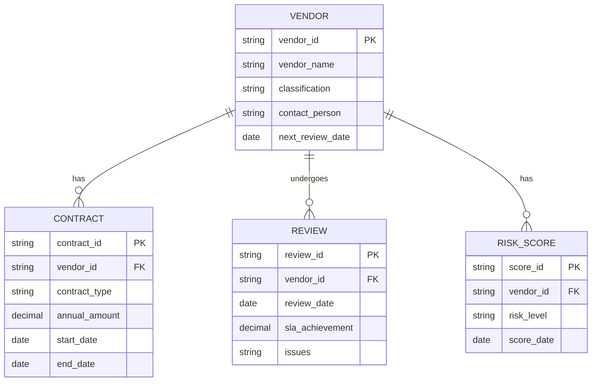
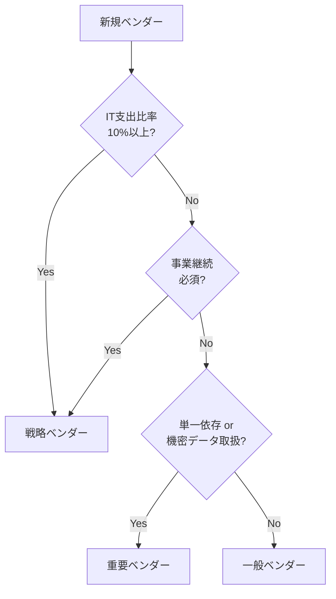
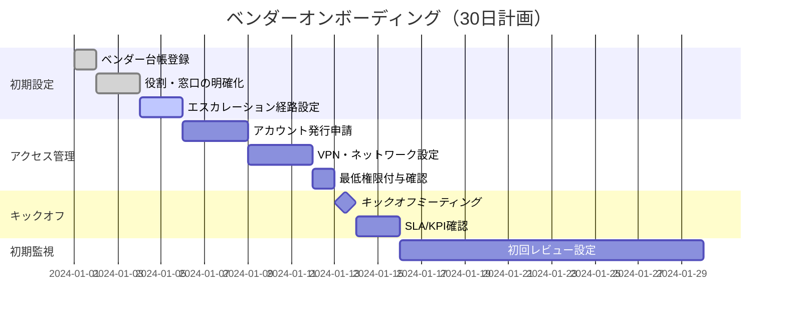
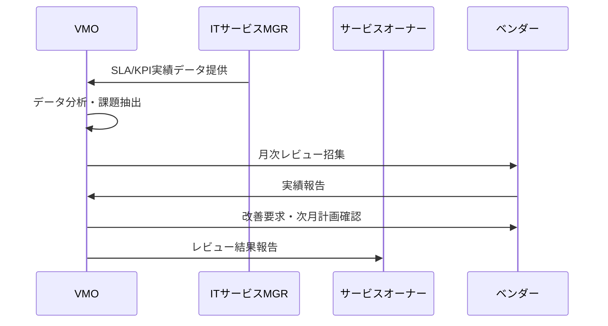
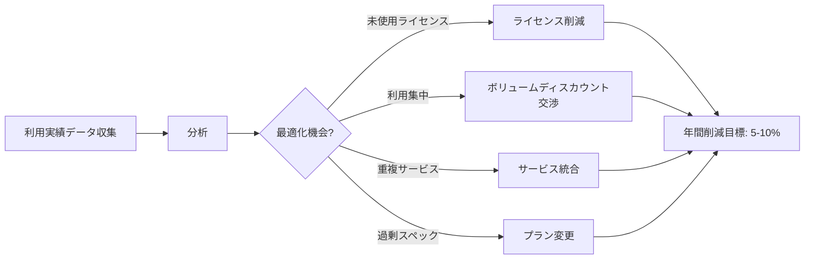
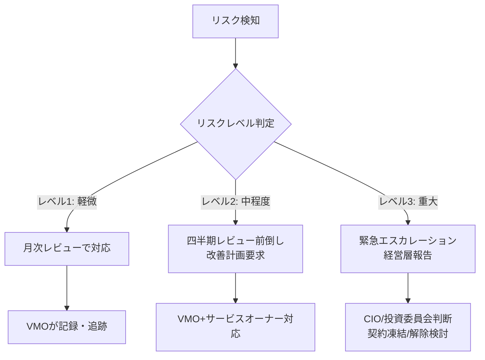
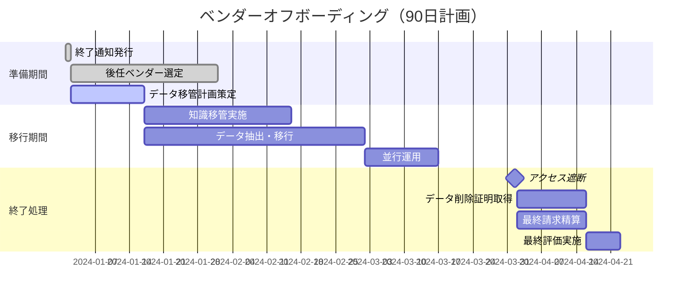

# ベンダーマネジメント実践ガイド

## 第3章：ベンダーライフサイクル管理

ベンダーマネジメントは「選定して終わり」ではありません。VMOは契約締結から終了まで、継続的にベンダーを管理する責任があります。

### 3.1 ベンダー台帳の作成と管理（VMOの最重要業務）

**VMOが管理すべきベンダー台帳の項目**：

**ベンダー分類（VMOが決定）**：

| 分類 | 定義 | レビュー頻度 | 管理レベル |
|------|------|---------------------|-----------|
| 戦略ベンダー | IT支出10%以上 or 事業継続必須 | 四半期毎 | 最高 |
| 重要ベンダー | 単一依存 or 機密データ取扱 | 半期毎 | 高 |
| 一般ベンダー | 代替可能・低額 | 年次 | 標準 |

**VMOが実施する分類基準**：

 

### 3.2 オンボーディング（VMOが主導）

契約締結後、VMOがベンダーを組織に迎え入れるプロセスです。

**VMOのオンボーディングチェックリスト**：

**VMOが実施すべき項目**：
1. ベンダー台帳への登録（ベンダーID、分類、連絡先）
2. ビジネスオーナー、技術オーナーの任命
3. エスカレーション経路の整備
4. アクセス権・VPN・アカウント発行のワークフロー化
5. キックオフミーティングの開催

 

### 3.3 パフォーマンス/リスクモニタリング（VMOの日常業務）

**月次レビュー（VMOが主催）**：

**VMOがモニタリングすべきKPI**：

| カテゴリ | KPI | 目標値 | データ取得元 | VMOの対応 |
|----------|-----|--------|-------------|-------------|
| サービス品質 | 可用性 | 99.9% | ITサービスMGR | 未達時に料金減額交渉 |
| サービス品質 | MTTR（平均復旧時間） | 4時間 | ITサービスMGR | 未達時に改善計画要求 |
| 関係性 | CSATスコア | 4.0/5 | サービスオーナー | 低評価時にエスカレーション |
| コスト | TCO削減率 | 年5% | 財務部門 | 未達時に再交渉 |
| リスク | セキュリティインシデント | 0件 | セキュリティ担当 | 発生時に契約解除検討 |

**四半期戦略レビュー（戦略・重要ベンダー向け、VMOが主導）**：

**VMOが準備すべき資料**：
- TCO実績 vs 契約時見込み
- ライセンス使用率分析
- ベンダーロードマップと自社IT戦略の整合性
- リスク変化（財務、体制、セキュリティ）

**VMOが協議すべき内容**：
- 契約更新に向けた改善提案
- 価格交渉・ボリュームディスカウント
- 共創企画・イノベーション機会
- 次年度のサービスレベル見直し

 

### 3.4 関係性・コスト最適化（VMOの価値創出）

**VMOが実施するコスト最適化手法**：

**VMOが戦略的ベンダーと実施すべき活動**：
- ロードマップ共有会議（四半期毎）
- 共創企画ワークショップ（年2回）
- エグゼクティブレビュー（CIO参加、年1回）
- イノベーションラボ参加（継続）

 

### 3.5 リスク管理とエスカレーション（VMOの危機管理）

**VMOが監視すべきリスクトリガー**：
- SLA連続未達（2ヶ月連続）
- 重大インシデント発生（事業影響大）
- ベンダー財務悪化（決算短信確認）
- セキュリティ事案・法令違反
- 主要担当者の離職・体制変更

**VMOが実行するエスカレーション**：

 

### 3.6 オフボーディング（VMOが完遂する最終プロセス）

契約終了時、VMOが混乱なくベンダーを退出させる責任を負います。

**VMOのオフボーディング計画（90日前開始）**：

**VMOのオフボーディングチェックリスト**：

- [ ] **90日前**：ベンダーに終了通知を正式発行
- [ ] **60日前**：データ移管計画完成（フォーマット、移管先確認）
- [ ] **30日前**：知識移管完了（運用マニュアル、設定情報、トラブルシューティングDB）
- [ ] **契約終了日**：全アカウント無効化、VPN切断
- [ ] **14日以内**：データ削除証明書取得
- [ ] **14日以内**：最終請求精算（未払・前払調整、ペナルティ）
- [ ] **30日以内**：最終評価レビュー実施、ベンダー台帳更新
- [ ] **30日以内**：事後検証（新ベンダー稼働確認、移行完了報告）

