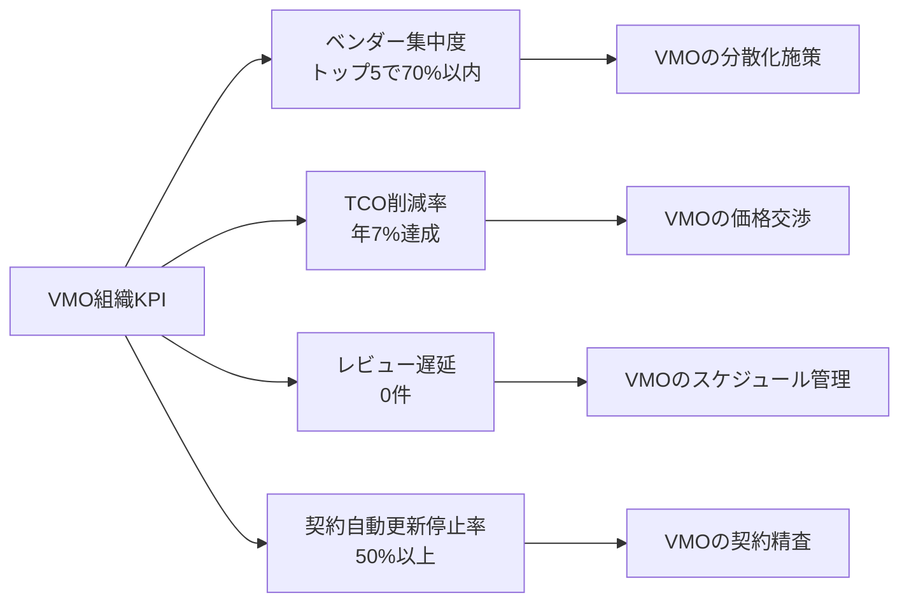
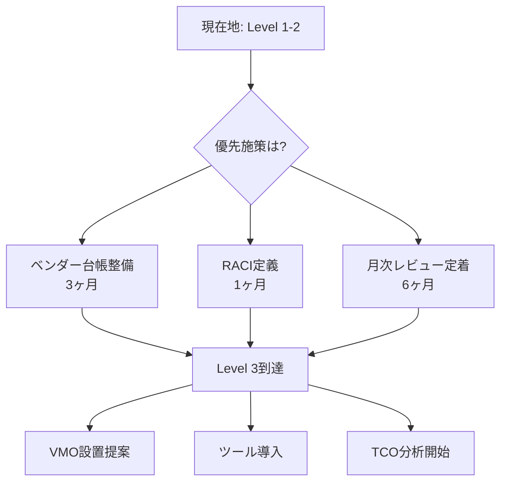
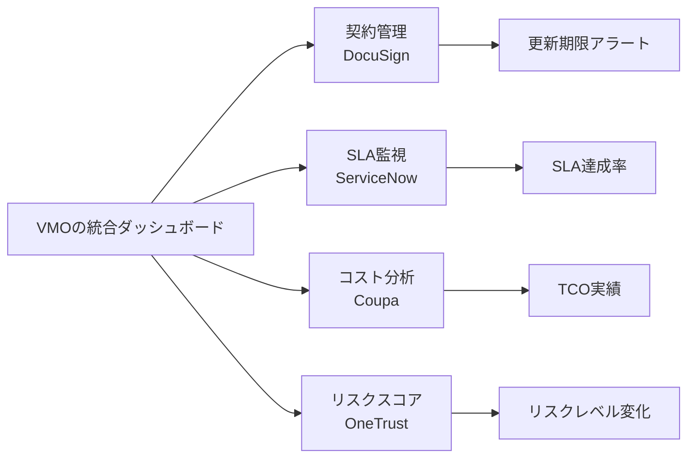
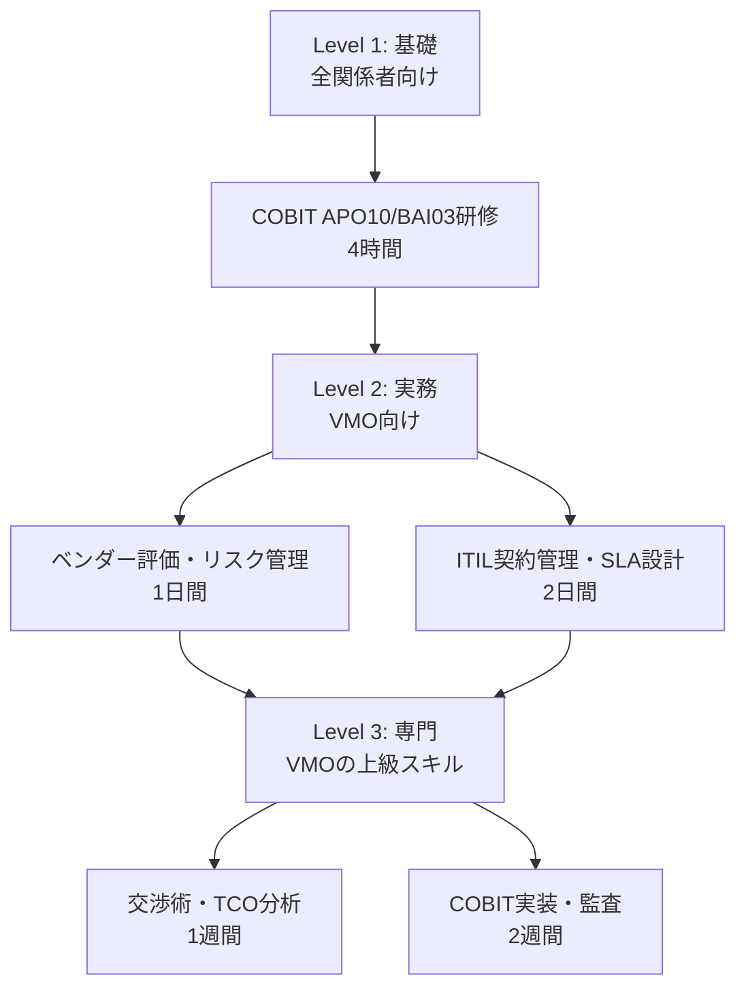

# ベンダーマネジメント実践ガイド（KPI）

## 第6章：成果を測る指標（KPI）

### 6.1 VMOの個人KPI

**VMOの業績評価に使われるKPI**：

| KPI分類 | 指標 | 目標値 | 測定頻度 |
|---------|------|--------|----------|
| **効率性** | ベンダーレビュー実施率 | 100% | 月次 |
| **効率性** | 契約更新リードタイム | 90日前開始率100% | 四半期 |
| **コスト** | TCO削減率 | 年7% | 年次 |
| **コスト** | 契約自動更新停止率 | 50%以上 | 年次 |
| **品質** | SLA達成ベンダー比率 | 90%以上 | 月次 |
| **品質** | ベンダー起因重大インシデント | 0件 | 月次 |
| **リスク** | リスク評価更新率 | 100% | 四半期 |
| **リスク** | オフボーディング遅延 | 0件 | 四半期 |

 

### 6.2 VMO組織全体のKPI

 

### 6.3 成熟度向上（COBIT準拠）

**VMOの組織の成熟度と、目指すべきレベル**：

| 成熟度レベル | 特徴 | VMOの主要活動 | KPI目標 |
|-------------|------|----------------|---------|
| **Level 1: 初期** | 属人的、プロセス未定義 | 基本台帳作成、緊急対応 | - |
| **Level 2: 管理** | 標準プロセス運用、RACI明確化 | 月次レビュー定着、SLA監視開始 | プロセス遵守率80% |
| **Level 3: 定義** | VMO設置、自動化ツール活用 | 四半期レビュー、TCO分析、リスク評価 | TCO削減7%、レビュー100% |
| **Level 4: 定量** | KPIダッシュボード、予測分析 | 予測モデル構築、戦略的最適化 | リスク予測精度85% |
| **Level 5: 最適化** | 継続的改善、ベンチマーク活用 | 業界ベストプラクティス導入、イノベーション | 業界トップ10%水準 |

**成熟度向上アクション**：

---
 

### 6.4 VMOが活用すべきツール

**業務を効率化するツール構成**：

| カテゴリ | ツール例 | VMOの用途 |
|---------|----------|-------------|
| 契約管理 | DocuSign | 電子契約、ベンダー台帳管理、更新アラート |
| SLA監視 | ServiceNow | KPI自動収集、ダッシュボード、レポート生成 |
| 調達管理 | Ariba | RFP配布、入札管理、承認ワークフロー |
| リスク管理 | OneTrust | ベンダーリスクスコアリング、監査管理 |

**ダッシュボード例**：

 

### 6.5 スキル向上ロードマップ

**習得すべきスキルと推奨研修**：

**コアスキル**：
- 契約管理（契約書レビュー、条項交渉）
- SLA設計・管理（KPI定義、モニタリング）
- ベンダー評価（スコアリング、リスク評価）
- 交渉力（価格交渉、条件改善）
- TCO分析（コスト最適化、ROI評価）
- リスク管理（COBIT、ISO準拠）
- プロジェクトマネジメント（PMBOKレベル）

---
