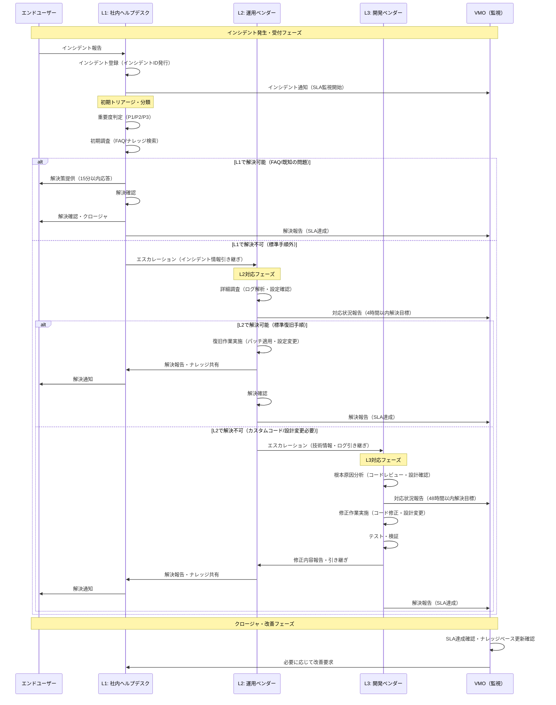
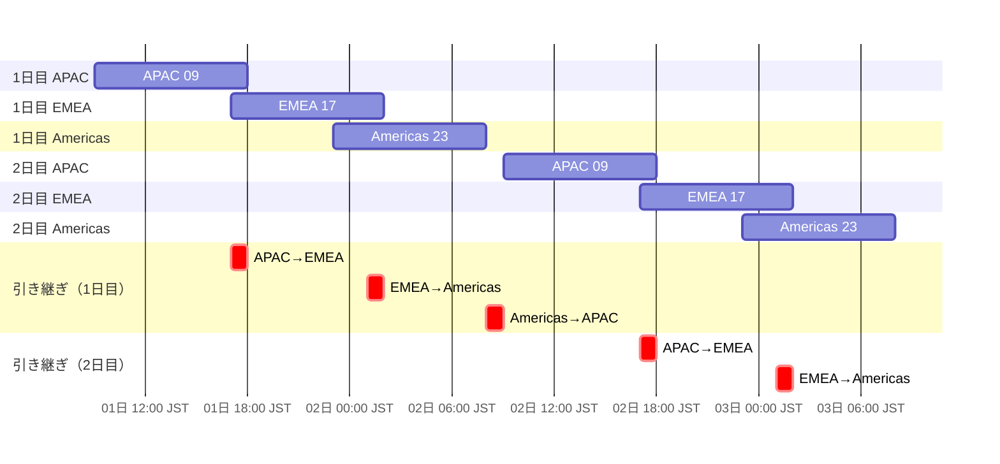

# ベンダーマネジメント実践ガイド（付録）

## 付録A：VMOが使えるテンプレート集

### A.1 ベンダー台帳テンプレート

```markdown
| ベンダーID | ベンダー名 | 分類 | 契約種別 | 年額 | 契約期間 | 担当者 | リスクスコア | 次回レビュー日 |
|-----------|----------|------|---------|------|---------|--------|------------|---------------|
| V001 | XX株式会社 | 戦略 | ERP保守 | 5,000万円 | 2024/4-2027/3 | 山田太郎 | 高 | 2026/1/15 |
| V002 | YY株式会社 | 重要 | SaaS | 1,200万円 | 2025/1-2026/12 | 佐藤花子 | 中 | 2026/3/30 |
```

<br>

### A.2 RFP評価マトリクステンプレート

```markdown
| 評価項目 | 配点 | 評価基準 | ベンダーA | ベンダーB | ベンダーC |
|---------|------|---------|----------|----------|----------|
| 機能適合度 | 30点 | 要件充足率 | 25 | 28 | 22 |
| 実績・信頼性 | 20点 | 同業界導入数 | 18 | 15 | 19 |
| セキュリティ | 20点 | 認証取得状況 | 16 | 18 | 14 |
| サポート体制 | 15点 | 対応時間・体制 | 12 | 13 | 10 |
| 価格競争力 | 15点 | TCO評価 | 10 | 12 | 13 |
| **合計** | **100点** | - | **81** | **86** | **78** |
```

<br>

### A.3 月次レビューアジェンダテンプレート

```markdown
# ベンダー月次レビュー
**日時**: 2026年1月15日 14:00-15:00
**ベンダー**: XX株式会社
**参加者**: [VMO、ITサービスMGR、サービスオーナー、ベンダー担当者]

## アジェンダ
1. 前月SLA/KPI実績報告
   - 可用性: 99.92%（目標99.95% → 未達）
   - MTTR: 3.5時間（目標4時間 → 達成）
   - CSAT: 4.2/5（目標4.0 → 達成）

2. 重大インシデント振り返り
   - 1/5 データベース障害（影響: 2時間停止）
   - 原因: パッチ適用時の設定ミス
   - 再発防止策: チェックリスト強化、テスト環境検証

3. 次月アクションプラン
   - 可用性改善策実施
   - 新機能リリース予定

4. エスカレーション事案
   - なし
```

<br>

### A.4 ベンダー評価シートテンプレート

```markdown
# ベンダー年次評価シート
**ベンダー名**: XX株式会社
**評価期間**: 2025年1月-12月
**評価者**: [VMOの名前]

## 評価項目

### 1. サービス品質（40点）
- SLA達成率: 98%（目標95%） → 35/40点
- 重大インシデント: 1件（目標0件） → 減点-5点

### 2. 関係性（30点）
- CSATスコア: 4.2/5 → 25/30点
- コミュニケーション: 良好 → 加点+5点

### 3. コスト（30点）
- TCO削減貢献: 年6%削減 → 25/30点
- 価格交渉協力度: 積極的 → 加点+5点

## 総合評価: 90/100点（A評価）

## 次年度方針
- 継続契約推奨
- 可用性SLA目標引き上げ（99.95% → 99.97%）
- 共創プロジェクト検討
```

<br>

### A.5 オフボーディングチェックリストテンプレート

```markdown
# ベンダーオフボーディングチェックリスト
**ベンダー名**: YY株式会社
**契約終了日**: 2026年3月31日
**担当者**: [VMOの名前]

## 90日前（1月1日）
- [ ] 終了通知正式発行
- [ ] 後任ベンダー選定開始
- [ ] データ移管計画策定開始

## 60日前（1月31日）
- [ ] データ移管計画完成（フォーマット確定）
- [ ] 知識移管スケジュール合意

## 30日前（3月1日）
- [ ] 知識移管完了（運用マニュアル、設定情報）
- [ ] データ抽出・移行完了
- [ ] 並行運用開始

## 契約終了日（3月31日）
- [ ] 全アカウント無効化
- [ ] VPN切断
- [ ] アクセス権削除

## 14日以内（4月14日）
- [ ] データ削除証明書取得
- [ ] 最終請求精算完了

## 30日以内（4月30日）
- [ ] 最終評価レビュー実施
- [ ] ベンダー台帳更新
- [ ] 事後検証完了
```

---
<br>

## 付録B：Q&A

### Q1: ベンダーが何社以上になったらVMO設置を検討すべきですか？

**A**: VMOが管理するベンダーが**50社を超えた時点**でVMO設置を強く推奨します。専任組織により管理効率が30%向上します。

---

### Q2: SLA未達のベンダーにどう対処すればいいですか？

**A**: VMOは以下の段階的対応を実施してください：
1. **1回目未達**: 月次レビューで原因確認、改善計画要求
2. **2回目連続未達**: 四半期レビュー前倒し、ペナルティ条項発動（料金減額）
3. **3回目以上**: エスカレーション → 契約解除検討 → CIO判断

---

### Q3: 契約更新交渉で価格削減を引き出すコツは？

**A**: VMOが使える交渉カード：
- **利用実績データ提示**：「実利用率が契約の70%なので、次年度は30%削減希望」
- **競合見積提示**：「他社は同条件で20%安い提案」
- **長期契約提案**：「3年契約なら年15%削減可能か？」
- **ボリューム統合**：「複数契約を統合するので全体で10%削減」

---

### Q4: クラウドベンダーのロックインをどう避けますか？

**A**: VMOが契約前に確認すべきこと：
- データエクスポートAPI提供（標準フォーマット）
- 設定・構成情報のエクスポート可能性（Terraform対応など）
- 移行支援サービスの提供
- 契約終了時の移管費用上限設定

---

### Q5: ベンダー評価が低い場合、すぐ乗り換えるべきですか？

**A**: VMOは以下を考慮して判断してください：
- **評価60点未満**: 改善計画3ヶ月実施 → 改善なしなら乗り換え検討
- **評価60-75点**: 条件見直し交渉、サービスレベル引き上げ要求
- **評価75点以上**: 継続、戦略的関係強化

---
<br>

## 付録C：ITIL準拠L1-L3問題解決フロー

| レベル | 担当 | VMOが契約に記載すべき業務範囲 | SLA目標 |
|--------|------|-------------------------------|---------|
| L1 | 社内ヘルプデスク | 受付、初期トリアージ、FAQ対応 | 15分応答 |
| L2 | 運用ベンダー | 標準障害復旧、ログ解析、パッチ適用 | 4時間解決 |
| L3 | 開発ベンダー | カスタムコード修正、設計変更 | 48時間解決 |
| L4 | 製品ベンダー | プロダクトバグ修正、機能追加 | 次リリース対応 |
---
<br>

**ITIL準拠：L1-L3問題解決フロー**：



<br>

## 付録D：Follow-the-sun モデル

**JST基準のタイムゾーン対応表:**

| JST時刻 | 稼働拠点 | 現地時刻（参考） |
|---------|----------|----------------|
| 09:00-18:00 | **APAC** | JST 09:00-18:00 |
| 17:00-02:00 | **EMEA** | CET 09:00-18:00 / GMT 08:00-17:00 |
| 23:00-08:00 | **Americas** | EST 09:00-18:00 / BRT 11:00-20:00 |
---
<br>

**Follow the Sun：48時間カバレッジ（JST基準・2日間表示）**



---
<br>

**3拠点同時開催の会議枠**

| タイムゾーン | 地域 | 会議時間 | 評価 | コメント |
|------------|------|---------|------|---------|
| **JST (UTC+9)** | 🇯🇵 日本 | **22:00-23:00** | ⭐ | 夜だが許容範囲内 |
| **GMT (UTC+0)** | 🇬🇧 イギリス | **13:00-14:00** | ⭐⭐⭐⭐ | ランチ後の良い時間 |
| **EST (UTC-5)** | 🇺🇸 米国東部 | **08:00-09:00** | ⭐⭐ | 朝の良い時間帯 |
| **PST (UTC-8)** | 🇺🇸 米国西海岸 | **05:00-06:00** | ❌ | 早朝すぎる |
| **IST (UTC+5:30)** | 🇮🇳 インド | **18:30-19:30** | ⭐⭐⭐ | 夕方の良い時間 |
---

**JST 22:00-23:00（GMT 13:00-14:00）は、以下の拠点にとって非常に良い選択:**

1. **ドイツ/イギリス（EMEA）**: 午後の理想的な時間
2. **米国東部（Americas）**: 早朝だが、DayLightSavingの時期は適切な時間
3. **インド（APAC）**: 夕方で参加しやすいが、業務時間外ではある
4. **日本/シンガポール（APAC）**: 60分会議なら許容範囲だが、インターバル制度がある場合は翌日の開始時刻に影響あり
5. ❌ **米国西海岸**: 05:00で早朝すぎて非現実的

