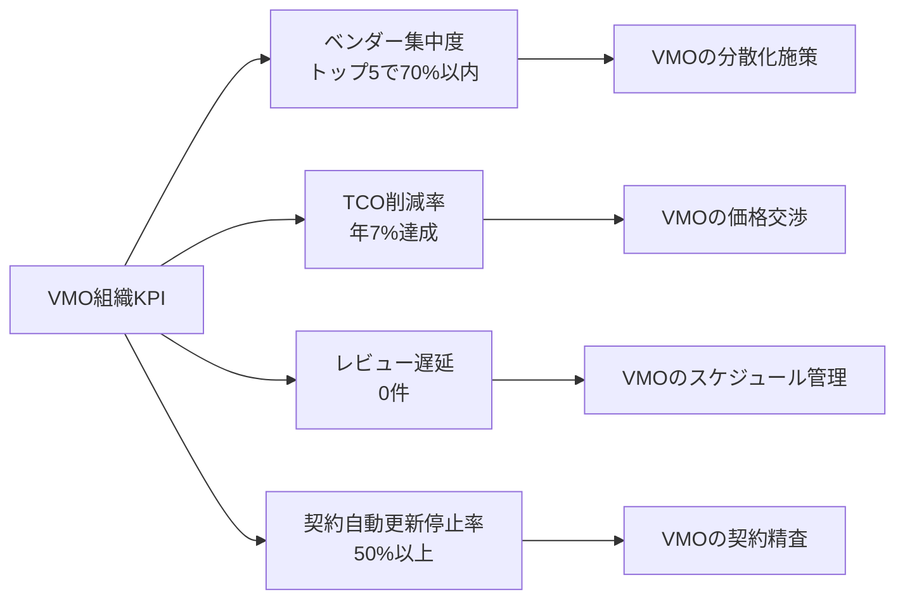
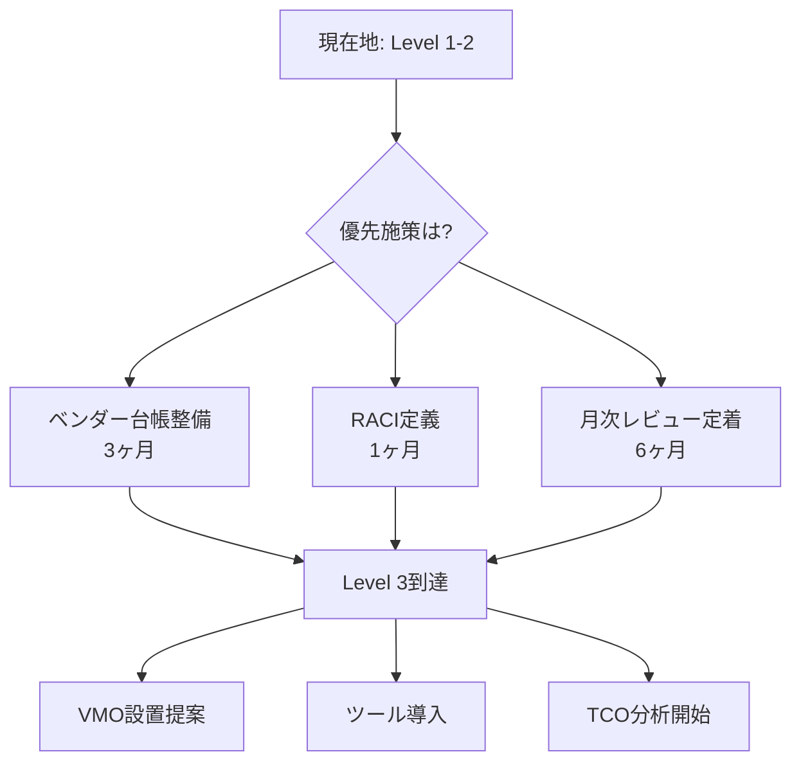

# ベンダーマネジメント実践ガイド（KPI）

## 第6章：成果を測る指標（KPI）

### 6.1 VMOの個人KPI

**VMOの業績評価に使われるKPI**：

| KPI分類 | 指標 | 目標値 | 測定頻度 |
|---------|------|--------|----------|
| **効率性** | ベンダーレビュー実施率 | 100% | 月次 |
| **効率性** | 契約更新リードタイム | 90日前開始率100% | 四半期 |
| **コスト** | TCO削減率 | 年7% | 年次 |
| **コスト** | 契約自動更新停止率 | 50%以上 | 年次 |
| **品質** | SLA達成ベンダー比率 | 90%以上 | 月次 |
| **品質** | ベンダー起因重大インシデント | 0件 | 月次 |
| **リスク** | リスク評価更新率 | 100% | 四半期 |
| **リスク** | オフボーディング遅延 | 0件 | 四半期 |

<br>

### 6.2 VMO組織全体のKPI



<br>

### 6.3 成熟度向上（COBIT準拠）

**VMOの組織の成熟度と、目指すべきレベル**：

| 成熟度レベル | 特徴 | VMOの主要活動 | KPI目標 |
|-------------|------|----------------|---------|
| **Level 1: 初期** | 属人的、プロセス未定義 | 基本台帳作成、緊急対応 | - |
| **Level 2: 管理** | 標準プロセス運用、RACI明確化 | 月次レビュー定着、SLA監視開始 | プロセス遵守率80% |
| **Level 3: 定義** | VMO設置、自動化ツール活用 | 四半期レビュー、TCO分析、リスク評価 | TCO削減7%、レビュー100% |
| **Level 4: 定量** | KPIダッシュボード、予測分析 | 予測モデル構築、戦略的最適化 | リスク予測精度85% |
| **Level 5: 最適化** | 継続的改善、ベンチマーク活用 | 業界ベストプラクティス導入、イノベーション | 業界トップ10%水準 |

**成熟度向上アクション**：



---
<br>

## 第7章：VMOの実践チェックリスト

### 7.1 日常業務チェックリスト

**VMOの週次タスク**：
```markdown
□ 月曜: SLA実績レポート確認（全ベンダー）
□ 火曜: 新規インシデントレビュー、エスカレーション判断
□ 水曜: 契約更新期限90日前ベンダーリストアップ
□ 木曜: 四半期レビュー予定ベンダーとの日程調整
□ 金曜: ベンダー台帳更新、週次サマリー作成
```

**VMOの月次タスク**：
```markdown
□ 第1週: 月次レビューミーティング開催（全重要ベンダー）
□ 第2週: SLA/KPIダッシュボード更新、未達ベンダーに改善要求
□ 第3週: 新規調達案件のRFP支援、評価マトリクス準備
□ 第4週: VMO月次レポート作成、CIO報告
```

<br>

### 7.2 四半期業務チェックリスト

**VMOの四半期タスク**：
```markdown
□ 戦略・重要ベンダーの四半期レビュー実施
□ TCO実績分析、コスト削減機会抽出
□ リスクスコア再評価（全ベンダー）
□ 契約更新交渉開始（更新3ヶ月前ベンダー）
□ ベンダーポートフォリオ最適化検討（集中度、代替性）
□ VMO四半期報告書作成、投資委員会報告
```

<br>

### 7.3 年次業務チェックリスト

**VMOの年次タスク**：
```markdown
□ 全ベンダーの年次評価実施、評価シート更新
□ 年間TCO削減実績集計、目標達成度確認
□ ベンダー台帳全件監査、休眠ベンダー整理
□ 次年度のベンダーマネジメント方針策定
□ VMO組織KPI達成度評価、改善計画立案
□ 調達プロセス見直し、ツール・テンプレート更新
□ スキル向上研修計画策定、認定資格取得
```

<br>

### 7.4 緊急時対応チェックリスト

**VMOが重大インシデント発生時に実施すべきこと**：
```markdown
□ 1時間以内: ベンダーから状況報告受領、影響範囲確認
□ 2時間以内: サービスオーナー、ITサービスMGRに連絡
□ 4時間以内: 暫定報告受領、エスカレーション判断
□ 24時間以内: 詳細報告受領、改善計画要求
□ 1週間以内: 根本原因分析会議開催、再発防止策合意
□ 2週間以内: 契約条項見直し、補償交渉
```

---
