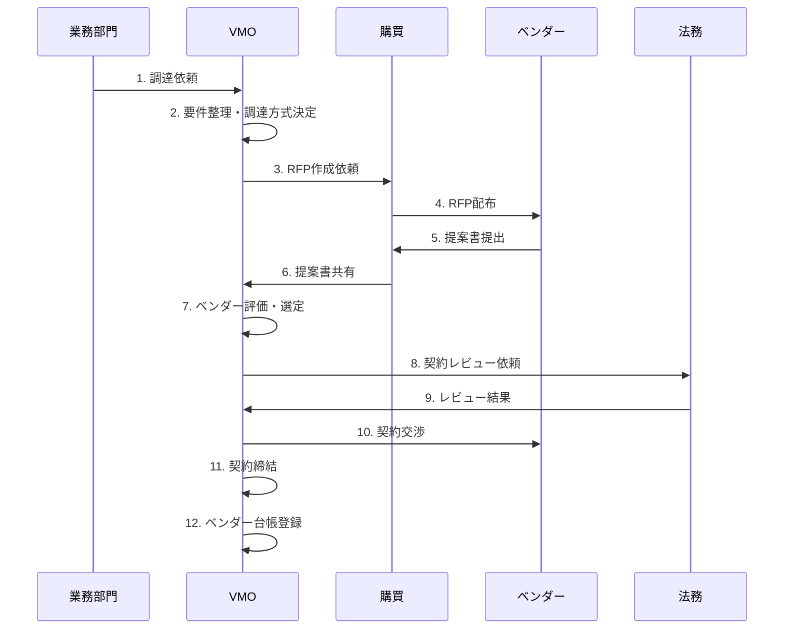
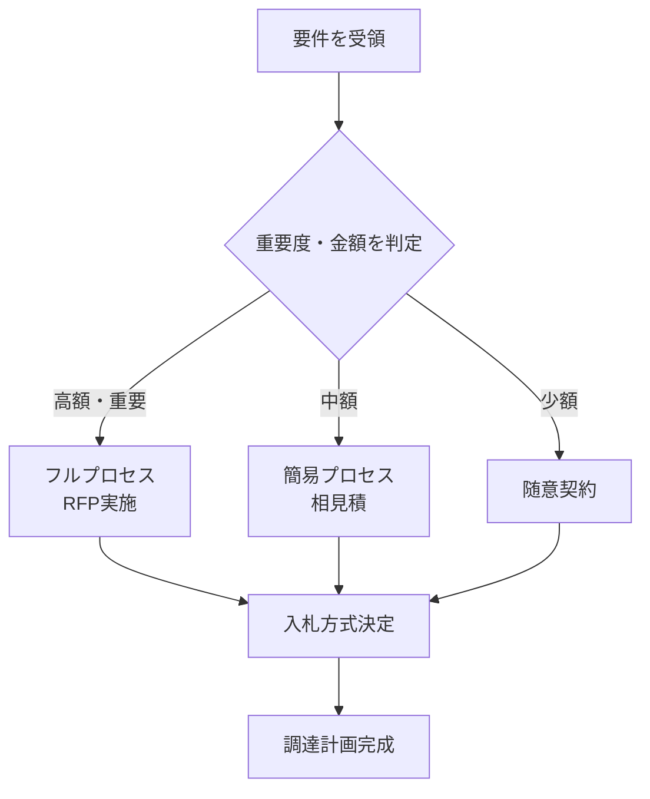

# ベンダーマネジメント実践ガイド

## 第2章：調達プロセス

### 2.1 調達プロセス全体の流れ（VMOの視点）

VMOは調達プロセス全体を通じて、以下の役割を果たします：

 

### 2.2 調達の8ステップとVMOのアクション

#### ステップ1：申請・要求定義
**VMOのアクション**：
- 業務部門から受け取った要件を機能要件と非機能要件に整理
- セキュリティレベル、可用性、RTO/RPOを明確化
- 予算と期間の妥当性を検証

#### ステップ2：調達計画・方式決定
**VMOのアクション**：

- 重要度・金額に応じて調達方式（競争入札/随意契約）を決定
- 新規契約か更新かを判断
- RFI/RFPの実施要否を決定

#### ステップ3：ベンダー選定（RFI/RFP）
**VMOのアクション**：
- 購買部門と協力してRFP文書を作成
- 候補ベンダーリストを準備（既存台帳から抽出）
- 提案書を評価マトリクスでスコアリング

**評価マトリクス例**（VMOが使用）：

| 評価項目 | 配点 | ベンダーA | ベンダーB | ベンダーC |
|---------|------|----------|----------|----------|
| 機能適合度 | 30点 | 25 | 28 | 22 |
| 実績・信頼性 | 20点 | 18 | 15 | 19 |
| セキュリティ姿勢 | 20点 | 16 | 18 | 14 |
| サポート体制 | 15点 | 12 | 13 | 10 |
| 価格競争力 | 15点 | 10 | 12 | 13 |
| **合計** | **100点** | **81** | **86** | **78** |

#### ステップ4：社内承認・稟議
**VMOのアクション**：
- 選定結果をまとめた稟議書を作成
- EA/PMO、セキュリティ、法務の承認を取得
- 最終的にCIOの承認を得る

#### ステップ5：契約・発注
**VMOのアクション**：
- ベンダーと契約条件を交渉（SLA、セキュリティ条項、データ保護など）
- 法務と協力して契約書をレビュー
- 契約締結後、購買部門に発注書（PO）発行を依頼

**VMOが確認すべき契約条項**：
- SLA（可用性、応答時間、回復時間）
- データ保護（暗号化、バックアップ、削除手順）
- 監査権と再委託条件
- 終了時のデータ返却・移管支援

#### ステップ6：納品・検収
**VMOのアクション**：
- ITサービスマネージャと協力して受入テストを実施
- 検収基準を満たしているか確認
- 問題があれば差し戻し、再納品を要求

#### ステップ7：検収照合・支払処理
**VMOのアクション**：
- 発注書、検収記録、請求書の3点照合を確認
- 財務部門に支払承認を依頼
- 会計システムへの計上を確認

#### ステップ8：ベンダー評価・契約更新/終了
**VMOのアクション**：
- SLA達成度、品質、コミュニケーションを評価
- 継続、条件見直し、終了の判断を実施
- 次年度の契約条件を協議

 

### 2.3 VMOが作成・管理すべき主要文書

| 文書名 | 目的 | 更新頻度 |
|--------|------|----------|
| ベンダー台帳 | 全ベンダーの一元管理 | 月次 |
| RFP文書 | ベンダー選定時の要件定義 | 案件毎 |
| 評価マトリクス | 客観的なベンダー評価 | 案件毎 |
| 契約書 | 双方の権利義務を明文化 | 契約毎 |
| SLAレポート | パフォーマンス監視 | 月次 |
| ベンダー評価シート | 定期レビュー結果 | 四半期/年次 |

---
