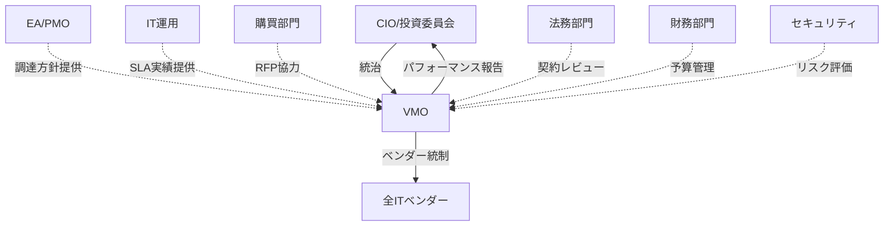
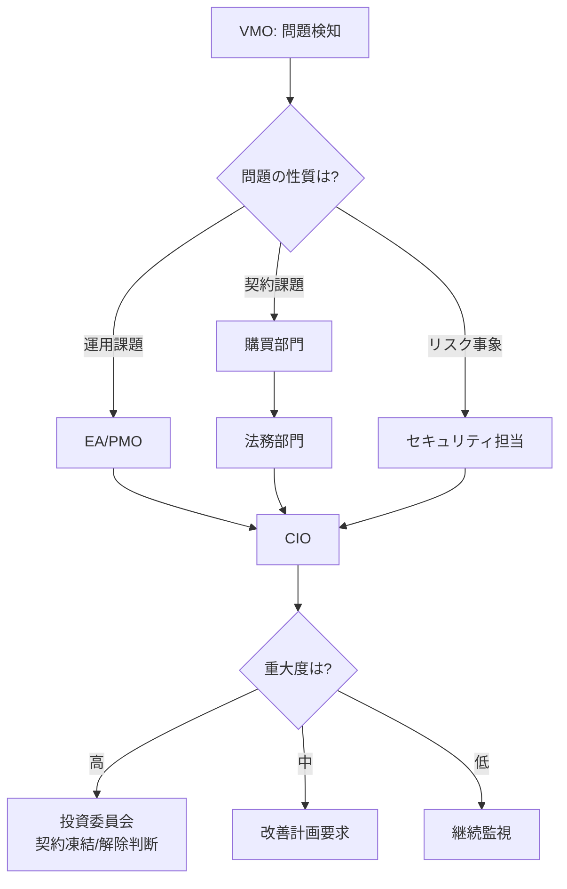
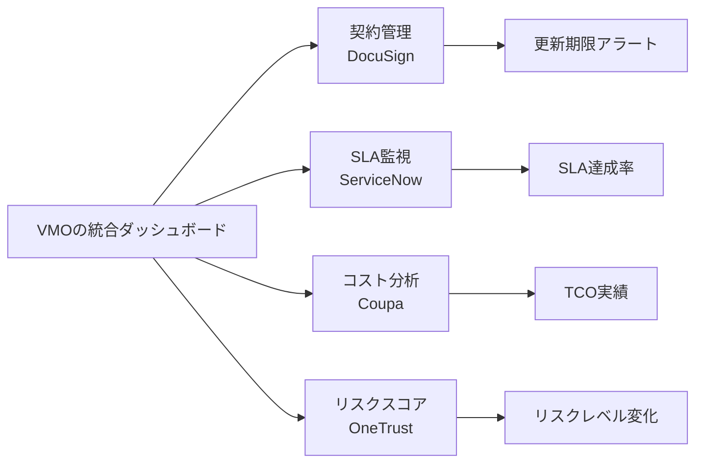
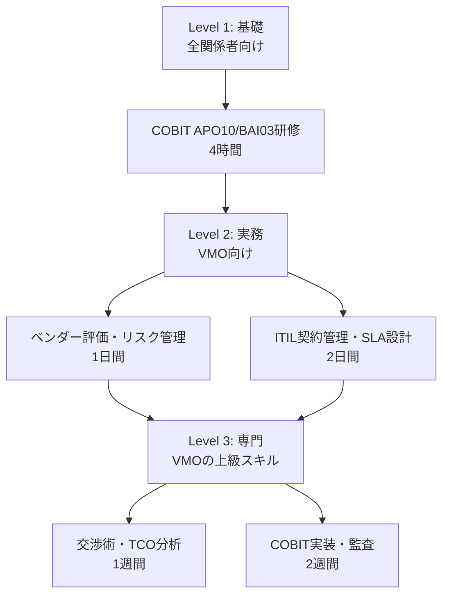

# ベンダーマネジメント実践ガイド

## 第5章：VMOの組織内での役割と連携

### 5.1 VMOの組織上の位置づけ

 

### 5.2 VMOの主要な連携先と役割分担（RACI）

**調達プロセスでのVMOの役割**：

| 活動 | VMO | EA/PMO | ITサービスMGR | サービスオーナー | 購買 | 財務 | 法務 | セキュリティ |
|------|------------|---------|---------------|-----------------|------|------|------|--------------|
| 要件定義 | I | C | R | **A** | I | I | I | C |
| RFP作成 | **C** | R | C | C | **R** | I | C | C |
| ベンダー評価 | **R** | C | R | C | C | I | I | C |
| 契約交渉 | **A** | I | I | C | R | C | R | C |
| SLA監視 | **C** | I | A | R | I | I | I | C |
| 月次レビュー | **R** | I | R | **A** | C | I | I | C |
| 契約更新 | **R** | C | C | C | **A** | R | R | C |

**凡例**：
- **R: Responsible（VMOが実行）**
- **A: Accountable（VMOが最終責任）**
- **C: Consulted（VMOが相談を受ける）**
- **I: Informed（VMOに情報共有される）**

 

### 5.3 運用フェーズでのVMOの役割（RACI）

| 活動 | VMO | サービスオーナー | ITサービスマネージャ | セキュリティ | 購買 | 財務 | 法務 |
|------|------------|-----------------|-------------------|-------------|------|------|------|
| SLA/KPI日常モニタリング | **R/C** | R | **A** | C | I | I | I |
| 月次/四半期レビュー・報告 | **R** | **A** | R | C | C | C | I |
| インシデントエスカレーション | **C** | C | R/A | R | I | I | I |
| 契約違反/SLA未達是正要求 | **R** | **A** | R | C | C | C | C |
| 契約更新/更改交渉 | **R** | C | C | C | **A** | R | R |
| 機能追加/チェンジ依頼 | **C** | **A** | R | C | C | C | C |
| ベンダー評価・スコアリング | **A** | C | R | C | C | I | I |
| リスク/セキュリティ監査 | **R** | C | I | R/**A** | I | I | C |
| オフボーディング/契約終了 | **R** | **A** | R | R | R | R | R/A |

**VMOが「A（最終責任）」を持つ活動**：
- 契約交渉
- ベンダー評価・スコアリング

**VMOが「R（実行責任）」を持つ活動**：
- 月次/四半期レビュー
- 契約違反是正要求
- 契約更新交渉
- リスク監査
- オフボーディング

 

### 5.4 エスカレーションルート

**VMOが問題をエスカレーションする経路**：

**エスカレーションすべきケース**：
- SLA連続未達（2ヶ月以上）→ EA/PMO → CIO
- 契約違反・法的問題 → 購買 → 法務 → CIO
- セキュリティインシデント → セキュリティ担当 → CIO → 投資委員会
- 財務悪化・事業継続リスク → CIO → 投資委員会

 

### 5.5 VMOが活用すべきツール

**VMOの業務を効率化するツール構成**：

| カテゴリ | ツール例 | VMOの用途 |
|---------|----------|-------------|
| 契約管理 | DocuSign | 電子契約、ベンダー台帳管理、更新アラート |
| SLA監視 | ServiceNow | KPI自動収集、ダッシュボード、レポート生成 |
| 調達管理 | Ariba | RFP配布、入札管理、承認ワークフロー |
| リスク管理 | OneTrust | ベンダーリスクスコアリング、監査管理 |

**VMOが構築すべきダッシュボード例**：

 

### 5.6 スキル向上ロードマップ

**VMOが習得すべきスキルと推奨研修**：

**VMOが持つべきコアスキル**：
- 契約管理（契約書レビュー、条項交渉）
- SLA設計・管理（KPI定義、モニタリング）
- ベンダー評価（スコアリング、リスク評価）
- 交渉力（価格交渉、条件改善）
- TCO分析（コスト最適化、ROI評価）
- リスク管理（COBIT、ISO準拠）
- プロジェクトマネジメント（PMBOKレベル）

---
