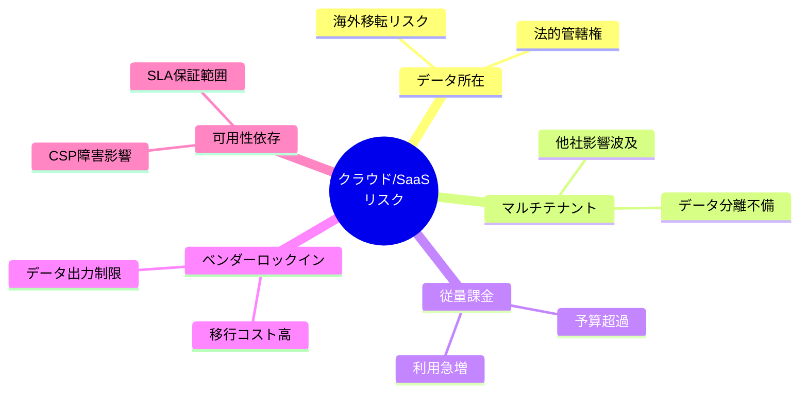
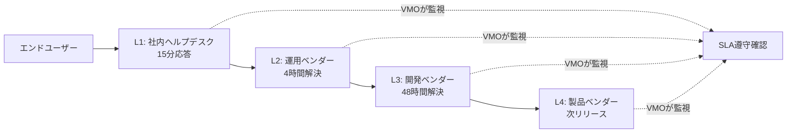
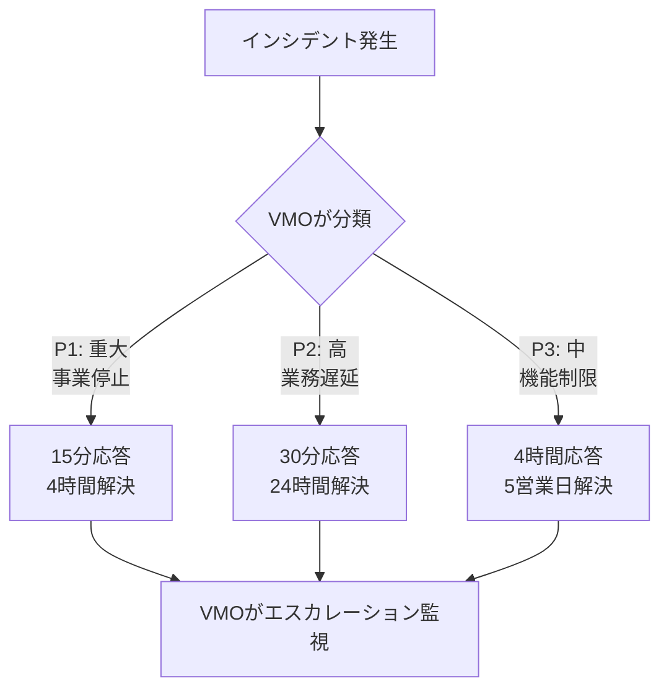
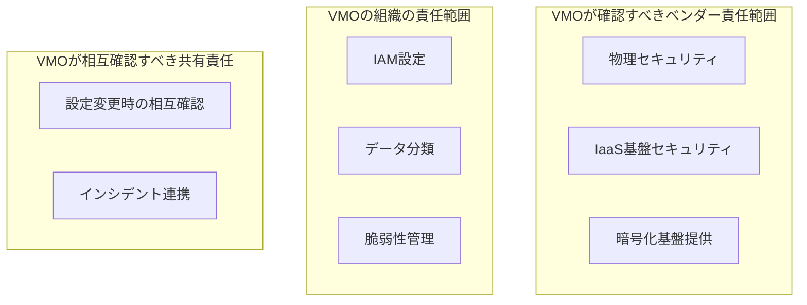
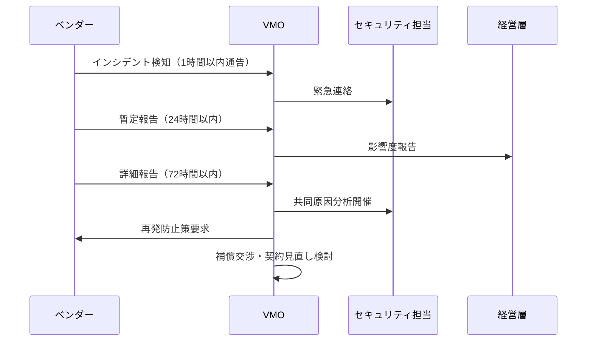

# ベンダーマネジメント実践ガイド

## 第4章：クラウド/SaaS・運用保守委託でのVMOの特別な注意点

### 4.1 クラウド/SaaS調達でのVMOの追加業務

**VMOがRFPに追加すべき項目**：

| 一般調達での確認事項 | VMOがクラウド/SaaSで追加確認すべき事項 |
|-------------------|-----------------------------------|
| 機能適合度 | マルチテナント分離、データ所在地（日本リージョン指定） |
| セキュリティ | Shared Responsibility Model明記、CSP認証（ISO27017/27701） |
| 出口戦略 | データポータビリティ（API/CSV出力）、ベンダーロックイン回避策 |
| 価格 | 従量課金の上限設定、予約インスタンス割引の活用 |

**VMOが評価すべきクラウド/SaaS特有のリスク**：



**VMOが契約に盛り込むべき条項例**：

```markdown
【データ所在地条項（VMOが要求）】
第X条（データ所在）
1. ベンダーは、契約者データを日本国内のデータセンターに保管するものとする
2. データの国外移転には契約者の事前書面承認を必要とする
3. データレジデンシー違反時は契約解除権を発動できる

【データポータビリティ条項（VMOが要求）】
第Y条（データエクスポート）
1. 契約者はいつでも全データをエクスポート可能とする
2. エクスポート形式は標準フォーマット（CSV/JSON）とする
3. エクスポート完了は30日以内とし、追加費用は発生しない
```

<br>

### 4.2 運用保守委託でのVMOの管理ポイント

**VMOが設計すべきL1-L4サポート体制**：



**VMOが契約で明確化すべき責任分界**：

| レベル | 担当 | VMOが契約に記載すべき業務範囲 | SLA目標 |
|--------|------|-------------------------------|---------|
| L1 | 社内ヘルプデスク | 受付、初期トリアージ、FAQ対応 | 15分応答 |
| L2 | 運用ベンダー | 標準障害復旧、ログ解析、パッチ適用 | 4時間解決 |
| L3 | 開発ベンダー | カスタムコード修正、設計変更 | 48時間解決 |
| L4 | 製品ベンダー | プロダクトバグ修正、機能追加 | 次リリース対応 |

**VMOが防ぐべきブラックボックス化対策**：

- 運用ドキュメント常時更新義務（契約条項化）
- 月次レビューで最新化確認
- 人材派遣契約禁止、固定メンバー制
- ナレッジ共有必須化（Confluenceなど）
- 契約前3ヶ月のPoC実施

<br>

### 4.3 VMOが交渉すべきSLA設計

**可用性SLA（VMOが重要度別に設定）**：

| 重要度 | VMOが設定する可用性目標 | 未達時の補償率（VMOが交渉） | VMOが要求するベンダー対応 |
|--------|-------------------------|---------------------------|-------------------------|
| ミッションクリティカル | 99.99% | 未達1%につき月額2%返金 | 即時復旧＋根本原因分析報告 |
| クリティカル | 99.95% | 未達1%につき月額1%返金 | 48時間復旧＋月次報告 |
| 一般 | 99.90% | 超過時ディスカウント | 四半期レビューで改善協議 |

**インシデント対応SLA（VMOが定義）**：



<br>

### 4.4 セキュリティ・データ保護（VMOの重要責任）

**VMOが契約に組み込むべきShared Responsibility Model**：



**ベンダーに要求すべきデータ保護条項**：

| 論点 | 契約に記載すべき内容 |
|------|---------------------------|
| データ分類 | 機密・内部・公開データの取扱範囲を明記 |
| 暗号化 | 静止時＋送信時AES256以上、顧客管理鍵（BYOK）対応 |
| バックアップ | 14日間保持、暗号化、顧客自己取得可能 |
| 削除 | 論理削除＋物理削除証明書（NIST 800-88準拠） |
| 監査権 | 年1回の監査実施権、SOC2レポート提出義務 |

**VMOが要求すべきセキュリティインシデント対応フロー**：



<br>

### 4.5 継続監視ダッシュボード

**VMOが月次で確認すべきKPI**（ServiceNow等で自動化）：

```markdown
■ サービス品質
□ 可用性実績: 前月99.92%（目標99.95% → 未達）
□ P1インシデント遅延: 0/2件（目標0件 → 達成）
□ セキュリティ更新適用率: 95%（目標100% → 要改善）

■ コスト
□ 利用率乖離: ライセンス-15%（未使用削減機会）
□ 従量課金予算比: +8%（予算超過リスク）

■ リスク
□ セキュリティインシデント: 0件（目標0件 → 達成）
□ SLA違反: 1件（改善計画要求）
```

**VMOの四半期ガバナンス実施項目**：
1. コスト超過要因分析 → 削減案策定
2. セキュリティ態勢評価 → 改善計画
3. サービスカタログ見直し → 不要サービス削減
4. 次年度契約条件交渉 → 自動更新停止判断

---
<br>
