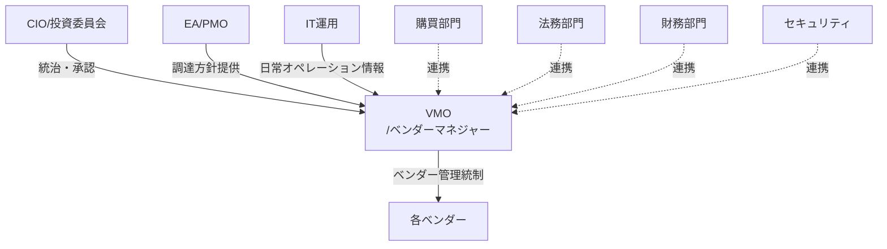
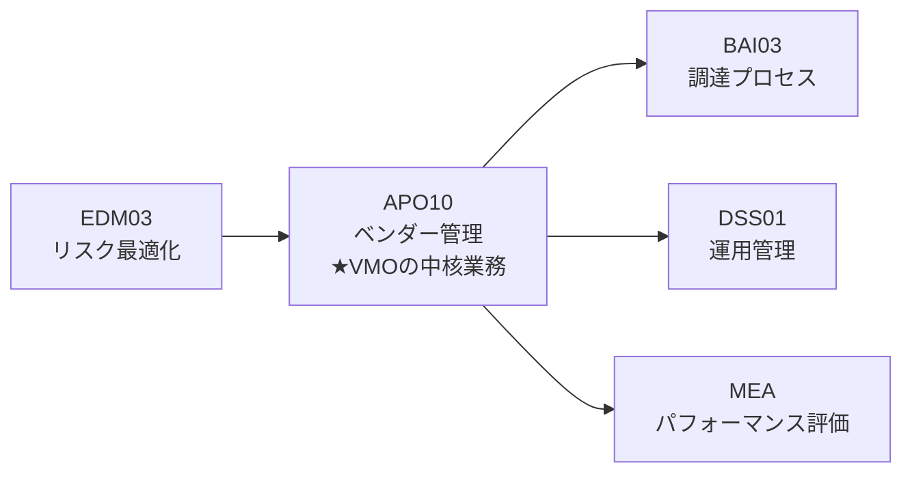

# ベンダーマネジメント実践ガイド

## はじめに

- このガイドは、VMO（企業IT組織のベンダーマネジメント担当者）が日々直面する業務を体系的に整理し、効果的にベンダーを管理するための実践的な手引きです。
- VMOの役割は、ベンダーとの関係を通じて、IT投資の価値を最大化し、リスクを最小化することです。
- 企業IT支出の大部分を外部ベンダーに依存する企業において、VMOの業務は経営に直結する重要な機能です。

 

## 第1章：役割と位置づけ

### 1.1 ベンダーマネジメントの責任

VMOは以下の責任を担っています：

- **ベンダー台帳の管理**：全ITベンダー・SaaSの一元管理
- **ベンダー分類とリスク評価**：重要度に応じた管理レベルの設定
- **パフォーマンスレビューの実施**：SLA遵守状況の監視と評価
- **契約交渉の主導**：更新時の条件改善とコスト最適化
- **関係性の構築**：戦略的ベンダーとの協創関係の維持

 

### 1.2 VMOが関わる組織とその関係

**VMOと他部門との関係**：

- **EA/PMO**：技術スタックやアーキテクチャ方針を受け取り、調達方針に反映
- **IT運用（ITサービスマネージャ）**：日常のSLA監視データを受け取り、ベンダー評価に活用
- **購買部門**：RFP発行や入札プロセスで協働
- **法務・財務・セキュリティ**：契約レビュー、予算確保、リスク評価で連携

 

### 1.3 VMOの業務とCOBIT 2019フレームワークの対応

VMOの業務は、COBIT 2019の以下のプロセスに対応しています：

**APO10（ベンダー管理）**がVMOの中核プロセスです。ここでベンダー分類、評価、パフォーマンス管理、契約統制を実施します。

---
