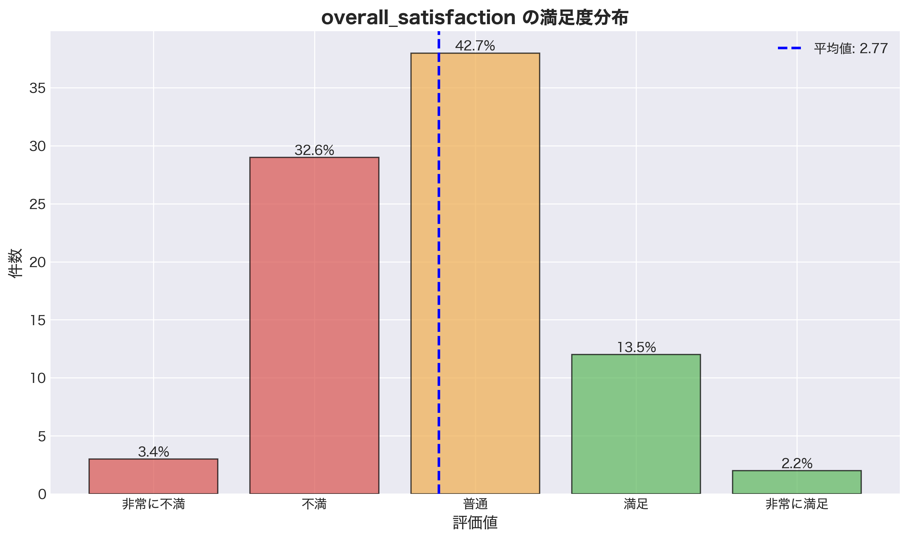
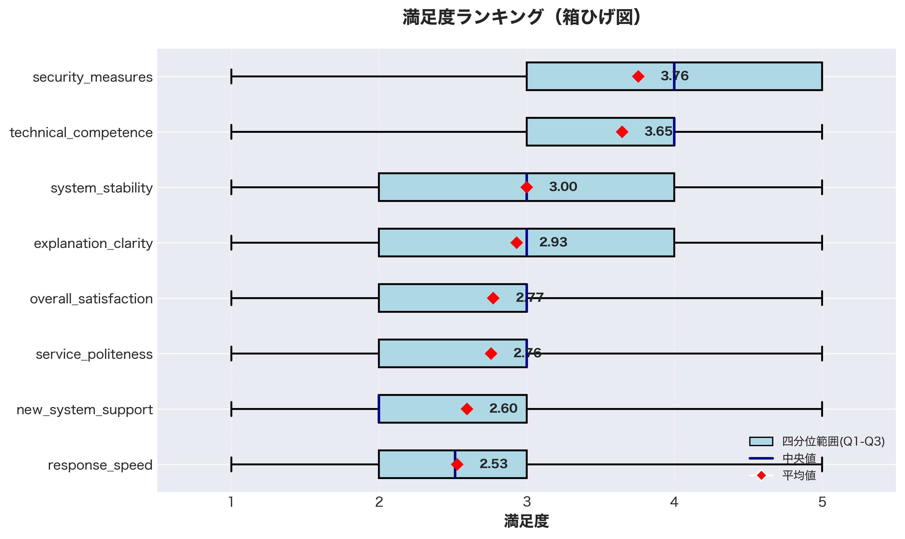
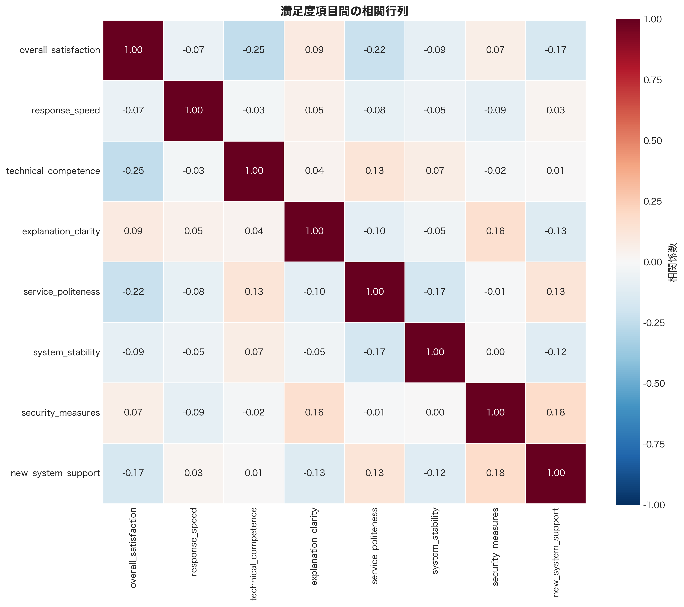
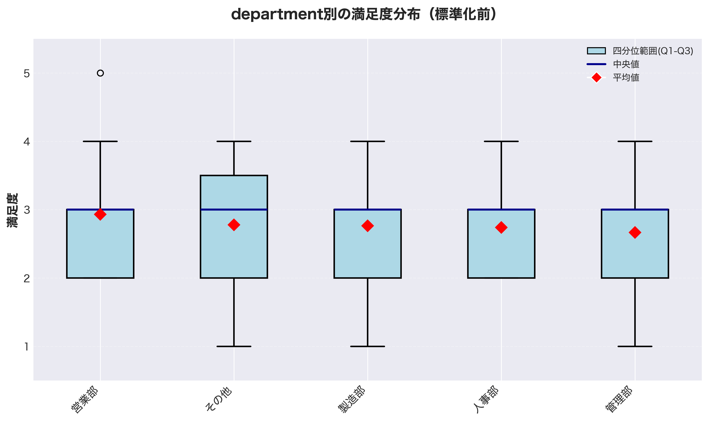
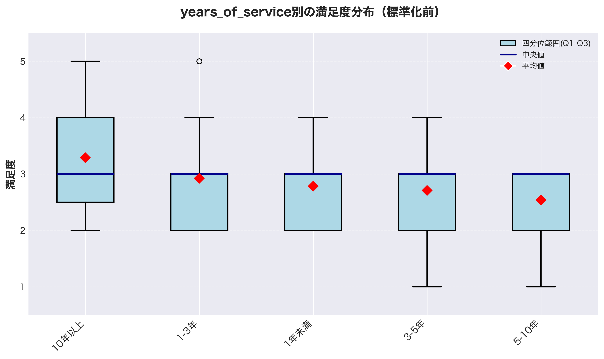
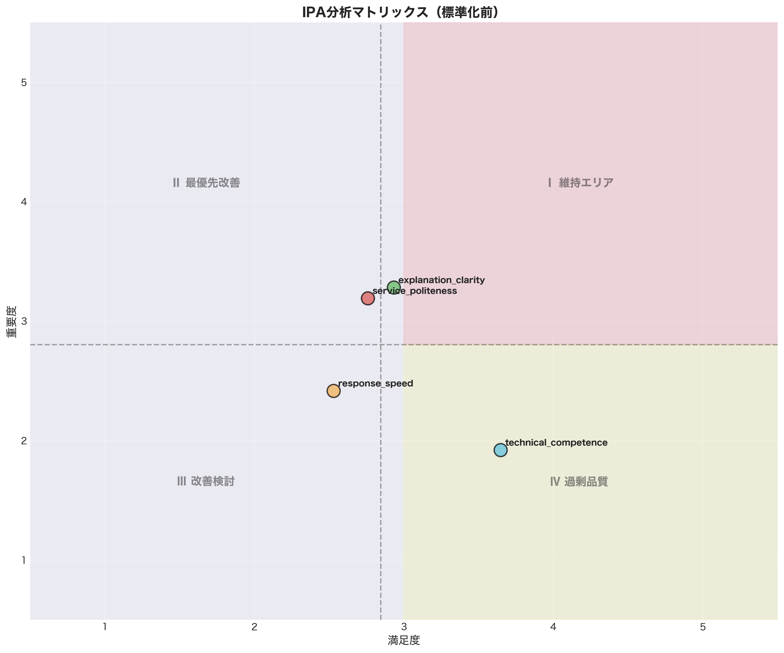

# IT部門サービス満足度調査 詳細レポート

**生成日時**: 2025年11月30日 18:49:33

---

## 目次

1. [エグゼクティブサマリー](#1-エグゼクティブサマリー)
2. [基本統計](#2-基本統計)
3. [相関分析](#3-相関分析)
4. [属性別分析](#4-属性別分析)
5. [IPA分析](#5-ipa分析)
6. [グラフ](#6-グラフ)

---

## 1. エグゼクティブサマリー

### 総合満足度: **2.77点**（5点満点）

### 満足度分布

- 満足以上（4-5点）: **15.7%**
- 不満以下（1-2点）: **36.0%**

### 満足度分布グラフ

### 最優先改善項目

| 順位 | 項目 | 満足度 | 重要度 | ギャップ |
|------|------|--------|--------|----------|
| 1 | service_politeness | 2.76 | 3.19 | 0.43 |

### 維持・強化項目

| 順位 | 項目 | 満足度 | 重要度 |
|------|------|--------|--------|
| 1 | explanation_clarity | 2.93 | 3.28 |

---

## 2. 基本統計

| 項目 | 平均 | 中央値 | 標準偏差 | 有効回答数 |
|------|------|--------|----------|-----------|
| overall_satisfaction | 2.77 | 3.00 | 0.80 | 89 |
| response_speed | 2.53 | 2.52 | 0.86 | 89 |
| technical_competence | 3.65 | 4.00 | 1.03 | 89 |
| explanation_clarity | 2.93 | 3.00 | 1.10 | 89 |
| service_politeness | 2.76 | 3.00 | 1.05 | 89 |
| system_stability | 3.00 | 3.00 | 0.92 | 89 |
| security_measures | 3.76 | 4.00 | 1.06 | 89 |
| new_system_support | 2.60 | 2.00 | 0.93 | 89 |

### 満足度ランキング

---

## 3. 相関分析

### 総合満足度との相関

| 項目 | 相関係数 | 有意性 |
|------|----------|--------|
| technical_competence | -0.247 | *** |
| service_politeness | -0.221 | *** |
| new_system_support | -0.171 |  |
| explanation_clarity | 0.092 |  |
| system_stability | -0.089 |  |
| response_speed | -0.067 |  |
| security_measures | 0.067 |  |

***: p < 0.05（有意）

### 相関ヒートマップ

---

## 4. 属性別分析

### department別の満足度

| グループ | 平均 | 標準偏差 | 人数 |
|----------|------|----------|------|
| その他 | 2.78 | 0.92 | 19 |
| 人事部 | 2.74 | 0.53 | 21 |
| 営業部 | 2.93 | 1.03 | 15 |
| 管理部 | 2.67 | 0.82 | 15 |
| 製造部 | 2.76 | 0.78 | 19 |

### position別の満足度

| グループ | 平均 | 標準偏差 | 人数 |
|----------|------|----------|------|
| 一般職 | 2.62 | 1.00 | 22 |
| 主任・係長 | 2.87 | 0.70 | 17 |
| 役員 | 2.67 | 0.64 | 22 |
| 課長・部長 | 2.92 | 0.81 | 28 |

### years_of_service別の満足度

| グループ | 平均 | 標準偏差 | 人数 |
|----------|------|----------|------|
| 1-3年 | 2.92 | 0.85 | 16 |
| 10年以上 | 3.29 | 1.11 | 7 |
| 1年未満 | 2.78 | 0.72 | 24 |
| 3-5年 | 2.71 | 0.88 | 22 |
| 5-10年 | 2.54 | 0.60 | 20 |

### it_skill_level別の満足度

| グループ | 平均 | 標準偏差 | 人数 |
|----------|------|----------|------|
| 上級 | 2.88 | 0.70 | 17 |
| 中級 | 2.99 | 1.00 | 19 |
| 初心者 | 2.46 | 0.67 | 20 |
| 基本的 | 3.05 | 0.66 | 17 |
| 専門的 | 2.50 | 0.82 | 16 |

---

## 5. IPA分析

### 最優先改善エリア

- service_politeness

### 維持エリア

- explanation_clarity

### 改善検討エリア

- response_speed

### 過剰品質エリア

- technical_competence

### IPAマトリックス

---

## 6. グラフ

### 生成されたグラフ一覧

1. [満足度分布](graphs/satisfaction_distribution.png)
2. [満足度ランキング](graphs/satisfaction_ranking.png)
3. [相関ヒートマップ](graphs/correlation_heatmap_original.png)
4. [department別比較](graphs/attribute_comparison_department_original.png)
5. [position別比較](graphs/attribute_comparison_position_original.png)
6. [years_of_service別比較](graphs/attribute_comparison_years_of_service_original.png)
7. [it_skill_level別比較](graphs/attribute_comparison_it_skill_level_original.png)
8. [IPAマトリックス](graphs/ipa_matrix_original.png)
